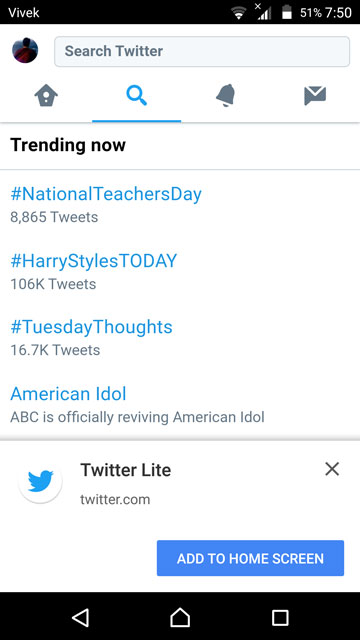

قبل عام تقريبا، قامت شركة تويتر بإطلاق النسخة الجديدة من موقعها على أجهزة الموبايل تحت مسمى تويتر لايت **Twitter Lite**.

الهدف من تحديث موقع تويتر على هذا النوع من الأجهزة هو الحصول على موقع سريع، متجاوب ويمنح المستخدمين تجربة استخدام مشابهة لتلك التي نراها في تطبيق تويتر على متجري **بلاي ستور** و **آب ستور **مع استهلاك أقل للبيانات والموارد.

عند زيارة الرابط **mobile.twitter.com** على هواتفكم الذكية ستلاحظون بأن تويتر لايت خفيف ويمكنكم إضافته على شكل أيقونة إلى الشاشة الرئيسية ليبدو وكأنه تطبيق أصلي كسائر التطبيقات على هاتفك.

تطبيقات الويب من هذا النوع تعرف **بتطبيقات الويب التقدمية **أو _Progressive Web Applications_، وهي إلى جانب الخفة والتجاوبية الممتازة على مستوى التصميم، تتميز بالعديد من المزايا الأخرى التي لا نراها في أحيان كثيرة حتى في التطبيقات الأصيلة.

## التقنيات المستخدمة لبناء مشروع Twitter Lite

تويتر لايت هو تطبيق جافاسكريبت خالص حيث يعتمد في **واجهته الأمامية** على مجموعة من المشاريع مفتوحة المصدر، يتقدمها React.js مع Redux، إضافة ل [Normalizr](https://github.com/paularmstrong/normalizr)، [Globalize](https://github.com/globalizejs/globalize) مع الإعتماد على Babel، Webpack و Jest في مرحلة التطوير.

أما في **الواجهة الخلفية**، فالتطبيق يعتمد على بيئة التشغيل Node.js للإتصال بالواجهة البرمجية Twitter API وكذلك لإنجاز نظام _Authentication_، دون نسيان الدور الأساسي الذي يلعبه Node.js فيما يعرف ب [Server Side Rendering](https://www.tutomena.com/web-development/javascript/react-vue-angular-comparison/).

قام مطورو شركة تويتر بكتابة أكواد الجافاسكريبت بطريقة **ES2015** الحديثة، مع الإستعانة بأداتي Babel و Webpack لتحويل هذه الأكواد إلى جافاسكريبت اعتيادي مدعوم من جل المتصفحات وتجميعها بعد ذلك في عدد أقل من الملفات ( *Module Bundling *). وتمت الإستعانة بمكتبة Jest لإختبار وفحص المئات من مكونات React التي تشكل واجهة المستخدم UI الخاصة بالتطبيق.

## مميزات تويتر لايت ( كباقي تطبيقات الويب التقدمية )

### 1\. تجربة استخدام أصيلة

لا تشعر بفرق كبير عند فتح تطبيق تويتر لايت، خاصة إذا فتحناه من أيقونة الشاشة الرئيسية، حيث يختفي شريط العنوان (Address bar) ونشعر فعلا بأننا نتصفح تطبيق تويتر الأصيل.

تطبيق تويتر لايت يقوم بإرسال التنبيهات (**Push Notifications**) للمستخدمين بعد أخذ الصلاحيات مهم، وكذلك يمكن التقاط الصور بواسطة الكاميرا وتصوير الفيديوهات إلخ ... إنها قوة [المتصفح](https://www.tutomena.com/web-development/javascript/did-you-know-browser-could-do-that/) :)

### 2. إمكانية الوصول للتطبيق حتى عند انقطاع الإتصال

تضمن لنا تطبيقات الويب التقدمية الوصول إليها حتى عندما يكون اتصال الإنترنت مفقودا، شكرا ل **Service Workers**.

ال [Service Worker](https://developers.google.com/web/fundamentals/primers/service-workers/) هو بمثابة سكريبت يقوم المتصفح بتنفيذ في الخلفية (Background) بشكل منفصل عن صفحة الويب، ويستخدم في **تطبيقات الويب التقدمية** لعمل نظام كاش ( Cache Système ) لحفظ أجزاء من التطبيق وعرضها عند الطلب مهما كان الإتصال بالإنترنت سيئا أو حتى مقطوعا (_Offline_). بهذه الطريقة يكون التطبيق متوفرا في جميع الظروف وسرعة تحميله تكون عالية مع استهلاك أقل للبيانات وموارد الخادم.

معظم المتصفحات الحديثة تدعم تقنية **Service Worker** كما ستلاحظون في [هذا الرابط](https://caniuse.com/#feat=serviceworkers).

### 3. قابلة للتثبيت

عند زيارة موقع تويتر على الموبايل فإنه سيتم عرض نافذة منبثقة للمستخدمين تطلب منهم إضافة التطبيق للشاشة الرئيسية للهاتف ( Add To HOMESCREEN ). هذه النافذة لا يتم عرضها برمجيا حتى لا يتم استخدامها من طرف المطورين لإزعاج المستخدمين، إنما تظهر من تلقاء نفسها عند استيفاء تطبيق الويب عددا من الشروط، أهمها :

- أن يتوفر التطبيق على ملف Web Manifest صحيح.
- أن يعتمد التطبيق على Service Workers.
- أن يستخدم تطبيق الويب بروتوكول HTTPS الآمن.

وتجب الإشارة إلى أن المساحة التخزينية التي تحتلها هذه التطبيقات بعد تثبيتها لا تكاد تذكر، حيث لا يتجاوز حجمها في معظم الحالات **1MB** إلى **2MB**،

## النهاية

من الواضح بأن تطبيقات الويب التقدمية تعتبر خطوة هامة إلى الأمام بالنسبة للويب الذي قيل يوما ما بأنه سيموت ولن يصمد أمام انفجار موجة تطبيقات الموبايل الأصلية.

لا يمكن الحديث في الوقت الحالي عن منافسة مباشرة بين هذان النوعان من التطبيقات، بل يمكن القول بأن هناك تكامل بينهما لصالح الشركات التي ستوسع قاعدة مستخدميها بشكل أكبر وتصل لشرائح أعرض من المستخدمين من الدول النامية، حيث الإتصال بالإنترنت يكون ضعيفا إلى متوسط في غالب الأحيان.
