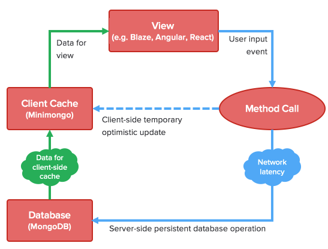

تعج بيئة الجافاسكريبت بعدد هائل من أطر العمل التي تسعى لجعل عمل المطورين أسهل في بناء تطبيقات ويب عصرية وخالية قدر الإمكان من العيوب والأخطاء البرمجية. وتكلمنا في مقالات سابقة عن عدد من أطر عمل جافاسكريبت التي تتصدر المشهد في السنين الأخيرة، ولكن ستكون هذه المرة الأولى التي نتحدث فيها عن إطار عمل آخر له من الشعبية والقوة ما يجعلنا نفرد له هذا المقال : إنه **Meteor.js**.

إطار العمل **Meteor.js** يختلف عن باقي أطر عمل جافاسكريبت المعروفة مثل أنجولار، React.js و Vue.js، فالأخيرة تختص بتطوير الواجهات الأمامية فقط، أي أن دورها كله ينحصر في المتصفح ( *Browser *). أما Meteor.js فيمتاز بكونه أكثر شمولية، حيث يهتم بجهة الخادم كذلك إلى جانب الواجهة الأمامية. بل ويمكن جمع أكواد جهة الخادم وجهة المستخدم في ملف واحد و باستخدام بعض التعابير الشرطية يمكننا أن نقول ل Meteor.js أين سيقوم بتنفيذ هذه الأكواد، هل في المتصفح أو في الخادم :)

if( Meteor.isServer ){

    //افعل شيئا في جهة الخادم

}

if( Meteor.isClient ){

    //افعل شيئا في جهة المستخدم

}

المثير كذلك أن **Meteor** يمكن استخدامه لإنشاء تطبيقات الموبايل بالإعتماد على تقنية كوردوفا، يعني أننا أما تقنية واحدة تمكننا من عمل كل شيء تقريبا يخص تطوير الويب والموبايل.

[bctt tweet="جميع التطبيقات تعمل إما في الخوادم (Server) أو في أجهزة المستخدمين (Client)، بينما Meteor.js يشكل حالة خاصة حيث يشغل كلا المجالين وبكفاءة عالية." username="tutomena" prompt="غرد على تويتر"]

## مميزات أخرى لإطار العمل Meteor.js

### **1\. لا تضيع وقتك في الإعدادات، ابدأ العمل مباشرة**

يعرف **Meteor.js** بأنه **يمنح المطورين تجربة سهلة للغاية للبدء في العمل على تطبيقات الويب** من دون إعدادات تذكر، فقط قم بتثبيت Meteor على جهازك وسيكون بحوزتك بعد ذلك خادم HTTP وإطار عمل افتراضي للواجهات الأمامية اسمه **Blaze** مع إمكانية استخدام أي من إطارات العمل المعروفة مثل **Vue.js** ،**React.js** أو **أنجولار**. ويمكن كذلك تثبيت والإستعانة بكافة الحزم من مستودع **NPM** وكأننا في مشروع Node.js اعتيادي.

Meteor يوفر كذلك بشكل افتراضي خادم MongoDb للتعامل مع قاعدة البيانات، من دون تحميل أي حزمة إضافية وبدون أي إعدادات مسبقة:)

### **2\. Minimongo : نسخة موازية لقاعدة البيانات في الذاكرة**

من مزايا Meteor كذلك ونقاط قوته ما يعرف بنسخة الذاكرة لقاعدة البيانات ( *In-Memory Database Cache *) أو _Minimongo_.

**Minimongo** هي نسخة مطابقة لقاعدة البيانات مخزنة في ذاكرة المتصفح من أجل سهولة الوصول إلى البيانات.

في تطبيقات Meteor يوجد مصدر واحد للحقيقة وهو Minimongo، حيث أنه بمجرد قيام المستخدم بإجراء لتحديث قاعدة البيانات فإن Meteor يقوم بدوره بتحديث النسخة المحلية لقاعدة البيانات بالإعتماد على نمط **Pub/Sub**، بحيث تكون دائما محينة وصالحة لتكون مصدرا للبيانات بالنسبة لجميع المكونات والأجزاء التي تشكل واجهة المستخدم للتطبيق.

هذه الآلية في التحديث والتحكم في حالة واجهة المستخدم تعرف في بيئة Meteor.js باسم **Optimistic UI**.

### **3\. مستوع للحزم خاص ب Meteor.js**

ذكرت سابقا بأن Meteor يدعم حزم مستودع NPM وهذا شيء جيد ويجعل في استطاعتنا الإستعانة بآلاف الحزم على هذا المستودع. مع هذا كله هناك مستودع آخر خاص بتطبيقات Meteor ويضم إلى حدود وقت كتابة هذه الأسطر حوالي 13250 حزمة تغطي كافة جوانب تطبيقات الويب، إنه مستودع **Atmospherejs**.

عند زيارة [Atmospherejs](https://atmospherejs.com/) ستجدون بأن هناك حزما لكافة العمليات والمهام التي تتكرر في أكثر تطبيقات الويب مثل إثبات الهوية (_Authentication_)، تحميل الملفات، إضافة ميزة تعدد الغات (_Internationalization_) إلخ ...

الحزم المتوفرة في هذا المستودع صنعت خصيصا لتعمل مع Meteor وبالتالي فلن تجد معها أي مشكل يخص التوافقية أو الملاءمة مع خصائص هذا الفريموورك.

## النهاية

إذا كنت معجبا بفكرة استخدام لغة برمجة واحدة في كل من جهتي الخادم والمستخدم، وتحب لغة البرمجة جافاسكريبت فأنت بالتأكيد ستعجب بإطار العمل **Meteor.js.**

هذا الإطار يغنيك عن البحث عن سؤال React.js أو Angular، و Express أو Sails... هو يجمع كل هذه الأشياء في قالب خاص به، ويجعلك تركز مباشرة على العمل والبرمجة عوضا عن البحث عن أفضل التقنيات وإعدادها لتعمل مع بعضها البعض على أفضل نحو.
