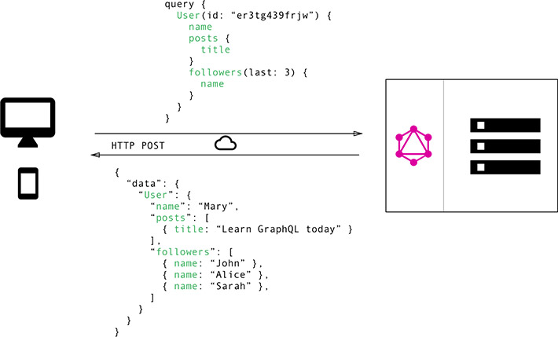

لا يخفى على أحد منا قيمة شركة **فيسبوك** الكبيرة في عالم الديجيتال باعتبارها فيه واحدا من أضخم ثلاثة مشاريع إلى جانب كل من **أمازون** وبطبيعة الحال **قوقل**.

هذا النجاح الذي حظيت به فيسبوك يمكن رده لعوامل متعددة، منها قدرة الشركة على ابتكار أفكار جديدة، وحماية نفسها من المنافسة عن طريق سياسية الإستحواذ على الشركات التي تزاحمها في السوق أو استنساخها في حال لم يستطيعوا الإستحواذ عليها كما حصل مع **سناب شات**.

فيسبوك شبكة اجتماعية لديها ما يناهز 2 مليار مستخدم نشيط. خدمة هذا العدد الهائل من المستخدمين ليس بالأمر الهين، ويعتبر تحديا كبيرا لمهندسي الشركة من أجل إيجاد أفضل الحلول لمنح المستخدمين تجربة ممتعة وسلسة مع فيسبوك عن طريق بناء وتطوير بنية تحتية تقنية مثالية ومحسنة على أفضل نحو.

واحد من مكونات هذه البنية التحتية هو الواجهة الأمامية للموقع، وهي الواجهة التي يتعامل معها مستخدمو الموقع بصفة مباشرة، لذلك كان على مهندسي فيسبوك تسخير كافة إمكانياتهم ومهاراتهم التقنية من أجل إيجاد أحسن الحلول لتطوير وتحسين هذه الواجهة الأمامية.

جهود المهندسين أثمرت عددا من التقنيات الجديدة التي تمت الإستعانة بها في مشاريع فيسبوك الداخلية حتى أثبتت نجاحها وقيمتها العالية، ليتم بعد ذلك إطلاقها على شكل **مشاريع برمجية مفتوحة المصدر** بإمكان أي مطور حول العالم استخدامها والإستعانة بها، بل وحتى المشاركة في تطويرها وتحسينها.

في هذا المقال سأتحدث عن أهم هذه المشاريع البرمجية التي خرجت من مختبرات فيسبوك ونراها اليوم في كل مكان تستخدم من طرف **مطوري الواجهات الأمامية** ( _Frontend Web Developers_ ) في مشاريعهم.

## React.js

مكتبة React.js غنية عن التعريف، فهي الآن تقريبا أشهر مكتبة جافاسكريبت وزاد عدد مستخدميها بوتيرة متسارعة منذ إطلاقها لأول مرة في عام 2013.

[هذه المكتبة كما شرحنا في مقال سابق](https://www.tutomena.com/web-development/javascript/react-javascript-library/) معدة خصيصا لتطوير واجهات المستخدمين في تطبيقات الويب، وفق فلسفة خاصة كانت React سباقة إليها وتتجلى في :

### **1\. JSX**

الإعتماد على امتداد للجافاسكريبت اسمه JSX بهدف إنشاء قوالب بتركيب يشبه شكل HTML ولكن داخل أكواد الجافاسكريبت. هذه القوالب يتم فيما بعد تحويلها لأكواد جافاسكريبت عادية حتى يمكن للمتصفحات التعامل معها.

- للمزيد من التفاصيل حول هذا الموضوع : [Introducing JSX](https://reactjs.org/docs/introducing-jsx.html)

### **2\. Virtual DOM**

الإعتماد على ما يعرف ب [Virtual DOM](https://www.tutomena.com/web-development/javascript/virtual-dom/) بغرض جعل عملية معالجة شجرة DOM في المتصفح أكثر سرعة وكفاءة، حيث يتم تحديث المقاطع أو الأجزاء فقط التي تغيرت حالتها ( _State_ ) في واجهة المستخدم.

شعبية React.js جارفة، حيث تجاوز عدد الإعجابات (النجوم) التي حصلت عليها في منصة Github أزيد من 94 ألفا! لتكون بذلك ثاني أكثر حزمة ويب شعبية في Github بعد Bootstrap.

## نمط Flux

تبنت فيسبوك نمط **Flux** عوضا عن نمط MVC الذي كان دائما هو (أو أحد مشتقاته) النمط الشائع في جميع أطر عمل جافاسكريبت. هذا النمط يتألف من ثلاثة أجزاء أساسية هي :

- Views : وهي ممثلة بمكونات React التي تشكل واجهة التطبيق الرسومية.
- Stores : وهي المخازن حيث توجد جميع البيانات التي تعتمد عليها المكونات (Components) من أجل تحديد حالتها في نقطة زمنية معينة.
- Dispatchers : تقوم المكونات بإطلاق ما يعرف ب _Dispatchers_ بهدف تحديث البيانات في المخازن، ما يعني بعد ذلك مباشرة تحديث حالة (_State_) المكونات والتطبيق بحسب نوعية Dispatcher الذي تم إرساله للمخزن.

[alert type="info" icon-size="normal"]عندما نتحدث عن Flux، فإننا نتكلم عن النمط (_Pattern_) النظري الذي صممته فيسبوك ليشكل أساسا لبناء واجهاتها الرسومية، ولكن قد يعنى به كذلك مكتبة [Flux](https://github.com/facebook/flux) التي طورتها فيسبوك بهدف تنفيذ ومحاكاة هذا النمط على أرض الواقع.[/alert]

توجد عدة مكتبات قامت بتنفيذ (_Implement_) نمط Flux، لعل أشهرها مكتبة Redux التي تحظى بشعبية ممتازة في بيئة React.js. وقاد قام مطورها - Dan Abramov - بتنفيذ نمط Flux بطريقته الخاصة حيث الإعتماد على مخزن واحد للبيانات عوض خاصية المخازن المتعددة في نمط ومكتبة Flux.

## GraphQL

**GraphQL** هو لغة صممت من طرف فيسبوك من أجل بناء الواجهات البرمجية بطريقة جديدة، لتحل بذلك محل طريقة REST المعروفة والتي كانت دائما الخيار الأول وتقريبا الأوحد لدى المطورين.

قامت شركة فيسبوك بإطلاق مشروع GraphQL في عام 2015 أمام المطورين، بعدما تم استخدامه داخليا لعدة سنوات قبل ذلك في مشاريع الشركة.

العديد من الشركات والعلامات التجارية الكبيرة سارعت لتبني نظام GraphQL في واجهاتها البرمجية، شركات من قبيل Github، تويتر، نيويورك تايمز، شوبفاي وعشرات الشركات الأخرى كلها اقتنعت بإمكانيات **GraphQL** كبديل أول لبنية **RESTful**.

GraphQL مشروع مستقل وليس موجها لأية لغة برمجة بعينها، ولكن يمكن التعامل معه بجميع لغات البرمجة المعروفة تقريبا كما ستلاحظون عند زيارة هذه الصفحة من الموقع الرسمي.

خادم GraphQL يقوم بعرض نقطة نهائية (_Endpoint_) واحدة عوضا عن خاصية النقاط المتعددة (_Multiple Endpoints_) في بنيات REST.

المستخدم يقوم بإرسال طلبه لهذه النقطة وسيتولى الخادم مهمة معالجة الطلب وإرسال الجواب على شكل كائن من نوع JSON.

### مثال :

{
book(id: "1") {
title
}
}

الجواب سيكون على هذا الشكل :

{
"title": "Harry Potter"
}

لا حظوا بأننا طلبنا فقط حقلا واحدا (_title_) من الجدول Book في قاعدة البيانات، هذه من الميزات الممتازة في GraphQL حيث نطلب ما نحتاجه فقط. في طريقة REST عند القيام بطلب GET لجلب معلومات كتاب معين من قاعدة البيانات، فإننا سنحصل على جميع معلومات الكتاب حتى عندما نحتاج لمعلومة واحدة فقط كما في مثالنا.

**على كل سأحاول إنجاز درس تفصيلي عن GraphQL في قادم الأيام إن شاء الله لكي تفهموا الموضوع جيدا.**

## مكتبة Jest

مكتبة **Jest** هي واحدة من عشرات المكتبات الخاصة باختبار الشفرات المصدرية لتطبيقات الجافاسكريبت.

قامت شركة فيسبوك بتطوير هذه المكتبة لتكون الطريقة الرسمية المعتمدة لفحص واختبار تطبيقات React.js، مع العلم أنها مكتبة مستقلة بذاتها ويمكن استخدامها كأداة لفحص مختلف مشاريع وتطبيقات جافاسكريبت.

عند إنشاء مشروع React.js بواسطة الحزمة [create-react-app](https://github.com/facebook/create-react-app) فإنه يتم إضافة [مكتبة Jest](https://facebook.github.io/jest/) بشكل افتراضي لحزمة المشروع وإعدادها لتعمل مباشرة عن طريق تنفيذ الأمر _npm test_.

## النهاية

استعرضت في هذا الموضوع فقط أشهر الأدوات التي طورتها شركة فيسبوك، وهناك مكتبات أخرى أقل شهرة في وقتنا الحالي ربما نتطرق لبعضها في مواضيع قادمة.

بدأت فيسبوك دخولها القوي لميدان دعم تطوير تطبيقات الويب الحديثة عن طريق طرح مكتبة رياكت قبل 5 أعوام، وأتبعتها بعد ذلك بعدة مكتبات أخرى لتتكامل معا وتشكل ما بات يعرف اليوم ب **React Ecosystem**. وبغض النظر عن كون هذه المشاريع مفتوحة المصدر وبترخيص MIT، فإنها تدل بما لا يدع مجالا كبيرا للشك على نجاح رؤية وفلسفة فيسبوك ومشاريعها الخاصة التي استطاعت بسرعة كبيرة أن تضم حولها عددا كبيرا من المطورين حول العالم، وتقنعهم بالإنضمام إلى هذا المجتمع الذي أصبح اليوم من أنشط المجتمعات البرمجية على الإنترنت.

---

**اقرأ أيضا :**

- **[كل ما تريد معرفته عن أطر العمل Angular ،React.js و Vue.js](https://www.tutomena.com/web-development/javascript/react-vue-angular-comparison/)**
- **[أهم الأدوات المستخدمة مع React Native لبرمجة تطبيقات الموبايل](https://www.tutomena.com/web-development/javascript/react-native-workflow/)**
- **[شرح أساسيات React.js – مكتبة جافاسكربت لتطوير واجهات المستخدم](https://www.tutomena.com/web-development/javascript/react-javascript-library/)**
- **[مدخل إلى React Native – إطار عمل لبرمجة تطبيقات الموبايل](https://www.tutomena.com/web-development/javascript/%d9%85%d9%82%d8%af%d9%85%d8%a9-%d8%b9%d9%86-react-native/)**
- **[الطريق السالك لكي تصبح مطور React Native](https://www.tutomena.com/web-development/javascript/steps-learn-react-native/)**
