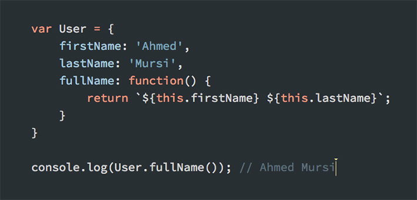
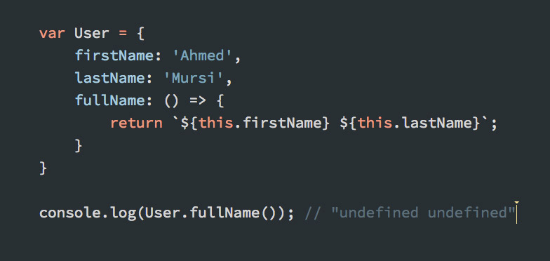

**الدوال السهمية** أو _Arrow functions_ من بين المزايا الجديدة التي ظهرت في إصدار ECMAScript 2015 الحديث للغة البرمجة جافاسكريبت. وساهمت هذه الميزة منذ ذلك الحين في تغيير كبير لطريقة كتابة الدوال في مشاريع الجافاسكريبت.

نالت هذه الإضافة الجديدة استحسان معظم المطورين حول العالم، بحيث أننا لم نعد نرى كثيرا كلمة _function_ عند إنشاء الدوال في الأكواد الحديثة.

## طريقة كتابة مختصرة وسهلة

طريقة كتابة الدوال السهمية بسيطة ومختصرة مقارنة بالطريقة التقليدية، فالتعبير التالي :

const fn = function() {
//...
}

يكافئ :

const fn = () => {
//...
}

هذه الكتابة يمكن أن تُبسط أكثر، حيث يمكن حذف معقوفات الدالة إذا كانت الأخيرة تضم سطرا برمجيا واحدا فقط :

const fn = () => console.log("Test!")

المعاملات يمكن تمريرها بين القوسين :

const fn = (arg1, arg2) => console.log(arg1, arg2)

ويمكن حذف القوسين نهائيا إذا كانت الدالة _تقبل معاملا واحدا_ فقط :

const fn = arg => console.log(arg)

لاحظ كيف تم تبسيط الدوال في جافاسكريبت بفضل هذه الميزة الجديدة :) قد يبدو شكل هذه الدالة مربكاً في البداية، ولكن عند الإعتياد عليها سيزول هذا الإلتباس ويصبح هذا الكود واضح المعنى.

## إرجاع ضمني بدون استخدام كلمة _return_

في الدوال السهمية يمكن القيام بعملية الإرجاع من دون الحاجة لاستخدام الكلمة المفتاحية **return**.

يمكن إرجاع القيمة في حال كان لدينا سطر واحد فقط بهذه الطريقة :

const fn = () => "Test"
fn() //'Test'

في حالة أردنا إرجاع كائن من نوع JSON، يجب إحاطته بقوسين حتى لا يتم اعتبار معقوفتي الكائن على أنهما خاصتين بالدالة ;)

const fn = () => ( {key: "Test"} )
fn() //{key: "Test"}

## الكائن this يعمل بشكل مختلف في الدوال السهمية

يعتبر الكائن **this** من أكثر المفاهيم استشكالا على مطوري الجافاسكريبت، حتى المحترفين منهم في أحيان كثيرة. هذا الكائن يعمل بعدة أشكال مختلفة بحسب السياق الذي تم فيه استخدامه.

من الجيد الإشارة إلى اختلاف الدوال السهمية في هذه الناحية عن الدوال التقليدية. الأخيرة عندما تكون بداخل كائن جافاسكريبت فإن _this_ بداخلها يشير إلى الكائن الأب، الذي توجد بداخله الدالة التقليدية.

لنلاحظ هذا المثال :

النتيجة هنا طبيعية بالنظر إلى أن _this_ يشير إلى الكائن _User_ الذي بدوره يتوفر على الخاصيتين _firstName_ و _lastName_.

أما الدوال السهمية، فهي كما قلنا تعمل بشكل مختلف. لاحظوا هذا الكود :

النتيجة هنا كما ترون هي "undefined undefined"، لأن الدوال السهمية ترث قيمة الكائن _this_ من ما يعرف ب _Context Execution_ أو **سياق التنفيذ** الخاص بها، وهو في حالتنا _window_ أو _null_ في حالة تم استخدام وضع "_use strict_".

من هذا نستنتج أن الدوال السهمية لا تصلح لتكون وظائف (methods) بداخل Literal Objects في جافاسكريبت. كما أنه لا يمكن استخدامها ك Constructors كما نفعل مع الدوال التقليدية.

هناك حالة أخرى لا ينصح فيها باستخدام Arrow Functions، أتحدث هنا عن دوال الإرجاع Callbacks الخاصة بأحداث DOM.

أنظروا إلى المثالين الآتيين لتعرفوا السبب :

const link = document.querySelector('#link')
link.addEventListener('click', () => {
// this === window
})

const link = document.querySelector('#link')
link.addEventListener('click', function() {
// this === link
})

لاحظوا بأن _this_ داخل **دالة الإرجاع السهمية** يشير إلى الكائن العام *window.* هذا غير مناسب لنا في هذه الحالة ولا يبدو منطقيا، فنحن عادة نحتاج في دالة الإرجاع لحدث معين أن يشير _this_ إلى العنصر صاحب هذا الحدث، وهو في حالتنا العنصر **link#**. لهذا يجب دائما الإبتعاد عن الدوال السهمية في مثل هذه المواقف لأنها غير مجدية.

للتعرف أكثر على الحالات التي **لا يجب فيها** الإستعانة بالدول السهمية، أنصحكم بقراءة [هذا المقال الممتاز من مدونة WesBos](https://wesbos.com/arrow-function-no-no/).

---

**مراجع :**

- [https://flaviocopes.com/javascript-arrow-functions/](https://flaviocopes.com/javascript-arrow-functions/)
- [https://wesbos.com/arrow-function-no-no/](https://wesbos.com/arrow-function-no-no/)
