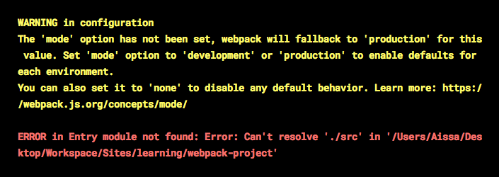
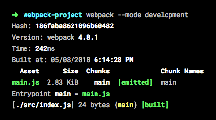
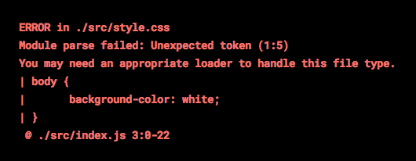
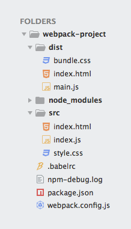

تحدثنا في مقال سابق عن **Webpack** من الناحية النظرية، وشرحنا دوره وأهميته في حياة مطوري الويب هذه الأيام.

وكنت قد وعدتكم بأن أقوم بإعداد درس جديد من أجل شرح Webpack واكتشافه بطريقة عملية حتى تترسخ في أذهاننا المفاهيم التي رأيناها في الدرس السابق، وها أنا اليوم أفي بوعدي لكم :)

سنسير في هذا الدرس خطوغ بخطوة لنرى كيفية إعداد **ويب باك** من الصفر من أجل تكييفه مع احتياجات مشروعنا، وقد يكون هذا الدرس طويلا لأنني لا أريد أن أحرق أي مرحلة مهما كانت بسيطة حتى يكون الشرح في متناول المبتدئين والمتقدمين على السواء.

## البداية

لننشئ مجلدا اسمه _wepback-project_ ونقوم بالدخول إليه :

```
mkdir wepback-project
cd wepback-project
```

ثم لنقم بتهيئة ملف _packages.json_ عن طريق هذا الأمر :

```
npm init
```

بعد إنشاء الملف _packages.json_ سنقوم بتحميل **Webpack 4**، وهي آخر نسحة من Webpack لحدود كتابة هذه الأسطر، مع تحميل حزمة Webpack-cli لتنفيذ بعض أوامر Webpack انطلاقا من Terminal.

```
npm install webpack webpack-cli --save-dev
```

الآن، عند تنفيذ الأمر webpack  من نافذة Terminal فإنه ستظهر لنا رسالة الخطأ هذه :

[](../images/webpack-error.png)

الرسالة باللون الأصفر هي فقط رسالة تحذيرية تعلمنا بأن WEBPACK يفترض مسبقا بأننا في وضع الإنتاج (_Production_) إذا لم نقل له العكس، وبالتالي فإنه قد يقوم بتنفيذ بعض المهام الخاصة بهذا الوضع مثل ضغط ملفات CSS و JS إلخ...

أما الرسالة الثانية باللون الأحمر فهي رسالة خطأ تقول لنا بأن WEBPACK يبحث عن مجلد اسمه _src_ في مشروعنا ولكن لم يجده. فانطلاقا من النسخة الرابعة، أصبح Webpack يعتمد مقاربة **_zero configuration_** التي تمكننا من القيام بعدد من المهام الأساسية من دون إنشاء ملف الإعدادات *webpack.config.js*. لهذا يفترض هذا المحزم بأن هناك مجلد اسمه _src_ وبداخله ملف _index.js_، ويمكننا طبعا تغيير هذه الإعدادات الإفتراضية عبر ملف _webpack.config.js_ كما سنرى لاحقا، أو حتى من دونه إنطلاقا من الأوامر السطرية فقط :

```
webpack ./src/index.js --output ./dist/main.js
```

### وضع التطوير

لنقم بإنشاء المجلد _src_ وملف _index.js_ بداخله.

وبما أننا في **مرحلة التطوير**، فسنطلب من Webpack أن يقوم بعمله بناء على هذا الوضع، والطريقة هي عبر إضافة العلم _mode--_ لأوامر ويب باك :

```
webpack --mode development
```

[](../images/webpack-success.png)

بعد تنفيذ هذا الأمر، ستتم عملية التحزيم بنجاح لأن **ويب باك** وجد كل الظروف التي افترضها مسبقا. وستلاحظون بأنه قام بإنشاء مجلد جديد اسمه _dist_ بداخله ملف جافاسكريبت *main.js* وبداخله كود الجافاسكريبت المحزم، غير مضغوط لأننا طلبنا من Webpack أن يعمل وفق إعدادات وضع التطوير _Development_.

ولجعل بيئة عملنا أكثر احترافية وعملية، سنقوم بتنفيذ أوامر Webpack من داخل سكريبتات npm التي نقوم بإضافتها داخل الملف _package.json_ في منطقة _scripts. إليكم الطريقة :_

```json
"scripts": {
"dev": "webpack --mode development"
}
```

لإعادة تنفيذ الأمر السابق webpack --mode development ، يكفي تنفيذ هذا الأمر :

```
npm run dev
```

بهذه الطريقة يمكننا تنفيذ أوامر npm مهما كانت معقدة، ومهما أظفنا أعلاما وخصائص جديدة لأوامر Webpack فإن أمر npm الذي نقوم بتنفيذه في نافذة Terminal يبقى كما هو. وحتى إذا قدر لمطور آخر أن يعمل على مشروعنا، فسيمكنه معرفة الأوامر التي يجب تنفيذها على المشروع فقط بفتح الملف _package.json_ ومعاينة الأوامر داخل الخاصية {} scripts *.*

لإضافة وضع بناء جديد خاص **بمرحلة الإنتاج**، فيمكننا إنشاء سكريبت جديد اسمه مثلا _build_ بنفس الكيفية التي أضفنا بها السكريبت _dev_.

```json
"scripts": {
  "dev": "webpack --mode development",
  "build": "webpack --mode production"
}
```

```
npm run build
```

لكي لا نضطر لإعادة تنفيذ هذه الأوامر بعد كل عملية تعديل على الملف _index.js_، سنقوم بإضافة علم جديد (_flag_) اسمه _watch--_ لأوامر Webpack بهذه الكيفية :

```json
"scripts": {
  "dev": "webpack --mode development --watch",
  "build": "webpack --mode production --watch"
}
```

## لنبدأ العمل في الأمور الجادة

أحدث طريقة لكتابة أكواد الجافاسكريبت معروفة باسم **ES6**، ولكن مع الأسف لا تدعمها حتى الآن بشكل كامل كل المتصفحات الكبيرة، لذلك علينا تحويل أكواد جافاسكريبت ES6 إلى أكواد جافاسكريبت ES5 مدعومة من كافة المتصفحات. هذه العملية معروفة باسم **Transpiling**، ويعتبر Babel هو أشهر Transpiler لأكواد الجافاسكريبت في الوقت الحالي.

لنكتشف معا كيفية استخدام Babel مع Webpack :)

### تحميل وإعداد بابل Babel

أولا علينا تحميل بابل من مستودع npm مع ملحقاته التي سوف نحتاجها.

```
npm install babel-core babel-loader babel-preset-env --save-dev
```

قمنا هنا بتحميل 3 حزم :

1. **babel-core** : الحزمة التي تحتوي على الشفرة المصدرية لنواة بابل.
2. **babel-preset-env** : الحزمة التي تمكن نواة بابل من تحويل أكواد جافاسكريبت ES6 إلى أكواد جافاسكريبت ES5.
3. **babel-loader** : هذه الحزمة تمثل ال **loader** الذي يستخدمه webpack لكي يعمل بتوافقية كاملة مع Babel. يعني أن Webpack يستعين **ببابل** في عملية Transpiling قبل أن يقوم بعملية التجميع أو التحزيم ( *Bundling *).

[alert type="info" icon-size="normal"]كما شرحنا في [المقال السابق](https://www.tutomena.com/web-development/javascript/what-is-webpack/)، فإن Webpack يعتمد على ما يعرف ب Loaders لكي يتمكن من تحزيم ومعالجة مختلف أنواع الملفات، وليس فقط ملفات جافاسكريبت (صور، CSS، خطوط، JSX ،TypeScript إلخ ...). [/alert]

الآن بعد أن قمنا بتحميل الحزم الثلاث، سنقوم بإنشاء ملف اسمه *babelrc.* لكي نطلب من بابل أن يستخدم الإضافة _babel-preset-env_ ( تعرف هذه الإضافات في بيئة "بابل" ب Presets ) أثناء عملية _Transpiling_. ونكتب بداخله ما يلي :

```json
{
  "presets": ["env"]
}
```

جاء الوقت الآن لنطلب من "ويب باك" أن يستعين ب Babel، سنفعل ذلك عن طريق ملف _webpack.config.js_ الذي ذكرناه أكثر من مرة.

## إعداد "ويب باك"

نحن الآن مطالبين بالإستعانة بالملف _webpack.config.js_ من أجل إضافة عدد من الإعدادات المتقدمة ل Webpack.

لنشئ هذا الملف الآن، ولنضع فيه المحتوى التالي :

```js
const path = require('path');

module.exports = {
  entry: { main: './src/index.js' },
  output: {
    path: path.resolve(__dirname, 'dist'),
    filename: 'main.js'
  }
};
```

هذا هو أبسط صورة يمكن أن يكون عليها الملف _webpack.config.js_، وهذا الكود بسيط حيث يطلب من **ويب باك** فقط أن يبدأ التحزيم من ملف _index.js (يسمى Entry point)_ على أن يجمع الكود النهائي في ملف _main.js (يسمى Output file)_ وهي كما رأينا سابقا الإعدادات الإفتراضية التي يمكن تغييرها كما شئنا.

لنطلب الآن من Webpack أن يستخدم الحزمة _babel-loader_ لكي نتمكن من كتابة أكواد جافاسكريبت ES6 :

```js
const path = require('path');

module.exports = {
  entry: { main: './src/index.js' },
  output: {
    path: path.resolve(__dirname, 'dist'),
    filename: 'main.js'
  },
  module: {
    rules: [
      {
        test: /\.js$/,
        exclude: /node_modules/,
        use: {
          loader: 'babel-loader'
        }
      }
    ]
  }
};
```

لاحظوا بأننا أضفنا المنطقة _{} module_، هناك سيتم إضافة وإعداد جميع ال _Loaders_ التي نحتاجها مع webpack في مشروعنا. بداخل المصفوفة _rules_ نضع هذه ال loaders على شكل كائنات من نوع JSON، وكل كائن يضم مجموعة من الخصائص أهمها :

- **test** : هذه الخاصية عبارة عن RegEx وتحدد ل webpack أي نوع من الملفات سيقوم بإجراء هذا loader عليها.
- **exclude** : الملفات التي نريد استبعادها رغم أنها تحقق ال _RegEx_ المحدد في الخاصية _test_.
- **use** : هذه الخاصية تخبر Webpack بال _loaders_ التي عليه إجراؤها وتطبيقها على هذه الملفات. (_babel-loader_ في حالتنا).

سنفتح الآن الملف _index.js_ ونكتب فيه بعضا من كود جافاسكريبت ES6 :

```js
// src/index.js

const fn = () => "Arrow functions're Working!";

alert(fn());
```

بعد تنفيذ الأمر **npm run dev** سنلاحظ بأن Webpack قام بعملية التجميع في الملف _main.js_ مع تحويل [الدالة السهمية](https://www.tutomena.com/web-development/javascript/arrow-functions-javascript/) (_Arrow function_) أعلاه إلى دالة تقليدية بطريقة جافاسكريبت ES5.

```js
// dist/main.js

'use strict';

var fn = function fn() {
  return "Arrow functions're Working!";
};

alert(fn());
```

إذن أصبح بإمكاننا الآن كتابة أكواد جافاسكريبت الحديثة في مشروعنا، و Webpack بفضل ال babel-loader سيتولى مهمة تجميعها وتحويلها لأكواد جافاسكريبت ES5 المدعومة من معظم المتصفحات.

## ماذا عن ملفات HTML ؟

نحن الآن لدينا ملف _dist/main.js_ المحزم والجاهز للإستدعاء في صفحة الويب، ولكن أين هي هذه الصفحة ؟ لا تقلق، صديقي، سنقوم بإضافتها حالا.

لنقم بإنشاء ملف اسمه _index.html_ داخل المجلد _src_ ونضع فيه المحتوى التالي :

<div class="filename">dist/index.html</div>

```html
<html>
  <head> </head>

  <body>
    <h1>مرحبا بكم في توتومينا :)</h1>
  </body>
</html>
```

هناك مشكلة صغيرة تواجهنا الآن :( عندما نقوم بتنفيذ الأمر _npm run dev_ فإنه لا يتم إنشاء أي ملف HTML داخل المجلد *dist،* رغم أننا قمنا بإنشاء الملف index.html في المجلد _src_. من الواضح إذن بأن Webpack لا يستطيع لوحده القيام بهذه المهمة. سنقوم بمساعدته بواسطة إضافة جديدة ( *Plugin *) اسمها [HTML Webpack Plugin](https://github.com/jantimon/html-webpack-plugin).

تلاحظون كذلك أننا لم نقم باستدعاء أي ملف جافاسكريبت في الصفحة _src/index.html_ :) سنترك هذه المهمة أيضا للإضافة **HTML Webpack Plugin** التي سنقوم بتثبيها في مشروعنا حالا ؛)

```
npm i --save-dev html-webpack-plugin
```

بعد تثبيت إضافتنا الجديدة، سنقوم بإعداد Webpack لكي يقوم باستخدامها. هيا بنا إلى الملف _webpack.config.js_ :)

```js
...

const HtmlWebpackPlugin = require('html-webpack-plugin')

module.exports = {
  entry: {
  ...
  },
  output: {
  ...
  },
  module: {
    rules: [
    ...
    ]
  },
  plugins: [
    new HtmlWebpackPlugin({
      hash: true,
      template: './src/index.html',
      filename: 'index.html'
    })
  ]

};
```

في البداية قمنا بإنشاء متغير (كلاس) جديد **HtmlWebpackPlugin** انطلاقا من الحزمة *html-webpack-plugin،* ثم قمنا بإنشاء نموذج (_Instance_) من هذا الكلاس داخل المصفوفة _plugins_، وبعد ذلك قمنا بتمرير 3 معاملات :

- **hash** : قمنا بتمرير _true_ لهذا المعامل حتى يتم إضافة سلسلة حروف وأرقام عشوائية إلى نهاية اسم ملف الجافاسكريبت المحزم ( مثال:  *main.js?3cbc8ec659d08ad396e1* ) عند استدعائه في الصفحة. يستخدم هذا ال Hash لأغراض تتعلق بالكاش Cache الخاص بالصفحة.
- **template** : هذا المعامل يمثل مسار القالب الذي سيبنى عليه ملف HTML المُخرَج.
- **filename** : اسم ملف HTMLالمُخرَج.

وهناك مجموعة من المعاملات الأخرى يمكنكم الإطلاع عليها في صفحة الإضافة على Github.

الآن، بعض تنفيذ _npm run dev_ مرة أخرى سنرى بأن Webpack قام بإنشاء ملف _index.html_ داخل المجلد _dist_ مع استدعاء الملف _main.js_ المحزم (_Bundled_).

<div class="filename">dist/index.html</div>

```html
<html>
  <head> </head>

  <body>
    <h1>مرحبا بكم في توتومينا :)</h1>

    <script type="text/javascript" src="main.js?3cbc8ec659d08ad396e1"></script>
  </body>
</html>
```

## لم ننتهي بعد! أين هو CSS ؟

لا يوجد تطبيق ويب من دون CSS، لنقم بإنشاء ملف _style.css_ في المجلد _src_.

ثم لنقم باستدعائه من ملف _index.js_، نعم من الجافاسكريبت :D

```js
// src/index.js

import './style.css';

const fn = () => "Arrow functions're Working!";
alert(fn());
```

Webpack لا يستطيع التعامل مع ملفات CSS، فهو دائما ينتظر ملفات JavaScript. لهذا عند تشغيله سيظهر لنا هذا الخطأ الجميل والذي يخبرنا بأنه علينا مساعدة Webpack في إيجاد حل للتعامل مع ملفات CSS وذلك بتثبيت ال Loader المناسب لهذه الحالة.

[](../images/webpack-css-error.png)

ال Loader الذي نحتاجه هنا موجود واسمه [css-loader](https://github.com/webpack-contrib/css-loader)، لنقم بتثبيته الآن :

npm install --save-dev css-loader

هذا loader يمكن Webpack من استيراد أكواد CSS باستخدام _import_ أو _require_، وهذه حدود دور css-loader، هذا الدور ضروري ولكنه غير كافي.

نحن الآن لدينا ال CSS المستورد بفضل css-loader، ولكن كيف نقوم باستدعاء هذا CSS في الصفحة ؟

لحسن الحظ هناك إضافة (Plugin) أخرى اسمها [mini-css-extract-plugin](https://github.com/webpack-contrib/mini-css-extract-plugin) وتمكن من استخلاص ال CSS المستورد ووضعه في ملف (أو ملفات) CSS منفصل.

لنقم بتثبيت هذه الإضافة :

```
npm install --save-dev mini-css-extract-plugin
```

بعد التثبيت، سنقوم بإعداد Webpack لكي يستعين بهذه الإضافة الجديدة :

<div class="filename">webpack.config.js</div>

```js

...

const MiniCssExtractPlugin = require("mini-css-extract-plugin");

module.exports = {
  entry: { ... },
  output: {
  ...
  },
  module: {
  rules: [
    ...
    ,{
      test: /\.css$/,
      use: [
        MiniCssExtractPlugin.loader,
        "css-loader"
      ]
    }
  ]
  },
  plugins: [
    ...,
    new MiniCssExtractPlugin({
      filename: "bundle.css"
    })
  ]
};
```

مثلما فعلنا مع إضافة _HtmlWebpackPlugin_، قمنا بإنشاء نموذج من الكلاس MiniCssExtractPlugin وأضفناه في المصفوعة plugins، ثم طلبنا منه أن يكون اسم ملف ال CSS المخرج **bundle.css**. ولا ننسى كذلك أننا أعطينا تعليمات لِ Webpack من داخل المصفوفة rules لكي يقوم بإجراء _css-loader_ و *MiniCssExtractPlugin.loader* (هذا الأخير يمكن تعويضه ب [style-loader](https://github.com/webpack-contrib/style-loader) بعد تثبيته) على جميع الملفات من نوع css.

ومن الآن، بعد تشغيل Webpack سيتم استخلاص ال css المستورد من داخل الجافاسكريبت ويضاف إلى ملف جديد اسمه _bundle.css_ في المجلد _dist_، ثم يتم استدعائه تلقائيا في الملف _dist/index.html_ :) إليكم الحالة النهائية لهذا الملف :

<div class="filename">dist/index.html</div>

```html
<html>
  <head>
    <link href="bundle.css?a583e8290b8c96b0a276" rel="stylesheet" />
  </head>

  <body>
    <h1>مرحبا بكم في توتومينا :)</h1>
    <script type="text/javascript" src="main.js?a583e8290b8c96b0a276"></script>
  </body>
</html>
```

وفي الصورة التالية، تجدون البنية النهائية لمشروعنا :

[](../images/folders-tree.png)

## النهاية

هكذا تعلمنا اليوم كيفية إضافة **Webpack** إلى مشاريعنا والإستعانة بالمزايا العديدة التي يوفرها بفضل العدد الكبير من Loaders و Plugins التي تزخر بها هذه البيئة.

المهام التي أنجزناها في هذا الدرس تعتبر بسيطة مقارنة بكل ما يمكن القيام به، حتى الإضافات و Loaders التي تطرقنا إليها اليوم لم نرى من إمكانياتها سوى القليل، فأدعوكم لزيارة صفحات كل واحدة منها على Github لإكتشاف جميع المزايا التي تقدمها.

لا تبخلوا علي بآرائكم حول هذه التقنية الرائعة، كما أدعوكم لطرح استفساراتكم وأسئلتكم حول هذا الموضوع في صندوق التعليقات أسفله، سأسعد كثيرا بالتواصل معكم :D
