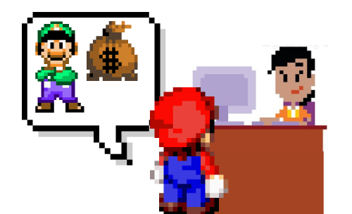
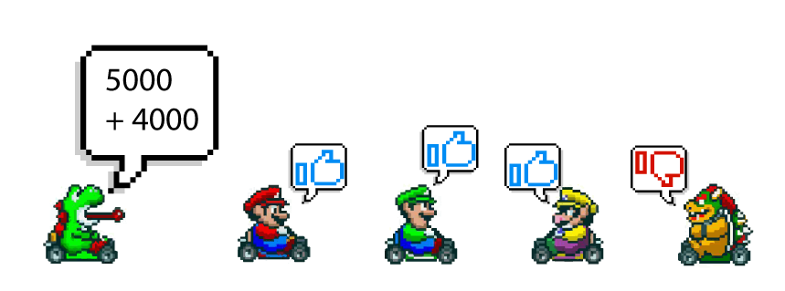
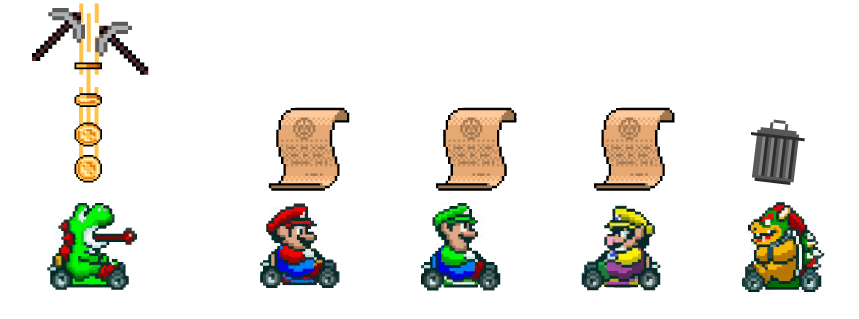

في السنين الأخيرة، تعالت الأصوات والكتابات التي تتحدث عن **بلوك تشين Blockchain** والعملات الرقمية، خاصة مع الإنفجار الكبير الذي شهدته قيمة العملة الأشهر بيتكوين العام الماضي. فما علاقة بلوكتشين إذن بعملة بيتكوين والعملات الرقمية بصفة عامة ؟ ما هي آلية عملها ؟ ولماذا حصلت على كل هذه الشعبية حتى باتت [من أكثر الإتجاهات التقنية طلبا في سوق العمل](https://www.tutomena.com/web-development/programming-trends-in-the-near-future/) على مستوى العالم ؟

سنجيب على هذه الأسئلة من خلال هذا المقال الذي نشره _Bruno Skvorc_ على موقعه الإلكتروني [Bitfalls](https://bitfalls.com/2017/08/20/blockchain-explained-blockchain-works/) والذي قمنا بترجمته بعد الحصول على تصريح منه.

## **ماريو و** **لويجي**

ماريو يحتاج إلى إرسال 100 دولار لأخيه لويجي لأن هذا الأخير يحتاج إلى ذلك المبلغ لتسديد ديونه التي لا تحتمل التأجيل.

[](../images/blockchain-01.png)

يدخل ماريو إلى البنك ويقول لموظف البنك: "أريد إرسال 100 دولار إلى لويجي".

يقول الصراف: بطاقة الحساب أو بطاقة تعريف الهوية من فضلك.

بعد ذلك يقوم الموظف بعملية التحويل فيخبر ماريو بأن العملية تمت بنجاح وتم إرسال المال.

[](../images/blockchain-02.png)

في هذا **السيناريو المركزي**، يكون البنك هو السلطة المركزية على أموال **ماريو** و**لويجي**. كلاهما يثقان في البنك لتحويل المبلغ من الطرف المرسل إلى المرسل إليه، وهما يؤمنان بصحة الأرقام التي تظهر لهما في كشف الحساب البنكي الخاص بكل منهما، على الرغم من حقيقة أن كل ما يتوجب على البنك فعله هو تغيير رقم في قاعدة البيانات حيث كل شيء رقمي.

[](../images/blockchain-03.png)

ومع ذلك، هذه السلطة المركزية تشكل تهديدا معينا لنا. إذ من المحتمل دائما أن تختفي أموالنا المخزنة لديها، فيمكن أن يكون هناك تلاعب بالحسابات من قبل موظف خبيث أو حتى من بنك نصاب، أو يمكن أن تضيع أموالنا بسبب خطأ تقني. في النهاية تعتمد مواردنا المالية بشكل مباشر على كفاءة هذه الأنظمة المعلوماتية.

إحدى طرق منع مثل هذه السيناريوهات هي تخطي البنك بالكامل وإيجاد نظام تتبع خاص بنا وارسال الأموال من موقع إلى آخر.

تخيل قطعة من الورق نسجل عليها حالة حسابنا المصرفي. إذا كان **ماريو** و**لويجي** يستخدمان ذلك النظام فقط، فمن الصعب الحفاظ عليه عادلاً إذا أصبح أحدهم جشعًا، فسيكون النظام قد تعرض بالفعل للخطر. ومن ثم فإن مثل هذا النظام الموزع غير المركزي يحتاج إلى عدد كاف من المشاركين لجعله قابلاً للتطبيق، على الأقل ثلاثة مشاركين.

## **الأوراق**

دعونا نفترض أن لدينا خمسة مشاركين: **يوشي**، **ماريو** ، **لويجي**، **واريو** و**باوزر.**

كل واحد منهم لديه ورقة خاصة به.

[](../images/blockchain-04.png)

**ماريو** يريد إرسال 100 دولار إلى **لويجي**.

للقيام بذلك، يقول للجميع _صراحة_: "سأرسل 100 دولار إلى **لويجي**! أرجوكم دونوا جميعا هذه العملية!"

[](../images/blockchain-05.png)

في تلك اللحظة، يتحقق كل مشارك من حساب **ماريو** للتأكد من أن لديه قيمة كافية لإتمام عملية الإرسال إلى **لويجي** (نعم، يمكن للجميع الإطلاع على حالة حساب **لويجي**) وإذا كان الأمر كذلك، يتم تسجيل هذه المعاملة في قطعة الورق الخاصة به. وهكذا يتم تدوين كل معاملة بين شخصين في كل ورقة من أوراق المشاركين.

قبل أن نودع الورق المعبأ في مجلد أو خزانة الملفات ونأخذ ورقة جديدة فارغة، نحتاج إلى ختم الورقة المملوءة **برمز خاص**.

## **الأختام والتعدين**

الرمز الخاص أو **الختم** يضمن أن محتويات الورقة صحيحة.

كيف نحصل على هذا الختم؟ باستخدام خوارزمية خاصة (عملية حسابية)، عندما نقوم بإدخال بعض بيانات الإدخال، ننتج دائماً نفس المخرجات _إذا كانت بيانات الإدخال هي نفسها_.

لنأخذ ما يلي على سبيل المثال:

X1 + X2 + … XN = Z

لنفترض أن قيمنا الورقية صحيحة وصالحة (بمعنى أنه تم تأكيد جميع المعاملات) إذا وفقط إذا كانت عملية تجميع معينة تُنتج الرقم 10000.

1000 + 6000 + 3000 = 10000

في هذه الحالة، تكون بيانات الإدخال 1000 و 6000 و 3000، بينما يكون الختم 10000.

حسنًا، لنفترض أن المشتركين لدينا أعلاه توصلوا إلى الاتفاقية التالية: إذا تم تجميع كل الأرقام الموجودة على الورق ومزيجًا محددًا من الأرقام الأخرى، وحصلنا على 10000، إذن المعاملات على هذه الورقة صالحة ويمكن أن تتم المصادقة عليها.

على سبيل المثال، إذا كان الورق يحتوي على المعاملات الخمسة التالية:

ماريو ← لويجي = 100

باوزر ← يوشي = 200

يوشي ← لويجي = 100

ماريو ← يوشي = 500

لويجي ← واريو= 100

المجموع هو 1000، لذلك نحن نبحث عن رقم يعطي 10000 عند إضافته إلى 1000. يمكن تحقيق هذا المبلغ المتبقي 9000 مع العديد من المجموعات:

- 5000 + 4000
- 1000 + 1000 + 1000 + 1000 + 1000 + 1000 + 1000 + 1000 + 1000
- 2000 + 3000 + 2000 + 2000
- إلخ...

جهاز الكمبيوتر لا يمكنه أن يحدد الأرقام التي ستنتج الرقم المطلوب بشكل سريع وبديهي. بل عليه أن يخمن عشوائيا بين مجموعات مختلفة من الأرقام تحت 10000 حتى يحصل على تركيبة واحدة تنتج 10000. وهكذا، الشخص الأول الذي يتوصل إلى التركيبة الصحيحة هو الذي لديه الحق في إخبار الأطراف الأخرى كلها بالنتيجة التي توصل إليها.

لنفترض أن **يوشي** وجد الجمع بين 4000 + 5000 هو 10000. سيقول للجميع: "لدي 10000! جرّب 4000 و 5000! ".

نظرًا لأنه من السهل جدًا التحقق من صحة أرقام **يوشي** عن طريق إدخالها في الخوارزمية، فجميع المشاركين الآخرين يمكنهم أن يتأكدوا بأن أوراقهم تنتج أيضا 10000 عندما يتم جمع 4000 و 5000 مع مجموع المعاملات التي سجلوها عندهم. ومن خلال ذلك، يتم التوصل إلى توافق في الآراء بأن جميع السجلات صالحة.

[](../images/blockchain-07.png)

إذا كانت ورقة شخص ما لا تنتج 10000 عندما يتم جمعها مع 4000 و 5000، فنحن نواجه مشكلة. على سبيل المثال، إذا قام **باوزر** بتسجيل أي معاملة غير صحيحة عن قصد أو غير قصد - مثلا ماريو أعطى **لويجي** 200 دولارًا وليس 100 - فحينئذٍ لن يكون المبلغ مطابقًا للمتطلبات.

وبالتالي تعتبر ورقة **باوزر** غير صالحة، وإذا أراد الاستمرار في المشاركة في هذا النظام، فسيتعين عليه التخلص من ورقته، ونسخ ورقة صالحة لشخص آخر، ويعد بأن يكون أكثر حذراً في المستقبل.

من ناحية أخرى، يحصل **يوشي** - الذي كان الشخص الذي وجد المجموعة الفائزة - على جائزة، على سبيل المثال 5 دولارات من النظام. ينتج النظام 5 دولارات كمكافأة للمشارك المحظوظ.

[](../images/blockchain-08.png)

5 دولارات تلك تم إنتاجها من الهواء، وفي عالم العملات الرقمية المشفرة تدعى **عملية التعدين**، حيث يحصل المشتركون في التعدين على مبالغ مختلفة ومتنوعة تدعى المكافأة.

في حين كان هذا مثالًا مبسطًا بشكل كبير، فإن الاختلاف الحقيقي الوحيد مع **بلوك تشين** الحقيقي (إلى جانب أنه في الواقع كل شيء رقمي وآلي) هو أن الخوارزمية المستخدمة لإنتاج **الختم** مختلفة وأكثر تعقيدًا، ويمكنها قبول كل من الأرقام والحروف، فيشبه الختم المخرج شيئا من هذا القبيل :

```
90BDAA79BBCCACF8558EDCBB30DF48D7FC920EEB75A28F883DE4100F58A99B49
```

تسمى الأختام **Hashes**، والخوارزميات المنتجة لها مثل SHA256 - التي أنتجت الشفرة أعلاه - **hashing functions**. حاول [فتح هذا الرابط](http://www.xorbin.com/tools/sha256-hash-calculator) وإدخال أي مقدار من النص في الحقل، سواء أدخلت كلمة واحدة أو محتوى كتاب بأكمله، سينتج دائمًا ختم من 64 حرفًا بالضبط.

بالتالي، للحصول على Hash الذي يختم ورقتنا، نمرر للخوارزمية جميع التعاملات على تلك الورقة. وبما أن هناك عدد لا متناهي من المجموعات _Combinations_ التي يمكن إعطاؤها كمدخل _Input_ للخوارزمية، فإنه يصبح من الإستحالة ـ رياضيا ـ تخمين تلك المدخلات بالإعتماد فقط على المخرج _Output_.

على وجه التحديد، في بلوك تشين **بيتكوين**، يكون الإتفاق في الشبكة وجميع المشاركين فيها أنه ما إن يتم إنتاج ختم Hash (_الذي نحصل عليه من المزج بين ختم الورقة الأخيرة وجميع التعاملات في الورق الحالي، بالإضافة إلى عدد عشوائي من الأرقام و الحروف_) تبدأ بعدد معين من الأصفار فإنها بذلك تكون صالحة.

على سبيل المثال، إذا كان للورقة 1 ختم أو Hash بقيمة `0000000000000000058edcbb30df48d7fc920eeb75a28f883de4100f58a99b49`، فسيكون ختم الورق 2 صحيحًا (_عندما تتم إضافة تعاملات الورقة الحالية وبعض البيانات العشوائية إلى ختم الورقة السابقة_) إذا كان يحتوي في المقدمة على عدد أصفار أكبر من أو يساوي العدد في الختم السابق.

للحصول على هذا المزيج من الأحرف العشوائية اللازمة لإنتاج ختم صالح جديد، يجب على الكمبيوتر إجراء عمليات تخمين.

[](../images/cryptocurrency-farm.jpg)

تتسم أجهزة الكمبيوتر الحديثة بالسرعة الفائقة وتجربة الآلاف من المجموعات في الثانية، ولكن لا يزال ذلك غير كافي لأن عدد المجموعات الممكنة تقريبًا لا نهائية.

كما رأينا أعلاه، درجة صعوبة عملية تخمين واحدة هي 17، لأن هناك 17 صفراً في مقدمة الختم. مع مرور الوقت، ستزداد الصعوبة وسيحتاج الختم الجديد إلى أعدد أصفار أكبر من 17 في المقدمة حتى يكون صالحا.

عندما يتم ختم ورقة كل من المشاركين على أنها صالحة، يتم إيداعها في ملف وتسحب ورقة بيضاء جديدة.

## **بلغة بلوك تشين Blockchain**

- ورقة واحدة هي **Block **أو **كتلة**.
- **Block** واحد يحتوي على العديد من التعاملات (_Transactions_).
- ال Block الجديد يتبع دائما ال Block السابق، لتتشكل سلسلة بلوك تشين **blockchain **أو **سلسلة الكتل**. يتم وضع الكتل المصادق عليها في ملف يعرف **بدفتر حسابات أو** **Ledger** (_مرادف لبلوك تشين_).
- تسمى أجهزة الكمبيوتر التي تقوم بتخمين المجموعات بالعقد **Nodes**. العقدة التي تخمن تركيبة الختم Hash تحصل على مكافأة في شكل رموز بلوك تشين، وفي مثالنا في الأعلى نتحدث عن مكافأة مكونة من عدد قليل من بيتكوين.
- يُطلق على هذا التخمين اسم **التعدين**، لأننا نحفر للحصول على قيمة جديدة في كومة كبيرة من التخمينات العشوائية. وبدلاً من استخدام العضلات والمعاول، نستخدم الكهرباء والوقت وقوة حساب الكمبيوتر.
- أيًا كان من يثبت أولاً صلاحية كتلة Block يعتبر فائزا ويحصل على جائزة. وفي عالم **بلوك تشين**، أقوى أجهزة الكمبيوتر (أو أجهزة التعدين القوية) عادة ما تربح المكافآت.

## النهاية

تسمح تقنية بلوك تشين بنقل المال من الطرف المرسل إلى المرسل إليه دون وسطاء وتعقيدات وكذا تكاليف أو عمولات مرتفعة، وهذا ما أدى إلى اقبال كبير على هذه التقنية والعملات الرقمية والمشفرة لتحصد شهرة كبيرة في ظرف وجيز.
