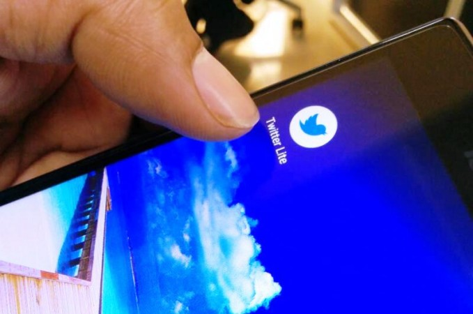

تتعدد مجالات البرمجة وتتطور بسرعة كبيرة، عاما بعد عام تظهر اتجاهات تقنية جديدة لتفرض نفسها في السوق المزدحم، في الوقت الذي تتكرس فيه أهمية البعض الآخر ليظل محافظا بقوة على مكانته.

وعلى ما يبدو، فإن سوق الشغل العالمي في عام 2018 مفتوح على مصراعيه لعدد من التخصصات التي يمكن اعتبارها جديدة وحديثة، ومن المرتقب أن تتعاظم الحاجة إليها وتتضاعف في قادم السنوات.

هذه التخصصات قد تكون محصورة ـ في رأيي المتواضع ـ في 4 اتجاهات تقنية وبرمجية على وجه الخصوص، وغرضي من هذا المقال أن أشاركها معكم لعل الموضوع يكون بوصلة ودليلا لكل قادم جديد يمر من هذه المدونة باحثا عن نقطة البداية لطريقه في البرمجة.

## 1- الذكاء الإصطناعي وتقنيات تعلم الآلة

منذ عدة أعوام بدأنا نسمع كثيرا عن الذكاء الإصطناعي (_Artificial Intelligence_) وتعلم الآلة (Machine Learning)، وهما من أحدث اتجاهات البرمجة والتقنية بصفة عامة.

الهدف من من هاتين التقنيتين هو تمكين الآلات والبرامج من التعامل مع المستخدمين والقيام بمهام متنوعة مع تمكين هذه البرامج من التعلم من تجاربها مع هؤلاء المستخدمين لجعلها تؤدي أدوارها بشكل أفضل كلما اشتغلت أكثر.

شركات التقنية العالمية مثل قوقل، فيسبوك، أمازون وبطبيعة الحال Apple دخلت منذ عدة أعوام في تنافس محموم على صناعة منتجات رقمية وتقنية فائقة الذكاء، ولعلك شاهدت آخر مؤتمر مطورين لشركة Google حيث تم عرض المساعد الرقمي لغوغل Google Assistant وهو يقوم بحجز موعد في أحد المطاعم دون أن تدري موظفة المطعم بأن من يكلمها روبوت رقمي وليس إنسان حقيقي!

<iframe width="100%" height="auto" src="https://www.youtube.com/embed/bd1mEm2Fy08?rel=0&amp;controls=0&amp;showinfo=0" frameborder="0" allow="autoplay; encrypted-media" allowfullscreen="allowfullscreen"></iframe>

توجد عدة منصات وأطر عمل للإشتغال على مشاريع تعلم الآلة والذكاء الإصطناعي، ولعل أشهرها [TensorFlow](https://www.tensorflow.org/) من شركات غوغل، وعندها واجهات برمجية API لعدة لغات برمجة، ولكن غالبا ما يتم استخدام **بايثون** لأن TensorFlow نفسه مبني على بايثون.

## 2- أمن المعلومات

التطور السريع الحاصل في ميادين التكنولوجيا وزيادة نسب ولوج الساكنة حول العالم لشبكة الإنترنت يندران بتحدٍّ كبير قادم أمام الشركات العالمية، تحدي حماية معلومات وخصوصيات المستخدمين والعملاء.

في كل عام يتعرض ملايين مستخدمي الإنترنت حول العالم لقرصنة وسرقة معلوماتهم الخاصة على الإنترنت، قد تكون السرقة من طرف أفراد وجهات أهدافها تخريبية صرفة، وقد تكون من جهات وشركات منظمة تتاجر في بيانات الملايين من البشر لأغراض متعددة تكون في أحيان اقتصادية وربما في أحيان أخرى سياسية كما في قضية **كامبريدج أناليتيكا** التي رأيناها وتابعنا جميعنا أخبارها مؤخرا.

فيسبوك اعتذرت للمستخدمين عن هذه الفضيحة ووعدت بأنها ستضاعف جهودها وتركيزها على حماية الملفات الشخصية للمستخدمين والمخزنة في مراكز بياناتها المنتشرة حول العالم.

هذا الموضوع ـ موضوع أمن المعلومات ـ كان دائما واحدا من أهم مشاغيل الشركات حول العالم، وكل ما فعلته فضيحة كامبريدج أناليتيكا، وقبلها فضيحة سرقة بيانات مئات الملايين من مستخدمي شركة **ياهو**، هو أنها أعادت هذه القضية إلى الواجهة وحركت جهات حكومية دولية لتشديد القوانين المفروضة على المواقع الإلكترونية لحماية واحترام بيانات مستخدميها، آخرها قانون الإتحاد الأروبي المعروف ب [GDPR](https://en.wikipedia.org/wiki/General_Data_Protection_Regulation).

كل هذه المعطيات تؤكد وتشير إلى أن تخصص **أمن المعلومات** سيكون من أكثر التخصصات التقنية التي سيقع عليها الطلب في الفترة القادمة.

## 3- تطبيقات الويب التقدمية

تحدثنا في [مقال سابق عن تطبيقات الويب التقدمية](https://www.tutomena.com/web-development/twitter-lite-pwa/)، وتعرفنا على تطبيق **تويتر لايت** الذي يعد واحد من أفضل الأمثلة عن هذا النوع من تطبيقات الويب التي شرحنا مزاياها وكيف أنها من الممكن أن تكون خيارا بديلا لكثير من الشركات الصغيرة والمتوسطة عن تطبيقات الهواتف الذكية الأصيلة _Native Mobile Applications_.

العديد من المزايا التي كنا نراها فقط في التطبيقات الأصيلة باتت مدعومة الآن من عدد من المتصفحات على غرار غوغل كروم مثل نظام التنبيهات، وبالتالي أصبح بالإمكان منح المستخدمين من خلال تطبيقات الويب التقدمية تجربة استخدام مماثلة لتلك التي يحصلون عليها في _Native Applications_.

على كل، هذا موضوع في غاية الأهمية وينطوي على تفاصيل كثيرة ويتطلب بالأساس مهارات جيدة في **الجافاسكريبت**، وقد نخصص له في الأيام القادمة مقالات ودروس مفصلة حتى نفهمه ونقوم بهضمه جيدا.

## 4- بلوك تشين

لا شك في أنك سمعت وقرأت كثيرا عن العملات الرقمية في المدة الأخيرة، وما دمت كذلك فمن المؤكد بأنك سمعت أيضا عن تقنية **بلوك تشين Blockchain** التي تعتبر المعمارية التي بنيت عليها كل العملات الإلكترونية التي نعرفها اليوم.

ظهرت [تقنية _Blockchain_](https://www.tutomena.com/blog/how-blockchain-works/) لأول مرة في عام 2008 على يد شخص (أو مجموعة من الأشخاص) عرف بالإسم المستعار **ساتوشي ناكاموتو** وقام بتطوير وإنشاء العملة الرقمية الأكثر شهرة **بيتكوين**.

يوفر نظام **بلوك تشين** أو **سلسلة الكتل** آلية تتسم **باللامركزية**، ما يسمح بحصول معاملات بين المستخدمين دون الحاجة إلى تدخل أطراف ثالثة كالمصارف في حالة العملات الرقمية، وبالتالي فالسلطة تكون هنا نابعة من جماعة المستخدمين المشاركين في كل شبكة بلوك تشين.

يعتقد الكثير من المهتمين بأن تطبيقات تقنية بلوك تشين محصورة على مجال العملات الرقمية والمعاملات المالية، بينما استخداماتها يمكن أن تكون أشمل وأوسع من ذلك الإعتقاد بكثير، منها على سبيل المثال، لا الحصر، فكرة **الإنترنت المركزي** وخدمة **التخزين السحابي الموزع** الذي بدأت بالفعل [بعض الشركات](https://storj.io/) في تقديمها للمستخدمين.

## النهاية

لا يوجد شك في أن عالم صناعة الإنترنت يحفل بالعديد من الصيحات التقنيات الحديثة، حيث أنه من أنشط المجالات وأسرعها تطورا. وقد حاولت قدر المستطاع، حسب متابعتي للموضوع، حصر أكثر الإتجاهات التقنية التي سيقع عليها الطلب في المستقبل القريب في الأربع مجالات أعلاه.

سأكون مسرورا جدا لسماع آرائكم حول ما ذكر في هذا المقال، ولا تترددوا في إغناء الموضوع بإضافاتكم التي دائما ما تكون قيمة ومرحب بها من خلال صندوق التعليقات ↓
