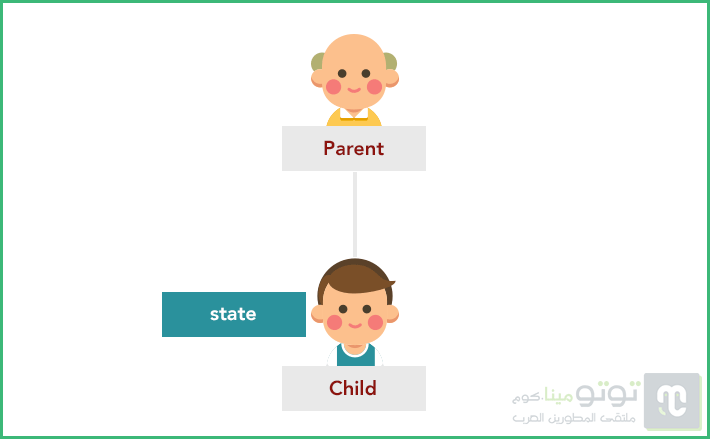
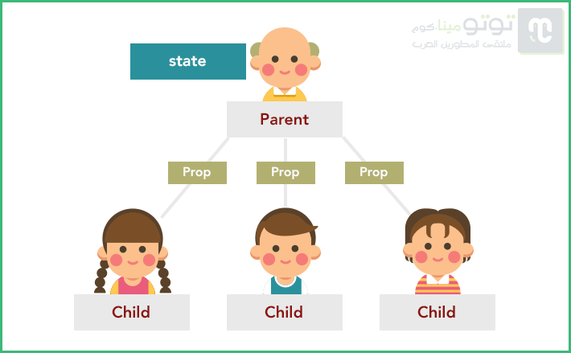
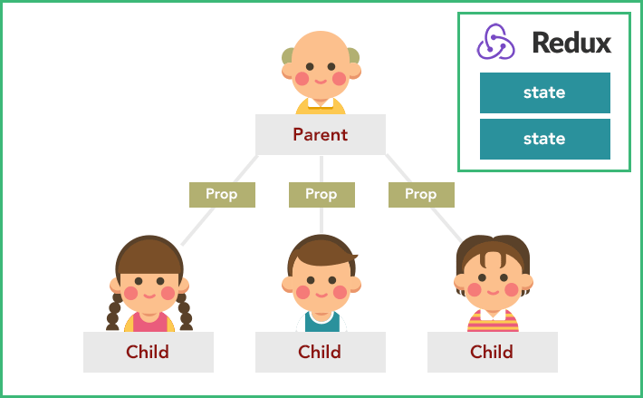
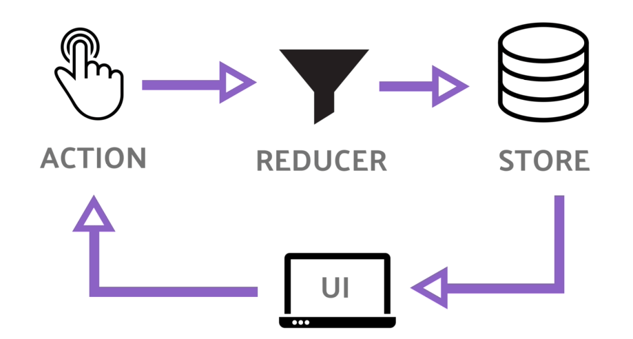

يهتم المطورون بتنظيم تطبيقاتهم و إدارة العمليات ضمنها، خصوصاً إذا كان المشروع كبيراً وعليه تحمل ضغط المستخدمين مع كفاءة عالية في معالجة المعلومات المدخلة والمخرجة (Input/Output). لذلك ظهرت مكتبات عديدة تقوم بادارة الحالات (_State Management_) مثل Redux و mobX، والأولى هي موضوع درسنا هذا، لا لشيء إلا لأنها المكتبة الأشهر والأكثر استخداما :)

سأحاول في هذه المقالة شرح مكتبة Redux وتبسيطها بأحسن أسلوب ليفهمها الجميع، أغلب المبتدئين يخافون استعمالها و يرونها معقّدة أكثر من اللزوم، لذلك كان لا بد أولا أن نقوم بتقديم المكتبة بالشرح النظري ثم بعد ذلك نقوم بإنجاز مثال عملي لاستيعاب ما تعلمناه بشكل جيد.

## **الجزء النظري**

كما تعلمون جاءت مكتبة React - والتي [سبق لنا الحديث عنها في المدونة هنا](https://www.tutomena.com/web-development/javascript/react-javascript-library/) -  لحل إشكالية العلاقة بين واجهة المستخدم (_User Interface_) والبيانات (_Data_) التي تتغير بشكل مستمر في تطبيقات الويب. هذه المكتبة هي بالأساس مسؤولة عن إنشاء المشاهد (Views) في تطبيقات الويب وليست إطار عمل متكامل مثل **أنجولار** على سبيل المثال، ولهذا يتم تمثيلها عادة على أنها الحرف **V** في نظام **MVC**.

مكتبة React.js تعتمد نظام تدفق بيانات أحادي الإتجاه _Unidirectional Data Flow_، حيث أن **المصدر الوحيد للحقيقة** هو **State**، وبالتالي فكل تغيير يطرأ على حالة مكونات التطبيق يجب أن يمر أولا عبر تحديث هذا الكائن، ولهذا السبب أصلا سمي _State_ أو _حالة_. وقد سبق لنا كتابة مقال خاص عن هذا الموضوع بيننا فيه [وجه الإختلاف بين نظام Unidirectional Data Flow الذي تنتهجه _React.js_ ونظام _Bidirectional Data Flow_](https://www.tutomena.com/web-development/javascript/one-way-vs-two-way-data-binding/) الذي تعتمده جل أطر عمل جافاسكريبت الأخرى وعلى رأسها Angular.

### لماذا استخدام مكتبة لإدارة الحالة ؟

قد نستطيع إنشاء تطبيقات كاملة بواسطة **React.js** ولكن سرعان ما سنكتشف محدودية خياراتنا خصوصا عندما تزداد درجة تعقيد التطبيق وتشابك العلاقات بين مختلف مكوناته (_Components_).

على سبيل المثال، لنفترض أنه لدينا مكون أب لديه ابن واحد، وهذا الأخير لديه حالته الخاصة. لاحظوا الصورة التالية :

[](../images/react-components-tree-1.png)

عندما بدأنا بالعمل على مشروعنا لم يكن لدينا تصور كامل للشكل النهائي الذي ستكون عليه شجرة مكونات التطبيق (ومن الصعب في الحقيقة معرفة ذلك)، ظننا بأن **المكون الأب** في الصورة سيكون لديه **ابن** وحيد ولذلك أعطينا للأخير حالة خاصة به (state).

بعد مدة، أدركنا بأن الأب سيكون لديه أبناء آخرين يحتاجون للوصول إلى حالة الإبن الأول، وهذا مستحيل في _React.js_ لأن **الحالة يتم تمريرها من الأعلى للأسفل فقط** عن طريق ال Props، ولا يمكن تمريرها أفقيا بين المكونات من نفس المستوى. إذن الحل الوحيد سيكون هو **تجريد الإبن الأول من حالته (state) ورفعها إلى الأب** ليقوم الأخير بإنزالها مرة أخرى للأبناء الثلاثة على شكل Prop :)

[](../images/react-components-tree-2-1.png)

عمل مضني تتضاعف صعوبته مع ازدياد حجم المشروع وتشابك مكوناته.

فيبسوك كانت على بينة من هذه النقطة، لذلك قاموا بتصميم نمط جديد ليلعب دور *Model،* ولكن بالإعتماد على تدفق أحادي الإتجاه للبيانات (_Unidirectional data flow_) عوض التدفق ثنائي الإتجاه الذي ألفناه في أطر عمل مثل Angular. اسم هذا النمط هو **FLUX** وهناك مكتبة جافاسكريبت أيضا **بنفس الإسم** من فيسبوك لتمكين المطورين من الإستعانة بمميزات FLUX في مشاريعهم.

من مميزات نمط Flux أنه يقوم بجمع حالات (_States_) جميع المكونات وتخزينها في ما يعرف **بالمخازن** أو _Stores_. **ويمكن لأي مكون (_Component_) الإتصال بتلك المخازن** عن طريق آلية محددة لتحديث حالته ومن ثم الحصول على **الحالة الجديدة** على شكل **Prop**.

تعتبر مكتبة **Redux** من أشهر التطبيقات (_Implementations_) لنمط Flux، إلا أن لديها مميزاتها الخاصة، منها على سبيل المثال الإعتماد على **مخزن واحد** (_Only One Store_) للحالات عوض خاصية **تعدد المخازن** الموجودة في [مكتبة Flux](https://github.com/facebook/flux) من فيسبوك.

[](../images/react-components-tree-redux.png)

يعود أول ظهور لمكتبة **ريداكس** إلى عام 2015 على يد المبرمجان **Dan Abramov** و **Andrew Clark**، وهي مكتبة مستقلة بذاتها ويمكن استخدامها في أي مشروع جافاسكريبت، وليس مشاريع React فقط.

## كيف تعمل مكتبة Redux ؟

تُجمع المبادئ الأساسية ل Redux عادة في ثلاث جمل، وهي :

1.  **مصدر واحد للحقيقة (Single source of truth):** أي أنه يتم تخزين حالات التطبيق بالكامل في **مخزن واحد** فقط على شكل كائن جافاسكريبت.
2.  **الحالة للقراءة فقط (State is read-only)**: تحصل المكونات على حالتها على شكل خصائص (_Properties_) قابلة للقراءة فقط، والطريقة الوحيدة لتحديثها وإجراء تغيير عليها هي عبر إرسال طلب (_Dispatch action_) يحمل عدد من المعلومات التي تمكن Redux من **تحديد الحالة المراد تغييرها**، وبعد ذلك إعادتها للمكون على شكل Prop كما قلنا في السابق. وكما نعلم جميعا، فإن ال Props في _React.js_ قابلة للقراءة فقط ولا يمكن التعديل عليها.
3.  **التغييرات تتم في وظائف نقية (Changes are made with pure functions)**: يتم تغيير الحالة في وظائف يفترض بها أن تكون نقية (_Pure functions_)، وتعرف هذه الوظائف في Redux باسم **Reducers**.

ولكي نفصل أكثر في طريقة وآلية عمل مدير الحالة Redux، سنحلل الصورة التالية :

[](../images/redux-schema.png)

يبدأ كل شيء من واجهة المستخدم (_User Interface_)، حيث يقوم المستخدم بسلوك معين يترجم في Redux إلى ما يعرف ب **Action**. هذا ال action يستقبل في **دوال نقية** (_Pure functions_) معروفة بال Reducers. تقبل في العادة معاملين اثنين : **الحالة القديمة** و ال _action_ الذي تم إطلاقه في السابق، وتقوم بإرجاع (_return_) **الحالة الجديدة** بناءً على المعلومات الواردة في ال action. هذا الأخير عبارة عن كائن يضم خاصيتين أساسيتين :

- **type** : هذه الخاصية إجبارية وتحتوي على نوع ال _action_ المراد إجراؤه.
- **payload** : هذه الخاصية غير إجبارية - ويمكن تسميتها أي اسم آخر غير _payload_ \- وتحتوي على المعلومات التي نريد إرسالها للمخزن (_Store_) ليتم دمجها في حالة التطبيق (_State_) عن طريق **Reducers** بطبيعة الحال.

// مثال لبنية الإجراء أو Action في Redux (أو نمط Flux بصفة عامة) :

```json
{
  "type": "ADD_TODO",
  "payload": {
    "text": "Learn Redux..."
  }
}
```

## **الجزء التطبيقي**

بعد أن شرحنا فكرة **Redux** نظرياً، سنشرح الفكرة تطبيقياً واخترت لكم مثالاً سهلاً  مستعيناً به من [مدونة daveceddia](https://daveceddia.com/how-does-redux-work/) و هو تطبيق **العداد **أو Counter. [](../images/counter-plain@2x.png) فكرته سهلة و بسيطة جداً..

لنلقي نظرة على الكود البرمجي:

```javascript
import React from 'react';

class Counter extends React.Component {
  state = { count: 0 };

  increment = () => {
    this.setState({
      count: this.state.count + 1
    });
  };

  decrement = () => {
    this.setState({
      count: this.state.count - 1
    });
  };

  render() {
    return (
      <div>
        <h2>Counter</h2>
        <div>
          <button onClick={this.decrement}>-</button>
          <span>{this.state.count}</span>
          <button onClick={this.increment}>+</button>
        </div>
      </div>
    );
  }
}

export default Counter;
```

كمراجعة سريعة، إليك ما قمنا به :

- count عبارة عن حالة (state) مخزّنة ضمن المكوّن الرئيسي Counter.
- عندما ينقر المستخدم على "+" فان onClick تستدعي الوظيفة increment و التي هي أيضا ضمن المكوّن الرئيسي Counter.
- بعد ذلك تقوم الوظيفة increment بتحديث **الحالة **count و إضافة العدد 1، و هكذا دواليك.
- بعد تحديث الحالة، يقوم رياكت **أوتوماتيكيا** بعمل **إعادة عرض** (**Re-rendering**) للمكوّن الرئيسي (Counter) ويتم إظهار قيمة العداد الجديدة.
- نفس العمليات تتكرر عند كل نقرة على الزرين **"+"** أو **"-"**.

### العمل بطريقة Redux

في مثل هذا النوع من المشاريع الصغيرة لا نحتاج للإستعانة بمدير للحالة مثل Redux، ولكن للغرض التعليمي لهذا المقال سنقوم بإعادة إنشاء نفس التطبيق بطريقة **Redux** حتى تتوضح وتترسخ جيدا في عقولنا كيفية عمله.

لنقم الآن بانشاء مشروع جديد بواسطة الحزمة **create-react-app** :

```
create-react-app counter-with-redux
```

بعد إنشاء وتوليد المشروع، سنقوم بفتح الملف **_src/index.js_** ونعوض ما فيه بهذا الكود :

```javascript
import React from 'react';
import { render } from 'react-dom';
import Counter from './Counter';

const App = () => (
  <div>
    <Counter />
  </div>
);

render(<App />, document.getElementById('root'));
```

كما لا ننسى إنشاء الملف **_src/Counter.js_** ونضع فيه الكود الخاص بالمكون Counter الذي شرحناه سابقا.

بعدها نقوم بتنصيب مكتبتي **Redux** و **react-redux**.

```
yarn add redux react-redux
```

> react-redux هي الحزمة التي تمكن مكتبة Redux من العمل بكفاءة وتوافقية ممتازة مع مكتبة React.js.

نقوم بحذف الوظائف السابقة (_increment_ و _decrement_) ونجعلها فارغة.

```javascript
import React from 'react';

class Counter extends React.Component {
  increment = () => {
    // fill in later
  };

  decrement = () => {
    // fill in later
  };

  render() {
    return (
      <div>
        <h2>Counter</h2>
        <div>
          <button onClick={this.decrement}>-</button>
          <span>{this.props.count}</span>
          <button onClick={this.increment}>+</button>
        </div>
      </div>
    );
  }
}

export default Counter;
```

نلاحظ أننا غيّرنا الحالة **this.state.count** إلى خاصية **this.props.count** :)

إلى هنا، العداد لا يعرف شيئا عن خاصية بهذا الإسم.. المدير Redux هو من سيتولى توفير هذه الخاصية للمكون Counter.

للحصول على العدد من Redux سنحتاج الى استدعاء (connect):

```javascript
import { connect } from 'react-redux';
```

نحتاج الآن الى الاتصال بالمكوّن (**Counter**) لربطه مع Redux عبر اضافة الكود التالي، و لا تهتم للاخطاء التي ستظهر كلها ستختفي بعد قليل.

```javascript
// Add this function:
function mapStateToProps(state) {
  return {
    count: state.count
  };
}

// Then replace this:
// export default Counter;

// With this:
export default connect(mapStateToProps)(Counter);
```

الدالة *mapStateToProps* مهمة للغاية، فهي المكلفة بتحويل أجزاء من الحالة (state) إلى خصائص تمرَّر إلى المكونات المعنية (Counter في هذه الحالة) عن طريقة **الدالة عالية الرتبة** connect (تعرف كذلك ب _Higher Order Function_) والتي تقوم بإرجاع ما يعرف في React بمكون عالي الرتبة Higher Order Component أو HOC ليقوم بتمرير الحالة count إلى المكون الإبن Counter على شكل خاصية أو Prop.

تذكر الصورة أعلاه حيث الأبناء يرثون الحالة على شكل خصائص من الأب. الإبن هنا هو المكون **Counter** والأب هو المكون **الغير المرئي** الذي تقوم الدالة connect بإرجاعه. آمل أن يكون شرحي موفقا :)

بعد ما أكملنا الجزء الأول من تطبيقنا، لنعد الان لتعديل الملف الرئيسي للتطبيق: (_src/index.js_) و نستدعي **المزوّد** أو **الممون** (**Provider**) و الذي يعمل **كمكون رئيسي** يغطي جميع المكوّنات (Components) التي نحتاج ربطها مع Redux.

```javascript
import { Provider } from 'react-redux';

...

const App = () => (
  <Provider>
    <Counter/>
  </Provider>
);
```

الممون بحاجة لمعرفة المخزن الذي يأخد منه المعلومات التي يوفرها بدوره للمكونات الواقعة تحت نفوذه.

لننشئ هذا المخرن عبر الدالة **createStore** التي نستدعيها من مكتبة redux كما يلي :

```javascript
import { createStore } from 'redux';

const store = createStore();

const App = () => (
  <Provider store={store}>
    <Counter />
  </Provider>
);
```

لاحظوا بأننا قمنا بتمرير المخزن للممون على شكل خاصية اسمها _store_.

### هل تتذكرون ال Reducers ؟

لدينا الآن الممون (Provider) ولدينا المخرن (Store) ولدينا واجهة المستخدم (UI). يتبقى لنا أن نقوم بإنشاء وظيفة Reducer واحدة على الأقل لكي نتمكن من **تمرير الحالة** للمخرن الذي قمنا بتعريفه.

ال Reducer هو مجرد **دالة جافاسكريبت** عادية تقبل معاملين اثنين : الحالة الآنية (_Current state_)، والإجراء المتخذ (Action)، بينما تقوم بإرجاع كائن يمثل حالة التطبيق الجديدة (_New state_).

لنقم بتعريف هذه الدالة ونمررها كمعامل للمخرن الذي أنشأناه قبل هنيهة :

```javascript
import { createStore } from 'redux';

function counterReducer(state = { count: 0 }, action) {
  return state;
}

const store = createStore(counterReducer);

const App = () => (
  <Provider store={store}>
    <Counter />
  </Provider>
);
```

نلاحظ أننا قمنا بإعطاء قيمة افتراضية للكائن state حيث count يساوي 0. وبما أننا لم نقم بعد بأي إجراء داخل ال Reducer فإننا نقوم بإرجاع الحالة الإفتراضية نفسها.

سنقوم بإجراء تعديلات على دالة _counterReducer_ حتى تأخذ بعين الإعتبار الإجراءات التي ستتوصل بها، وهي في مثالنا البسيط هذا إجراءين اثنين لا ثالث لهما : INCREMENT و DECREMENT.

نتذكر جميعا عندما تحدثنا عن بنية ال actions، حيث أنها عبارة عن كائنات تضم خاصية واحد إجبارية هي **type** وخاصيات أخرى اختيارية لتمرير عدد من البيانات إلى ال Reducer.

في تطبيق العداد لا نريد تمرير أي معلومة لهذا ال Reducer، فكلما نسعى إليه هو إضافة أو طرح العدد 1 بحسب نوع (Type) الإجراء (INCREMENT أو DECREMENT).

إذن الإجراء (action) سيكون على هذه الهيئة البسيطة :

```json
{
  "type": "INCREMENT"
}
```

لنعد الآن إلى دالتنا counterReducer ونستثمر فيها ما تعلمناه :

```javascript
function counterReducer(state = { count: 0 }, action) {
  switch (action.type) {
    case 'INCREMENT':
      return {
        count: state.count + 1
      };
    case 'DECREMENT':
      return {
        count: state.count - 1
      };
    default:
      return state;
  }
}
```

يجب الإنتباه إلى أنه يجب على ال Reducer إرجاع حالة جديدة حتى ولو لم يتم اتخاذ أي إجراء بداخله، ولذلك نقوم دائما بإرجاع الحالة الإفتراضية في منطقة default وإلا فإن قيمة الحالة ستكون undefined.

### **ملاحظة مهمة : State is immutable**

تتبع مكتبة Redux نمط ومبادئ **البرمجة الوظيفية** في جافاسكريبت، ومن أهم تجلياتها أن الكائن state غير قابل للتغيير بصفة مباشرة (_Immutable_). هذا المبدأ معروف في functional programming باسم **Immutability**.

هذا يعني أنه لا يمكننا كتابة أكواد كهذه :

```javascript
function badCounterReducer(state = { count: 0 }, action) {
  switch (action.type) {
    case 'INCREMENT':
      // NO! BAD: this is changing state!
      state.count++;
      return state;

    case 'DECREMENT':
      // NO! BAD: this is changing state too!
      state.count--;
      return state;

    default:
      // this is fine.
      return state;
  }
}
```

لا يمكن كذلك استخدام وظائف المصفوفات مثل **push** لأنها تقوم بتغيير المصفوفة عوضا عن إنشاء مصفوفة جديدة كما تفعل الوظيفة **concat** مثلا، وبالتالي ينصح دائما باستخدام الأخيرة في مثل هذه الحالات حتى نظل محافظين على مبدأ الغير قابلية للتغيير أو _Immutability_.

> على كل حال، موضوع _Immutability_ يحتاج شرحا موسعا ومقالا خاصا، ننجزه في قادم الأيام إن شاء الله :)

## لحظة من فضلك : من أين جاءت هذه الإجراءات ؟

قد تسأل نفسك وأنت تقرأ الدرس: من أين جاءت هذه ال actions ؟ وكيف وصلت لدالة counterReducer ؟

إذا سألت هذا السؤال فأهنئك على تركيزك العالي، فطرح الأسئلة الجيدة هي أولى وأهم مراحل التعلم.

ببساطة الإجراء ات يتم إطلاقها من داخل مكونات React عن طريق الوظيفة **disptach** التي يوفرها Redux، وهي في الأصل وظيفة خاصة بالمخزن أو Store يمكن استدعاؤها على النحو التالي :

```javascript
store.dispatch(someAction);
```

ولكن الدالة **connect** التي تمنحها الحزمة react-redux، جعلت مهمة إطلاق الإجراءات أكثر عملية وملاءمة لبيئة React.js، حيث أنها توفر الوظيفة **disptach** كخاصية (prop) للمكون، تماما كما تحول state إلى props خاصة بالمكون مثلما رأينا في فقرة سابقة.

هكذا سيصبح شكل المكون Counter الجديد على هذا النحو :

```javascript
import React from 'react';
import { connect } from 'react-redux';

class Counter extends React.Component {
  increment = () => {
    this.props.dispatch({ type: 'INCREMENT' });
  };

  decrement = () => {
    this.props.dispatch({ type: 'DECREMENT' });
  };

  render() {
    return (
      <div>
        <h2>Counter</h2>
        <div>
          <button onClick={this.decrement}>-</button>
          <span>{this.props.count}</span>
          <button onClick={this.increment}>+</button>
        </div>
      </div>
    );
  }
}

function mapStateToProps(state) {
  return {
    count: state.count
  };
}

export default connect(mapStateToProps)(Counter);
```

## **النهاية**

هكذا نكون قد أنهينا هذا الدرس الذي يمثل مدخلا لفهم عميق وجيد **لمكتبة Redux** وآلية عملها.

هناك جزئيات وتفاصيل عديدة لم نتطرق إليها حتى لا يطول الدرس أكثر مما هو طويل الآن :) وحتى لا يستشكل فهمه على المبتدئين الذين نولي لهم دائما أهمية قصوى في مدونة توتومينا.

للإستزادة يمكنكم الرجوع إلى [الموقع الرسمي لمكتبة ريداكس](https://redux.js.org/)، كما سنحاول إنجاز دروس أخرى متعلقة بهذه المكتبة وكيفية استخدامها في مشاريع أكبر وأكثر تعقيدا من مشروع العداد :)

إلى ذلك الحين نستودعكم الله، ولا تترددوا في طرح استفساراتكم وملاحظاتكم في صندوق التعليقات، سأكون سعيدا جدا بتفاعلاتكم مع هذا الموضوع.
