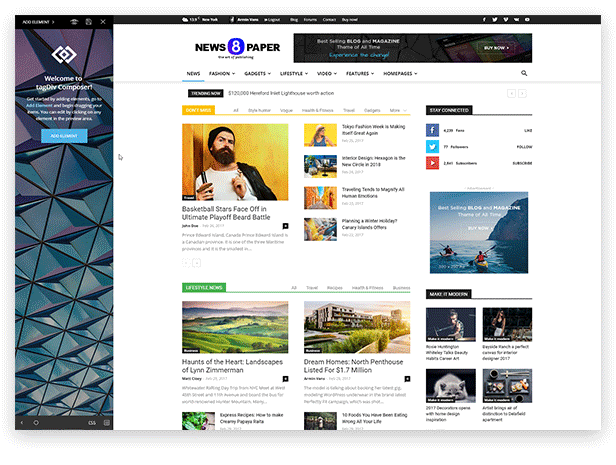
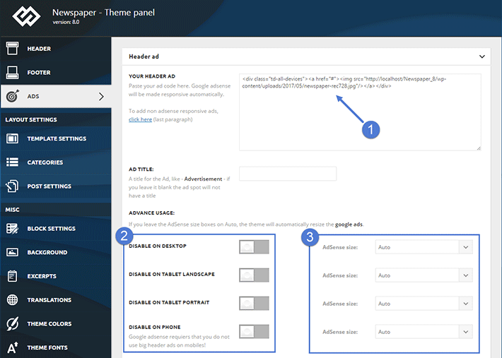
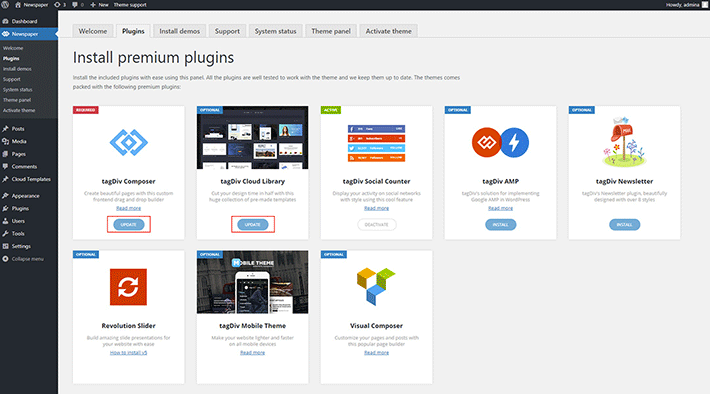
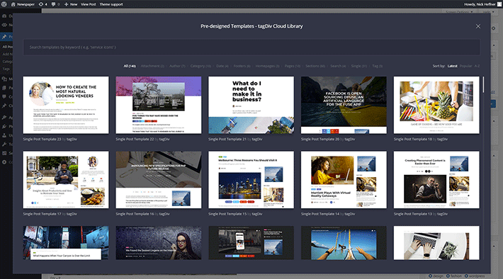

يعتبر **قالب Newspaper**، لفريق _TagDiv_، من بين الأشهر على منصة ثيم فوريست، ولعل أزيد من 60 ألف مبيعة التي استطاع تحقيقها سبب كافٍ لإعتباره واحدا من أنجح قوالب ووردبريس على الإطلاق.

هذا القالب صمم في الأصل ليكون قالبا مناسبا للمواقع الإخبارية والمدونات التي تعتمد على النشر الكثيف للمحتوى، ولكن مع مرور الوقت وبعد سلسلة طويلة من التحديثات والتطويرات التي طرأت عليه، يمكن اعتبار Newspaper الآن قالبا شاملا ومتعدد الأغراض (_Multi-Purposes_)، ويمكن استخدامه لدعم أنواع مختلفة من المواقع الإلكترونية.

في مدونة توتومينا نقوم باستخدام قالب Newspaper منذ عامين تقريبا، ولقد كانت تجربتنا معه جيدة إلى حد بعيد وساعدنا كثيرا في تطوير مدونتنا والدفع بها نحو الأمام. وهدفي من هذا المقال أن أشارك معكم هذه التجربة، وذلك بالقيام بمراجعة شاملة للقالب، لعلي بذلك أفتح أعينكم على قالب ووردبريس الذي ربما كنتم دائما تبحثون عنه، وليكون إجابة على العديد من الأسئلة التي تصلني من أصدقاء المدونة بخصوص هذا الموضوع.

## التصميم

يتميز قالب Newspaper بتصاميمه العصرية التي تستجيب لأحدث متطلبات المواقع الإلكترونية الحديثة. هذه التصاميم مبنية على نظام شبكي Grid System مرن يمكن المستخدم من تخصيص موقعه وتطبيق أفكاره وتصاميمه الإبداعية بسهولة ومرونة تامة. ليس عليك أن تكون مطور أو مصمم ويب حتى تقوم بإنشاء موقع جميل ذو واجهة مخصصة، حيث يمكنك بناء واجهة موقعك من الصفر أو اختيار تصميم جاهز من بين قرابة 60 تصميم جاهز للإستخدام بنقرة واحدة :) وبدون أن تكون لديك أي خلفية تقنية ولو كانت بسيطة.

ميزة التصاميم الجاهزة تمكن المستخدمين من الحصول على قاعدة بعشرات المواقع الجاهزة والجذابة والمتوافقة مع مختلف التخصصات (أخبار، رياضة، تقنية، امرأة، كمال أجسام، أسفار، حيوانات إلخ...) القابلة للتثبيت بنقرة واحدة فقط كما أسلفنا. ويمكن تثبيت هذه التصاميم مع محتويات تجريبية Demo content حتى يبدو الموقع على هيئته الحقيقية، وتستطيع بعدها حذف المحتويات التجريبية وكذا التصاميم الجاهزة والعودة بالقالب إلى حالته البدئية إذا كنت تريد.

## باني الصفحات TagDiv Composer

منذ النسخة 8، طور فريق TagDiv باني صفحات خاص بهم اسمه Tagdiv Composer بعدما كانوا يعتمدون في النسخ السابقة على Visual Composer.

إنشاء باني صفحات من الصفر كان قرارا سليما بالنظر إلى المميزات الكثيرة التي حملها معه، لعل أبرزها خفته الكبيرة مقارنة ب Visual Composer، حيث أن TD Composer صمم خصيصا [لقالب Newspaper](https://www.tutomena.com/go/newspaper-theme) وبالتالي فهو يوفر فقط الميزات التي نحتاجها مع القالب، كما أنه يمكن من بناء الصفحات انطلاقا من الواجهة الأمامية _Frontend_ مع معاينة التغييرات على مستوى الموقع في الوقت الحي دون انتظار إعادة تحميل الصفحة.

يوفر باني الصفحات TD Composer كذلك ميزة كتابة وتحرير أكواد css مع معاينة التغييرات على مستوى واجهة المستخدم في ذات الوقت، والقالب يولي أهمية كبيرة لتجاوبية التصاميم ولذلك فهو يمكن من معاينة الصفحة والتحكم في الأجزاء _Blocks_ المكونة لها بحسب شاشة العرض (هاتف، تابلت، شاشات كبيرة إلخ...).

وعلى ذكر الأجراء أو Blocks، فإن قالب Newspaper يوفر أزيد من 25 نوع من ال Blocks لعرض محتويات الموقع بطرق مختلفة ومتنوعة، بالإضافة إلى عدد كبير أيضا من التصاميم المختلفة والمقترحة لكل من ال Header و Footer الخاص بالموقع. أما الودجات فهي حاضرة بقوة في القالب، حيث نجد أزيد من 37 ودجات مختلف إلى حدود النسخة الحالية التي تحمل الرقم 8.8، وبفضلها يمكن إضافة العديد من المزايا للموقع مثل روابط منصات التواصل الإجتماعي، صور انستاغرام، حالة الطقس، أسعار العملات، والعديد من الأمور الأخرى.

- [قد يهمك أيضا :أفضل قوالب ووردبريس متوافقة مع السيو SEO في ثيم فورست](https://www.tutomena.com/web-development/wordpess-seo-friendly-themes-themforest/)

## الخطوط

تلعب الخطوط دورا محوريا في تصاميم الويب الحديثة، حيث أنها تجاوزت كونها مجرد أداة لتقديم وقراءة النصوص لتصير اليوم واحدا من المكونات الأساسية لتصميم تطبيق الويب وكذا الهوية البصرية للشركات والمواقع الإلكترونية.

فريق **Tagdiv** يعون هذه المعطيات جيدا، لهذا سهلوا كثيرا على مستعملي قالبهم إضافة الخطوط لمواقعهم، فوفروا إمكانية استيراد **خطوط غوغل**، **أدوبي تايب كيت**، وكذلك الخطوط المخصصة (_Custom fonts_) إنطلاقا من لوحة التحكم الخاصة بالقالب، وتعيين وتطبيق هذه الخطوط على مختلف عناصر الموقع ودائما انطلاقا من لوحة التحكم فقط، يعني ـ مبدئيا ـ لن تحتاج لتحرير أي ملف ووردبريس ولن يطلب منك التمتع بأي مهارات تقنية ولو بسيطة :D

## الإعلانات

لطالما كانت الإعلانات من الروافد الأساسية لكل موقع إخباري أو مدونة، وقد يسَّر مطورو _Newspaper Theme_ بشكل كبير مهمة إضافة بانرات إعلانية للقالب، حيث وفروا مناطق متعددة ومتنوعة في كل صفحة من صفحات القالب مع الحفاظ على تجربة تصفح جيدة للقارئ. وبطبيعة الحال، يتم إضافة أكواد HTML لهذه البانرات من لوحة التحكم بسهولة تامة.

## لوحة التحكم ( Theme Panel )

جميع إعدادات قالب Newspaper موجودة في مكان واحد اسمه **Theme Panel**، لوحة تحكم غاية في التنظيم والبداهة.

إعدادات Footer ،Header، قوالب المقالات ، التصنيفات واختيار الألوان الرئيسية للموقع والخطوط، كل هذه المزايا _وأكثر_ يمكن ضبطها وإعدادها وحفظها انطلاقا من Theme Panel بسهولة.

## إضافات مدفوعة مع القالب

يأتي قالب Newspaper مع مجموعة من الإضافات الممتازة التي تتناغم مع القالب، بعضها من تطوير فريق Tagdiv نفسه والبعض الآخر إضافات خارجية.

### 1\. إضافات TagDiv

- **tagDiv Composer** : سبق وتحدثنا عن هذه الإضافة أعلاه، فهي المسؤولة عن تثبيت باني الصفحات tagDiv Composer.
- **tagDiv Social Counter** : هذه الإضافة مسؤولة عن عرض ودجات لأزرار مصممة بشكل جميل وبروابط نحو حساباتنا على مواقع التواصل المعروفة، مع إظهار عدد من البيانات المهمة كعدد المعجبين مثلا على فيسبوك وعدد المتابعين على تويتر إلخ...
- **tagDiv Multi-Purpose**: هذه الإضافة جديدة نوعا ما، وتساعد في بناء صفحات هبوط Landing pages مخصصة بالكامل عن طريق إضافة عدد من العناصير الجديدة إلى tagDiv Composer.
- **tagDiv AMP** : كما يدل اسم هذه الإضافة، فهي تقوم بتمكين القالب من خاصية [صفحات غوغل المسرعة](https://www.tutomena.com/marketing/accelerated-mobile-pages/) AMP، وبذلك لا نحتاج لأي إضافات خارجية من أجل هذه الخاصية المهمة.
- **tagDiv Newsletter** : تقوم هذه الإضافة بتوفير عدد من التصاميم الجميلة لودجات الإشتراك في النشرة البريدية متوافقة مع عدد من خدمات التسويق الإلكتروني المشهورة مثل [Mailchimp](https://mailchimp.com/) و [Mailer Lite](https://www.mailerlite.com/).
- **tagDiv Mobile Theme** : توفر هذه الإضافة قالبا خفيفا خاصا بالهواتف للحفاظ على تجربة استخدام جيدة على تلك الأجهزة. وحتى لو لم يتم تثبيت هذه الإضافة فإن القالب يظل متجاوبا بشكل ممتاز على مختلف أنواع الأجهزة.

### 2\. إضافات خارجية

- **Visual Composer** : باني الصفحات Visual Composer غني عن التعريف، فهو الأشهر في عالم ووردبريس. ورغم أن فريق tagDiv قاموا بتطوير باني صفحات خاص بمنتجاتهم إلا أنه مازال قالب Newspaper متوافقا بشكل جيد مع Visual Composer، وقد تم تضمينه **مجانا** في حزمة القالب علما أنه - في الحالة العادية - رخصة استخدامه _لموقع واحد_ تكلف 59 دولارا.
- **Revolution Slider** : إذا كان Visual Composer هو أشهر باني صفحات ووردبريس، فإن [Revolution Slider](https://revolution.themepunch.com/examples/) هو أشهر إضافة ووردبريس لإنشاء السلايدرات، وتم شراؤه تقريبا **260 ألف مرة** من [متجر كود كانيون](https://codecanyon.net/item/slider-revolution-responsive-wordpress-plugin/2751380?ref=aissaino). ومرة أخرى تم توفير هذه الإضافة بالمجان في حزمة _Newspaper Theme_ وثمنه في الحقيقة يبدأ ب 26 دولارا.

بالإضافة إلى هذا كله، يوفر قالب Newspaper توافقية ممتازة مع عدد من إضافات ووردبريس الشهيرة مثل WP Super Cache ،Contact Form 7 ،bbPress ،BuddyPress ،WooCommerce ...

## السرعة والأداء

تحدثنا فيما سبق عن إضافة **tagDiv AMP** لإضافة خاصية صفحات AMP لموقعنا، هذه الخاصية باتت هامة للغاية بالنسبة للمواقع الإخبارية والمدونات لأنها تمنح تجربة استخدام جيدة على الهواتف الذكية، وهذا من شأنه تعزيز وتحسين ظهور الموقع على محرك البحث غوغل.

وحتى إذا كنت غير مقتنع تماما بصفحات قوقل المسرعة AMP فإن هناك نسخة موبايل للقالب خفيفة أيضا وتوفر فقط الخاصيات والمزايا التي لا تؤثر سلبا على تجربة المستخدمين في هذا النوع من الأجهزة.

التوثيق الرسمي سيساعدك أيضا على إخراج أفضل ما في القالب من إمكانيات بفضل العديد من الأمثلة والفيديوهات التعليمية والتوجيهية.

## tagDiv Cloud Library

من المزايا الجديدة في الإصدار **8.8** الأخير لقالب Newspaper توفير مكتبة سحابية تضم أعدادا كبيرة من القوالب (Templates) المخصصة للإستخدام كنماذج سواء لصفحات (Pages) أو مقالات (Posts) الموقع، **مع القابلية للتعديل عليها دائما من tagDiv Composer**.

هذه الميزة نالت إعجابي كثيرا لأن خيارات مدير الموقع لم تعد مقتصرة مثلا على النماذج الجاهزة (_Post templates_) التي نجدها في ملفات القالب للتحكم في كيفية ظهور مقالاتنا، بل الأمر الآن أصبح أوسع من ذلك إذ نستطيع اختيار نماذج متوفرة من المكتبة السحابية التي **تحدث باستمرار** دون إجراء أي تحديثات على مستوى القالب. عظيم أليس كذلك ؟ :)

## نقطة سلبية

إيجابيات **قالب Newspaper** متعددة ونقاط قوته كما رأينا متنوعة، ولكن هذا لا يعني أنه خالي من العيوب أو أنه قالب مثالي غير قابل للتحسين والتطوير.

من أبرز العيوب والنقاط السلبية في _Newspaper Theme_ أنه لا يدعم اللغة العربية ولغات RTL بصفة عامة، وقد حاولت مراسلة أعضاء الفريق لمطالبتهم بإضافة هذه الخاصية للقالب ولكنهم لم يبدو نية واضحة لفعل ذلك، حيث أخبروني بأن هذه الميزة ليست ضمن مخططاتهم في المدى المنظور.

شخصيا، كنت أعرف بخصوص هذه النقطة السلبية قبل شرائي للقالب، ومع ذلك لم أتردد كثيرا في اقتنائه لأن المزايا الأخرى التي يوفرها أقنعتني، كما أن كوني مطور ويب سمح لي بإضافة خاصية **RTL** للقالب بأقل مجهود مستعينا ببعض المهارات في CSS و ووردبريس.

وإذا كنت مقتنعا كذلك، صديقي، بإمكانيات ومزايا قالب Newspaper الأخرى وترى بأن غياب ميزة RTL هو العائق الوحيد الذي يمنعك من شراءه فاطمئن :) أنا سأساعدك على تعريب القالب عن طريق مدك بالقالب الإبن المعرب الذي قمت بإنشائه.

## النهاية

لا شك في أن مزايا وإيجابيات **قالب Newspaper** كثيرة ويصعب في الحقيقة جمعها وتفصيلها كلها في مقال واحد، لذلك سأحاول من حين لآخر كتابة مقالات أصغر عن مزايا محددة في هذا القالب لشرحها وإيضاحها لعدد من المتابعين الذين دائما ما يسألونني عنها.

[معاينة أو شراء القالب](https://www.tutomena.com/go/newspaper-theme)
