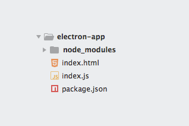
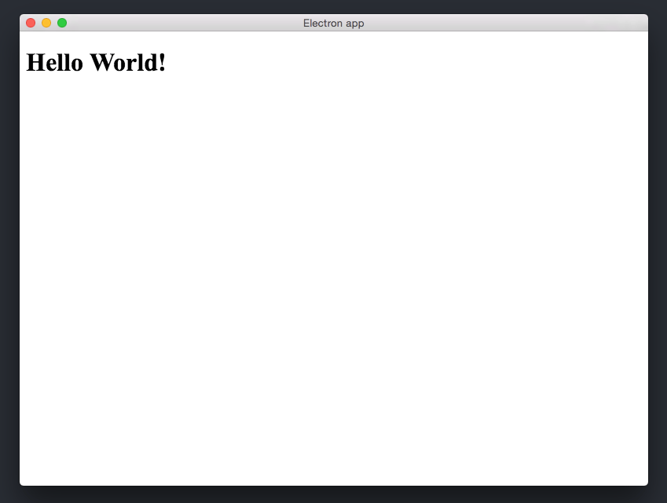

تحدثنا في [مقالات سابقة](https://www.tutomena.com/web-development/javascript/javascript-dominance/) على مدونة توتومينا عن كون لغة جافاسكريبت واحدة من أكثر اللغات التي تتعدد مجالات استخدامها، ولم تعد المتصفحات المكان الوحيد الذي تشتغل فيه. لقد بات بإمكاننا تطوير خوادم الويب وتطبيقات الهواتف الذكية بالجافاسكريبت :) ولكن ما لا يعلمه الكثيرون ربما أننا نستطيع كذلك تطوير تطبيقات سطح المكتب بواسطة هذه اللغة، وهذا بالضبط ما يفعله **إطار العمل إلكترون** (Electron).

[إلكترون](https://electronjs.org/) هو مشروع مجاني مفتوح المصدر تم تطويره من طرف شركة **Github** لبناء تطبيقات سطح المكتب **عابرة للمنصات** (Cross-platform) باستخدام تقنيات الويب : جافاسكريبت، HTML و CSS.

يحظى هذا الإطار بشعبية كبيرة ويعتبر من أشهر المشاريع على منصة Github، وتمت الإستعانة به في عدد من أقوى التطبيقات مثل :

- Slack
- Visual Studio Code
- محرر Atom
- Discord
- Microsoft Teams

تم إطلاق مشروع **إلكترون** لأول مرة عام 2014 تحت مسمى **Atom Shell** قبل أن يتم تغييره لإسمه الحالي في العام الموالي.

## البنية التحتية لإطار العمل إلكترون

يعتمد إلكترون على مكتبة العرض (_Rendering library_) الخاصة بمشروع **Chromium** ـ الأخير عبارة عن نسخة مفتوحة المصدر لمتصفح Google Chrome ـ وكذلك بيئة التشغيل **Node.js** من أجل التمكن من الوصول لموارد ونظام الملفات الخاصين بالحاسب.

يمثل _Chromium_ الواجهة الأمامية في تطبيقات إلكترون، بينما الواجهة الخلفية ممثلة ب Node.js وكلا التقنيتين تعتمدان على المحرك **V8** لمعالجة وقراءة أكواد الجافاسكريبت **بسرعة فائقة**.

هذه المعطيات تعني أن كلما طرأ تحسين على أداء محرك الجافاسكريبت V8 (من Google) كلما كان ذلك في صالح تطبيقات **إلكترون**، حيث يتحسن أداؤها وسرعتها هي الأخرى. استخدام مكتبة العرض **فقط** من مشروع **كروميوم** ـ عوض الإستعانة بالمشروع كاملا ـ يعني كذلك أن مطوري **Electron** سيتمكنون من تحديث **كروميوم** بسهولة أكثر. إلا أن هذا، في الجهة المقابلة، سيعني بأنه لن يكون بالإمكان الوصول _لجميع_ وظائف ومزايا متصفح كروم من خلال تطبيقات إلكترون.

## إنشاء أول تطبيق بواسطة إطار العمل Electron

أولا لنقم بإنشاء مجلد جديد اسمه _electron-app_ على سبيل المثال، ثم ندخل إليه من خلال نافذة الأوامر السطرية وننفذ الأمر التالي :

npm init

بعد تنفيذ هذا الأمر سيقوم مدير الحزم npm بتوليد ملف package.json الذي عهدناه في تطبيقات Node.js :

```json
{
  "name": "electron-app",
  "version": "1.0.0",
  "main": "index.js"
}
```

ثم نقوم بإضافة سكريبت npm جديد نسميه مثلا start ليقوم بتشغيل تطبيق إلكترون، وتصبح بالتالي هيئة ملف package.json على هذا النحو :

```json
{
  "name": "electron-app",
  "version": "1.0.0",
  "main": "index.js",
  "scripts": {
    "start": "electron ."
  }
}
```

لن نقوم بتنفيذ الأمر _npm start_ الآن، سيكون علينا أولا تحميل وتثبيت إطار العمل إلكترون في مشروعنا وإلا فإن الأمر **. electron** لن يعمل بطبيعة الحال :)

### تحميل إلكترون

هناك [عدة طرق لتركيب إلكترون](https://electronjs.org/docs/tutorial/installation)، ولكن الطريقة الموصى بها هي تحميله على شكل تبعية npm خاصة بمرحلة التطوير لمشروعنا.

```
npm install --save-dev electron
```

بعد نهاية تحميل حزمة إلكترون، سنقوم بإنشاء الملف **index.html** الذي سيتم عرضه كواجهة مستخدم.

بعد إنشاء هذا الملف ستكون بنية مشروعنا على هذا الشكل :

[](../images/folders-structure.png)

هذه أبسط بنية لمشروع إلكترون.

يهمنا في هذا الدرس ملفين اثنين فقط : **index.js** و **index.html**.

لنفتح ملف index.js ونضع فيه هذا الكود :

<div class="filename">index.js</div>

```javascript
const { app, BrowserWindow } = require('electron')
const path = require('path')
const url = require('url')

app.on('ready', () => {
// إنشاء نافذة طولها 800 وعرضها 600.
const win = new BrowserWindow({ width: 800, height: 600 })

// تحميل واستدعاء الملف index.html
win.loadURL(
url.format({
pathname: path.join(__dirname, 'index.html'),
protocol: 'file:',
slashes: true
});
);
})

```

يتم تطوير تطبيقات إلكترون بنفس الطريقة وباتباع نفس المبادئ التي ألفناها في Node.js.

جميع الوظائف والواجهات البرمجية لإطار العمل إلكترون (_BorwserWindow_ مثلا) يمكن الوصول إليها من خلال الوحدة **electron**.

يمثل الملف **index.js** عقل التطبيق والمكان الذي تنطلق وتدار منه العمليات المنطقية الخاصة به.

باقي الأسطر أظنها واضحة للجميع، حيث قمنا بإنشاء نافذة (نافذة متصفح كروميوم :) ) عرضها 800 وطولها 600، ثم طلبنا من هذه النافذة أن تقوم بتحميل الملف **index.html** الذي أنشأناه فيما سبق ومن ثم عرض محتواه.

محتوى الملف **index.html** سيكون شيئا بسيطا للغاية، رسالة Hello World مثلا ;-)

<div class="filename">index.html</div>

```html
<!DOCTYPE html>
<html>
  <head>
    <meta charset="UTF-8" />
    <title>Electron app</title>
  </head>
  <body>
    <h1>Hello World!</h1>
  </body>
</html>
```

والآن بإمكاننا تشغيل التطبيق ورؤية نتيجة عملنا وذلك عن طريق تنفيذ الأمر :

npm start

[](../images/electron-demo-app.png)

نافذة أفضل ما يقال عنها أنها بسيطة :oops:

يمكننا إضافة تنسيقات للبرنامج عن طريق CSS كما نفعل دائما في تطبيقات الويب، ليس هناك جديد يذكر.

## النهاية

يسعى مطورو **إلكترون** لجعل مهمة تطوير تطبيقات سطح المكتب (_Desktop apps_) أكثر سهولة على المطورين، مع ضمان استهداف منصات وأنظمة تشغيل مختلفة باستخدام نفس التقنيات واللغات، الشيء الذي لم يكن متاحا من قبل بمثل هذه البساطة.

هدفنا من هذا الدرس لم يكن إنشاء تطبيق أو برنامج متقدم، إنما أردنا فقط تقديم هذه التقنية الجديدة (جديدة نسبيا) وتعريفكم بها، فمن يعلم، ربما تود ـ صديقي ـ أو يطلب منك يوما ما إنشاء تطبيق سطح مكتب، حينذاك يمكنك أن ترفع رأسك وتقول : **الجافاسكريبت قدها وقدودها** (آمل أني كتبتها صح إخواني الخليجيين :P ).
