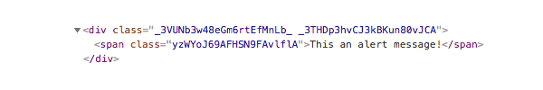

في مشاريع React.js، يمكن **تنسيق المكونات** (_Components_) بعدة طرق مختلفة، واختيار طريقة دون غيرها يعتمد على رغبة المطور ومدى ارتياحه لها. وقد تكون الإستعانة بطريقة معينة أفضل في حالات محددة بحسب درجة تعقيد وحجم المكون.

في هذا الدرس، سنكتشف معا هذه الطرق الأربعة لتنسيق وإضافة أكواد CSS لمكونات تطبيقات React.js، وأنا متأكد بأن المطور سيعرف تلقائيا الطريقة التي عليه استخدامها بحسب حالة وحجم المكون أو المشروع الذي يشتغل عليه.

## 1. استدعاء ملف CSS

تعتمد هذه الطريقة على إنشاء ملف CSS واستدعائه من داخل ملف جافاسكريبت الخاص بالمكون المراد تنسيقه.

```javascript
import React from 'react';
import './Alert.css';

const Alert = () => (
  <div className="alert-box danger">
    <span className="alert-message">This an alert message!</span>
  </div>
);

export default Alert;
```

كما تلاحظون نقوم باستيراد ملف CSS تماما كما نقوم [باستيراد وحدات الجافاسكريبت](https://www.tutomena.com/web-development/javascript/import-export-javascript/)..

شكرا Webpack.

```css
.alert-box {
  padding: 15px;
  border: 1px solid #b71d1d;
}
.alert-box.danger {
  background: #aae9fb;
}
.alert-box.danger .alert-message {
  color: #b71d1d;
}
```

هذه الطريقة يمكن مقارنتها مع الطريقة التي تستخدم في مشاريع **أنجولار** (Angular) حيث أن لكل مكون ملفات CSS الخاصة به ويتم استدعاؤها فقط عندما يقع الطلب على هذا المكون.

## 2. طريقة Inline styling

جميعنا نعرف طريقة Inline Styling التي تستخدم لتنسيق عناصر html في تطبيقات الويب.

**React.js** يتيح لنا كذلك استخدام هذه الطريقة لإضافة أكواد CSS لمكوناته، ولكن الفرق أن التنسيق يكون على شكل **كائن جافاسكريبت** وليس **string** كما جرت العادة في مقاييس HTML الإعتيادية.

```javascript
import React from 'react';

const alertBoxStyle = {
  padding: '15px',
  border: '1px solid #b71d1d'
};
const alertMessageStyle = {
  backgoundColor: '#aae9fb',
  color: '#b71d1d'
};

const Alert = () => (
  <div style={alertBoxStyle}>
    <span style={alertMessageStyle}>This is an alert message!</span>
  </div>
);

export default Alert;
```

كتابة تنسيقات **Inline Styles** في React على شكل كائنات جافاسكريبت أمر منطقي إذا علمنا أن قالب المكون هو في النهاية مجرد أكواد جافاسكريبت تظهر وكأنها html عادي، ولكنها في الحقيقة ليست كذلك.

تلك الأكواد التي تشبه html هي مجرد تركيب يدعى JSX يتم تحويله فيما بعد بواسطة **Babel** و **Webpack** إلى أكواد جافاسكريبت عادية في مرحلة البناء أو *Bundling*.

## 3. طريقة وحدات CSS أو CSS Modules

### **ما هي Css modules ؟**

بحسب المستودع الرسمي لمشروع وحدات Css، فإن تعريف الأخيرة هو :

> **CSS files in which all class names and animation names are scoped locally by default.**

**وحدات CSS** ليست مشروعا رسميا من هيئة [W3.org](https://www.w3.org/Style/CSS/specs.en.html) ولا يوجد له أي دعم أصلي من أي من المتصفحات المعروفة، بل هي فقط عملية تتم أثناء مرحلة بناء ملفات الجافاسكريبت الخاصة بمشروعنا (باستخدام [Webpack](https://www.tutomena.com/web-development/javascript/webpack-practical-guide/) مثلا) ويتم خلالها تغيير أسماء كلاسات ومحددات CSS و HTML حتى يتم استخدامها وفق نطاق (Scope) محدد. والهدف هو حماية أكواد داخل نطاق المكون الذي قام باستدعائها.

إليكم كيفية استخدام وحدات ال CSS داخل مكون React.js :

```javascript
import React from 'react';
import styles from './Alert.css';

const Alert = () => (
  <div className={[styles.alertBox, styles.danger].join(' ')}>
    <span className={styles.alertMessage}>This an alert message!</span>
  </div>
);

export default Alert;
```

نلاحظ أننا قمنا باستدعاء ملف _Alert.css_ وكأنه ملف جافاسكريبت، ونقوم باستهداف الكلاسات داخله وكأنها خصائص داخل كائن جافاسكريبت.

وملف CSS سيكوم على هذا الشكل :

```css
:local(.alertBox) {
  padding: 15px;
  border: 1px solid #b71d1d;
}
:local(.alertBox.danger) {
  background: #aae9fb;
}
:local(.alertBox.danger .alertMessage) {
  color: #b71d1d;
}
```

وفي مرحلة ال Bundling سيقوم Webpack (بعد إعداده) بتوليد أسماء جديدة للكلاسات التي تم استخدامها، ما يعني أن الأسماء التي قمنا بكتابتها لا يتم استخدامها أبدا في المتصفح، فقد تم تعويضها بالأسماء الجديدة كما ستلاحظون في الصورة التالية :

[](../images/css-module-html-output.png)

عندما تقوم بإنشاء مشروع React.js باستخدام الحزمة _create-react-app_ فإن Webpack يكون معد لدعم خاصية CSS modules ولكن بشرط إحاطة المحددات ب **()local:** كما في المثال أعلاه.

أما إذا تم إنشاء المشروع بطريقة أخرى فسيكون علينا إعداد Webpack ليدعم هذه الميزة. والإعداد بسيط لا يحتاج سوى لإضافة هذه الأسطر :

```json
{
  "loader": require.resolve("css-loader"),
  "options": {
    "importLoaders": 1,
    "modules": true,
    "localIdentName": "[name]__[local]___[hash:base64:5]"
  }
}
```

حينذاك لا نكون مجبرين على استخدام **()local:**، بل نكتب كلاسات CSS كما نفعل دائما في أي ملف css عادي.

## 4. استخدام styled-components

[styled-components](https://github.com/styled-components/styled-components) هي مكتبة موجهة ل React.js لإضافة تنسيقات على شكل مكونات (_Components_) يتم إنشاؤها باستخدام خليط من الجافاسكريبت و css.

```javascript
import React from 'react';
import styles from './Alert.css';

import styled from 'styled-components';

const themes = {
  danger: {
    bgColor: '#aae9fb'
  }
};

const AlertBox = styled.div`
  padding: 15px;
  border: 1px solid #b71d1d;
  background: ${props => props.type.bgColor};
`;

const AlertMessage = styled.span`
  color: #b71d1d;
`;

const Alert = () => (
  <AlertBox type={themes.danger}>
    <AlertMessage>This an alert message!</AlertMessage>
  </AlertBox>
);

export default Alert;
```

1. أولا نقوم بتحميل مكتبة `styled-components` بطبيعة الحال عن طريق مدير الحزم npm.
2. بعد ذلك نقوم بتعريف وإنشاء **مكون التنسيق** الخاص بنا وتحديد عنصر html الذي يمثله في واجهة المستخدم (div و span في حالتينا).
3. في الأخير نقوم باستعمال أسماء مكونات التنسيق التي أنشأناها (`AlertBox` و `AlertMessage`) ونقوم بطلبها واستدعائها تماما كما نفعل مع مكونات React.js في الحالات العادية.

## النهاية

هذه الطرق الأربعة التي تستخدم على نطاق واسع **لتنسيق** تطبيقات ومشاريع **React.js**.

كما قلت في المقدمة، المطور يستطيع معرفة الطريقة أو الطرق التي تنسابه بحسب الحالة التي أمامه، وبالتالي لا يمكن الحكم على أي من تلك المقاربات بأنها أفضل من غيرها.

---

سيسعدني كثيرا سماع آرائكم وتجاربكم مع مشاريع React.js، وكيف تقومون عادة بإضافة تنسيقات CSS إليها.

دعونا نستفيد من بعضنا البعض :)

---

### مراجع :

- [codeburst.io](https://codeburst.io/4-four-ways-to-style-react-components-ac6f323da822)
- [css-tricks.com](https://css-tricks.com/css-modules-part-1-need/)
