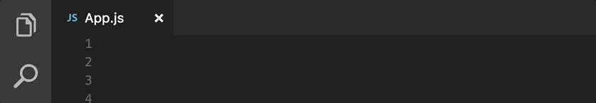
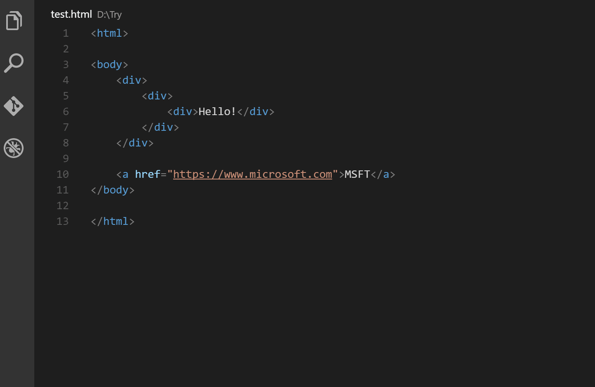
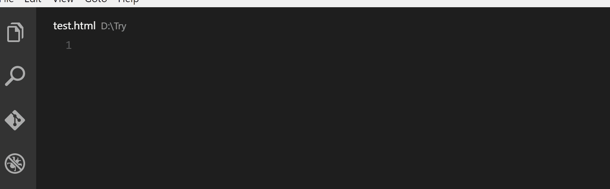

اكتسب محرر الأكواد **فيجوال ستوديو كود** **Visual Studio Code** شعبية كبيرة منذ إطلاقه لأول مرة عام 2015 من طرف شركة مايكروسوفت، وأصبح في وقت وجيز واحدا من أفضل 3 محررات بالنسبة لمطوري الويب، خاصة منهم الذين يقضون أوقاتا طويلة في العمل على مشاريع **جافاسكريبت** و **Node.js**.

يوفر **VSCode** افتراضيا العديد من المزايا التي يحتاجها كل مطور واجهات الويب الأمامية، ويدعم بشكل قوي لغتي جافاسكريبت و **Typescript**، هذه الأخيرة من تصميم شركة مايكروسوفت نفسها.

إلى جانب ذلك، يزخر [متجر Visual Studio Code](https://marketplace.visualstudio.com/vscode) بأعداد هائلة من الإمتدادات (Extenstions) التي تضيف إلى هذا المحرر مزايا أخرى متنوعة لجعل حياة المطورين أكثر سعادة ويسرا.

وبدون الإطالة في المقدمة، سنقدم لكم اليوم مجموعة من أهم وأبرز **إضافات VSCode** التي يستخدمها مطورو الويب لمشاريع JavaScript و Node.js.

## Prettier

تمكن [إضافة Prettier](https://marketplace.visualstudio.com/items?itemName=esbenp.prettier-vscode) من تنسيق وترتيب الشفرة البرمجية وفق إعداد محددة بعناية، حيث يتم ضمان تنسيق الكود بكيفية أوتوماتيكية عند حفظ التغييرات. ونلمس كثيرا أهمية هذه الإضافة في المشاريع الجماعية التي يشتغل عليها أكثر من مطور، إذ يضمن لنا **Prettier** لنا تنسيقا موحدا مهما كانت عادات كل مطور على حدة في كتابة الأكواد البرمجية.

<iframe width="710" height="439" src="https://www.youtube-nocookie.com/embed/YIvjKId9m2c?rel=0&amp;controls=0&amp;showinfo=0" frameborder="0" allow="autoplay; encrypted-media" allowfullscreen="allowfullscreen"></iframe>

إلى جانب **جافاسكريبت**، يدعم Prettier العديد من اللغات وأطر العمل مثل **CSS** ،**Typescript** ،**GraphQL** ،**Vue.js** ، **SCSS** إلخ...

## Import Cost

تتيح لنا إضافة [import Cose](https://marketplace.visualstudio.com/items?itemName=wix.vscode-import-cost) رؤية حجم الوحدات والمكتبات التي يتم استيرادها عن طريق خاصية **import** في جافاسكريبت. هذا يسمح للمطورين بالبقاء على بينة من "الثمن" الذي عليهم دفعه في مقابل عملية الإستيراد :)

ويساعد معرفة حجم هذه الوحدات المستوردة في اتخاذ القرارات المناسبة واستدعاء فقط الأكواد التي نحتاجها عوض استدعاء مكتبة كاملة على سبيل المثال من أجل غرض محدد يمكن استيراده لوحده من أجل تخفيف حجم الحزمة أو ملف جافاسكريبت النهائي للمشروع.

## Auto Rename Tag

تمكننا إضافة [Auto Rename Tag](https://marketplace.visualstudio.com/items?itemName=formulahendry.auto-rename-tag) من إعادة تسمية وسوم **HTML** بطريقة آلية، حيث أنه بمجرد تغيير اسم أحد الطرفين المكونين لوسم HTML (وسم الإفتتاح ووسم الإغلاق) فإن الطرف الآخر يتغير أوتوماتيكيا وبسرعة.

تدعم هذه الإضافة كذلك تركيب **JSX** الذي يستخدم في مشاريع [**React.js**](https://www.tutomena.com/web-development/javascript/react-javascript-library/).

## Auto Close Tag

ميزة الإغلاق التلقائي موجودة ومدمجة في محرر **فيجوال ستوديو كود** منذ الإصدار **1.16**، ولكن هذا الدعم كان مقتصرا على ملفات HTML فقط. لذلك جاءت إضافة [Auto Close Tag](https://marketplace.visualstudio.com/items?itemName=formulahendry.auto-close-tag) لإتاحة هذه الميزة كذلك في ملفات **PHP**، **جافاسكريبت**، **Vue** ،**JSX** وغيرها...

الإغلاق التلقائي للوسوم يمنحنا سرعة كبيرة في كتابة الكود وتجربة جيدة توفر علينا وقتا ثمينا لا يستهان به.

## Live Server

تساعد إضافة [Live Server](https://marketplace.visualstudio.com/items?itemName=ritwickdey.LiveServer) على إطلاق سريع لخادم محلي يقوم بتحديث المشروع على المتصفح بشكل تلقائي بعد كل عملية حفظ.

هذا الخادم لا يقتصر فقط على دعم الملفات الساكنة مثل HTML وCSS وجافاسكريبت، بل يدعم كذلك ناحية الخادم وتحديدا مشاريع **Node.js** حيث يقوم بإعادة تحميل المتصفح كذلك بعد كل تغيير في الكود.

## ESLint

[مكتبة ESLint](https://eslint.org/) معروفة لدى مطوري جافاسكريبت، هدفها مساعدتهم على كتابة أكواد جافاسكريبت خالية من الأخطاء، حيث تفرض على المطور بعض القواعد والإصطلاحات التي يجب عليه احترامها للحصول في النهاية على شفرة برمجية نقية وخالية من الأخطاء.

<iframe width="100%" height="439" src="https://www.youtube.com/embed/hppJw2REb8g?rel=0&amp;controls=0&amp;showinfo=0" frameborder="0" allow="autoplay; encrypted-media" allowfullscreen="allowfullscreen"></iframe>

[إضافة ESLint](https://marketplace.visualstudio.com/items?itemName=dbaeumer.vscode-eslint) الخاصة ب Visual Studio Code تقوم بدمج ESLint في المحرر مما يتيح للمطورين رؤية الأخطاء واقتراحات ESLint مباشرة عند كتابة الأكواد، دون الإضطرار للجوء لنافذة الأوامر السطرية كما جرت العادة في الإستخدام العادي لهذه المكتبة.

## خاتمة

ليست هذه إلا عينة يسيرة من الكم الهائل لإضافات **محرر فيجوال ستوديو كود** الموجهة لمطوري واجهات الويب الأمامية وكذلك مطوري Node.js.

هذه الإضافات توفر على المطور أوقاتا ثمينة وتساعده على الرفع من إنتاجيته، جاعلة تجربته أكثر متعة وسهولة مع الكود والعمليات المتكررة.
