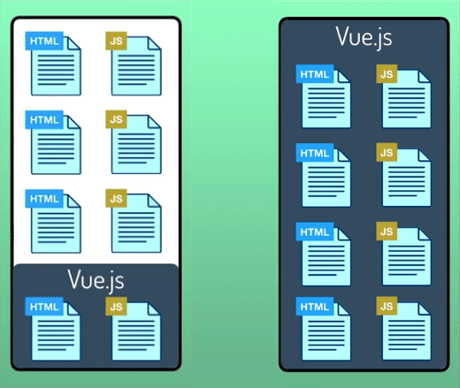
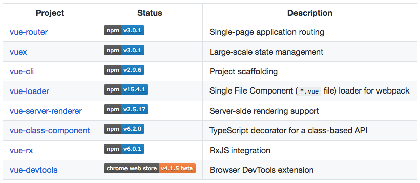

اختيار إطار عمل جافاسكريبت ليس أسهل مهمة في العالم في وقتنا هذا، بالخصوص إذا علمنا أن الخيارات متعددة ومجتمع جافاسكريبت من أنشط المجتمعات في عالم لغات البرمجة.

نسبة ساحقة من مطوري الويب حول العالم متفقون ويعلمون جيدا أن الثلاثي المتكون من **أنجولار**، **React.js** و **Vue.js** هم الأكثر شعبية والأكثر استخداما في تطبيقات ومشاريع الويب الحديثة، والإختيار بين واحد منهم يعتبر مهمة أصعب حيث أن لكل واحد نقاط قوة كبيرة ومزايا خاصة تجذب مطوري واجهات الويب الأمامية.

**إطار العمل Vue.js**، الذي [طوره في البداية شخص واحد فقط](https://www.tutomena.com/web-development/javascript/vuejs-framework-launching-story/)، استطاع اقتسام هذه الكعكة مع React.js و Angular اللذان يقف خلفهما عملاقا الويب **Facebook** و **Google**، وهذا ليس من قبيل الصدفة.

**Vue.js** يتمتع بمزايا كثيرة تكسبه جاذبية خاصة وتجعله خيارا مفضلا لأعداد هائلة من المطورين. وفي هذا المقال، سنستعرض لكم 3 من أهم هذه الأسباب التي قد تجعلك مقتنعا باستخدام Vue.js في مشاريعككم القادمة.

## 1. ابدأ بسهولة كما كنت تفعل مع jQuery

في السابق، عندما كنا نريد إضافة مكتبة جيكويري لمشروعنا كنا فقط نقوم باستدعائها عن طريق الوسم `<script>` كما نستدعي أي ملف جافاسكريبت. بنفس الطريقة يمكن إضافة **Vue.js** لمشاريعنا :

```html
<script src="https://cdn.jsdelivr.net/npm/vue/dist/vue.min.js"></script>
```

بعد ذلك يمكننا إنشاء ملف الجافاسكريبت الخاص بنا حيث سنكتب أكواد Vue.js.

لنرى مثالا صغيرا عن سهولة استخدام Vue.js في مشاريع الويب :

<div class="filename">app.html</div>

```html
<div id="app">
  <h1>{{ message }}</h1>
  <input v-model="message" />
</div>
```

<div class="filename">app.js</div>

```javascript
var app = new Vue({
  el: '#app',
  data: {
    message: 'Hello Vue!'
  }
});
```

<div class="filename">app.css</div>

```css
h1 {
  font-size: 36px;
  color: #444;
}
```

لا يوجد أسهل من هذا :)

تتبع مكتبة Vue.js [نظام تدفق بيانات ثنائي الإتجاه](https://www.tutomena.com/web-development/javascript/one-way-vs-two-way-data-binding/) (_Two-Way Data Binding_) في غاية المرونة، حيث أن تغيير البيانات من واجهة المستخدم يقابله تحديث أتوماتيكي للبيانات في كود جافاسكريبت والعكس صحيح.

### تنويه

يجب التنويه هنا إلى أن هذه الطريقة في البدء مع Vue.js قد تكون صالحة في حال احتجنا Vue لغرض بسيط في صفحة واحدة أو بعض صفحات مشروعنا. ولكن عندما يكون المشروع في أغلبه عبارة عن كود جافاسكريبت أو تطبيقا أحادي الصفحة Single Page Application فإن الحل الأفضل والموصى به لتثبيت Vue.js هو عن طريق الحزمة [Vue-CLI](https://cli.vuejs.org/). هذه الأخيرة تعني ل Vue.js ما تعنيه حزمة **create-react-app** بالنسبة ل React.js أو **Angular-CLI** لإطار العمل أنجولار.

هذه المرونة نقطة إيجابية بالنسبة لمكتبة Vue.js، إذ يمكننا بواسطتها تطوير مشاريع كاملة ومعقدة في نفس الوقت الذي يمكننا استخدامها لغايات أقل تعقيدا مثل إنشاء مكونات (_Components_) تستخدم في أجزاء معينة فقط من صفحات الموقع، وهذا هو السبب في وصف Vue.js بأنه **Progressive** framework.

[](../images/vuejs-progressive-framework.png)

## 2\. النظام البيئي ل Vue.js مدعوم كله تقريبا بشكل رسمي

[](../images/vuejs-ecosystem.png)

معظم المكتبات المكونة للنظام البيئي لإطار العمل **Vue.js** مدعومة **رسميا** من طرف الفريق نفسه المطور ل Vue.js، وهذه ميزة فريدة لا نراها على سبيل المثال في أطر عمل أو مكتبات منافسة مثل **React.js**.

هذه الميزة تضمن للمطورين توافقية دائمة وتناغما مستمرا بين مختلف هذه المكتبات (**Vuex** ،**Vue-router** ،**Vue-cli** إلخ...) التي تستخدم بشكل مكثف في جل مشاريع Vue.js.

الجميل كذلك في هذه النقطة أننا لو أردنا مكتبة، على سبيل المثال **لإدارة الحالة** (_State management_) في تطبيقات Vue، فلن يكون علينا البحث بعيدا عن الحل الأفضل من بين، _ربما_، عشرات المكتبات الموجودة لنفس الغرض، لأن فريق Vue.js وفر لنا مكتبة خاصة لهذه المهمة واسمها **Vuex** موثقة أيضا بشكل جيد على [الموقع الرسمي](https://vuex.vuejs.org/) ل Vue.js.

هذا النظام البيئي الغني والمتراص جعل من Vue.js إطار عمل **قابلا للتفكيك** وفق احتياجاتنا، فعوض جمع كل تلك الوظائف في قلب ونواة الإطار، كما هو الحال في إطار العمل **Angular** مثلا، قام الفريق المطور بقيادة **Evan You** بتقسيم كل ذلك إلى مكتبات مستقلة عن نواة المكتبة الأساسية. بهذا تم الحفاظ على حجم Vue.js الصغير وجعل منها **مكتبة وإطار عمل في نفس الوقت**.

## 3. السرعة الفائقة والأداء الممتاز

إطار العمل Vue صغير بالمقارنة مع الثنائي Angular و React.js، فحجمه وهو مضغوط (_gzipped_) لا يتجاوز **30 كيلو بايت** شاملة Vue-router ،Vue.js و Vuex :)

هذا الحجم الصغير يعني وقت تحميل سريع في المتصفح واستهلاك أقل للذاكرة.

السبب الآخر لقوة أداء وسرعة Vue.js هو الإعتماد على مبدأ **Virtual DOM** الذي تم استلهامه من React.js. هذا المبدأ يعتمد على إنشاء **شجرة DOM وهمية** في ذاكرة المتصفح (عبارة عن كائن جافاسكريبت)، وبعد كل تغير في **حالة** التطبيق يتم مقارنة Virtual DOM مع **DOM الحقيقي** ليتم تحديث الأجزاء فقط التي طرأ عليها التغيير وليس شجرة DOM كلها.

للمزيد من التفاصيل يمكنك الرجوع إلى [موضوع سبق أن كتبناه خصيصا لشرح خاصية Virtual DOM](https://www.tutomena.com/web-development/javascript/virtual-dom/).

## النهاية

يحظى إطار العمل **Vue.js** بشعبية كبير جدا في عالم JavaScript، وكما رأينا لم يكن هذا من قبيل الصدفة أو المجاملة.

استطاع هذا **الفريموورك** انتزاع مكان أساسي في تشكيلة أقوى وأفضل أطر عمل جافاسكريبت بالرغم من كونه لا يتمتع بدعم شركة عملاقة مثل Google أو Facebook، وهذا يزيدنا يقينا بأن الشعبية والثقة التي اكتسبها في السنوات القليلة الماضية كانت مستحقة وعن جدارة.
