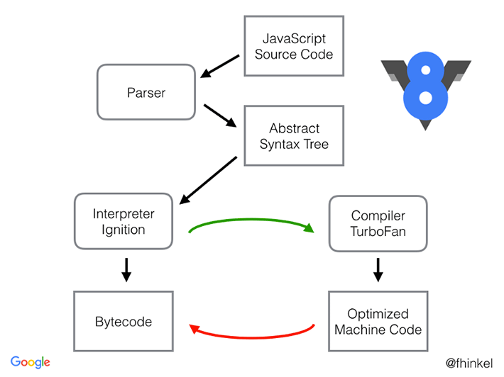
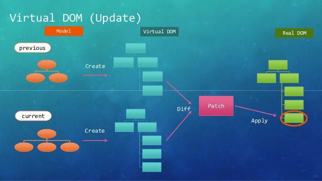

لم يكن **براندن إيش** ربما يتخيل بأن لغة البرمجة الصغيرة التي قام بتصميمها في أيام معدودة من عام 1995، ستصبح في يوم ما واحدة من أكثر لغات البرمجة استخداما على مستوى العالم.

لم يكن الغرض من **جافاسكريبت** في البداية سوى إضافة بعض التأثيرات التفاعلية على مستوى متصفح **Netscape**، وربما كذلك لم يدر في خلد **Brendan Eich** بأن حياة Netscape ستكون أقصر بكثير من حياة JavaScript. فلقد قامت شركة AOL - التي كانت قد استحوذت على Netscape في عام 1999 - بوضع حد لحياة ذلك المتصفح في أواسط عام 2003، بينما مثل العام الموالي الفترة التي شهدت الولادة الثانية والحقيقية لجافاسكريبت، وستعرفون لاحقا لماذا ;)

## **عصر DHTML**

في السنوات الأولى من الألفية الحالية كان استخدام الجافاسكريبت مقتصرا على إضافة بعض التأثيرات البصرية والتفاعلية الخفيفة على صفحات الويب، مثل إظهار النوافذ المنبثقة عند النقر على زر معين، أو تغيير محتوى وتصميم بعض العناصر عند حدث معين وغيرها من الأمور التي نستطيع القيام بها اليوم باستخدام Css3 فقط!

عرفت تلك الأيام بفترة ال **Dynamic HTML** أو **DHTML**.

## عصر الأجاكس وانبعاث الجافاسكريبت

في عام 2004، قامت شركة Google بإطلاق خدمة البريد **Gmail** التي يعرفها الصغير والكبير في يومنا هذا.

كانت خدمة Gmail أول تطبيق ويب يستخدم جافاسكريبت بتلك الكثافة الكبيرة مستغلا واجهة [XMLHttpRequest](https://en.wikipedia.org/wiki/XMLHttpRequest) لإجراء **العمليات الغير متزامنة** (_Asynchronous_) مع الخادم، وشكل بذلك Gmail مثالا حيا ووحيدا لما يمكن القيام به على المتصفح بفضل إمكانيات جافاسكريبت. في الوقت الذي كان فيه منافساه آنذاك Hotmail وYahoo Mail مازالا يجبران المستخدمين على انتظار إعادة تحميل الصفحة بعد كل عملية اتصال مع الخادم!

في العالم الموالي، 2005، عادت شركة Google لإطلاق تطبيق ويب آخر كبير وأعقد من Gmail، هذا التطبيق لم يكن سوى **Google Maps** :)

قامت شركة Google بتطوير هذا المشروع الضخم بنفس التقنيات التي استخدمتها في Gmail، وكانت سباقةً أيضا لتكون أول شركة كبيرة توفرة واجهة جافاسكريبت ـ JavaScript API ـ لتمكين المطورين من إضافة خرائط Google Maps مخصصة لمواقعهم الإلكترونية.

النجاح الباهر لقوقل في إطلاق المشروعين السالفين أسال لعاب مطوري الويب وكبريات الشركات حول العالم، فسار الجميع لتقفي آثار العملاق الأمريكي، وشهد الويب في تلك الفترة نقلة نوعية شكلت بداية لعصر ال **Web 2.0** وظهور وانتشار تقنية **Ajax** (أو Asynchronous JavaScript and XML) التي غيرت وجه هذه الصناعة إلى الأبد.

تمكن تقنية الأجاكس - المبنية على الكائن **XMLHttpRequest -** من القيام بالإستعلامات نحو الخادم (Server) وتلقي الرد من دون أن يعاد تحميل الصفحة وبشكل غير تزامني _Asynchronous،_ يعني يمكن لجافاسكريبت أن يقوم بأشياء أخرى ريثما يصلنا جواب الخادم :)

هذه التقنية فتحت أعين المطورين كما قلنا على الفرص الكبيرة التي باتت متاحة في هذا المجال، وظهرت بذلك عدد من المكتبات التي كان هدفها توفير أرضية مناسبة لمطوري الويب لتطوير تطبيقات وحلول ويب متقدمة وعصرية، كان من أشهرها مكتبات مثل **Mootools** ،**Prototype** و**Dojo.** ولكن الأشهر على الإطلاق والأكثر تأثيرا كانت مكتبة **jQuery** لصاحبها John Resig.

## مكتبة jQuery تسرق الأضواء من الجميع

لم تكن **جيكويري** أول مكتبة جافاسكريبت تظهر على الساحة، فلم ترى النور إلا في عام 2006، ولكنها استطاعت حسم الصراع مع منافساتها بسرعة كبيرة بفضل مميزاتها الكثيرة.

كان مطورو الويب يعانون من كون أكواد جافاسكريبت لا تشتغل بالضرورة كما هو متوقع في جميع المتصفحات، حيث أن لكل منها محرك الجافاسكريبت الخاص بها، وعانينا بشدة على وجه الخصوص مع متصفحات انترنت إكسبلورر من مايكروسوفت والتي كانت دائما معزولة ومتخلفة عن الركب ولها واجهة **DOM AP**I خاصة بها، ولم يكن ممكنا إهمالها أوتجاهلها لأنها كانت تستخدم من طرف شريحة عريضة من رواد الإنترنت آنذاك.

كان أحد أهم إنجازات جيكويري أنها استطاعت توفير واجهات جافاسكريبت متوافقة مع جميع المتصفحات الكبيرة، وقامت بتجريد تلك الواجهات بشكل يجعل من استخدامها وقراءتها أمرا غاية في السهولة على المطورين. فلكي نستمع لحدث النقر على عنصر معين في HTML، كنا مجبرين على كتابة كودين لنفس الغرض، واحد لإنترنت إكسبلورر وآخر لفايرفوكس وباقي المتصفحات.

```javascript
var button = document.getElementById('btn');

if (button.addEventListener) {
  // all browsers except Internet Explorer before version 9

  button.addEventListener(
    'click',
    function() {
      // Do Something
    },
    false
  );
} else {
  if (button.attachEvent) {
    // Internet Explorer before version 9

    button.attachEvent('onclick', function() {
      // Do Something
    });
  }
}
```

ولكن مع جيكويري أصبح المسألة أكثر سهولة :

```javascript
$('#btn').click(function() {
  // Works in all browsers ;)
  // Do Something
});
```

هذا الكود سيعمل على جميع المتصفحات المعروفة في السوق، فما على المطور الآن إلا التركيز على الوظائف التي تخص مشروعه ويترك موضوع وصداع التوافقية لجيكويري التي تتكفل بكل ذلك في الكواليس. وإذا كنت من المتطفلين قليلا :) فستدخل للشفرة المصدرية لمكتبة jQuery وترى العمل الكبير الذي أنجز في الخفاء لإعطائنا مثل هذه الواجهات البرمجية الجميلة والبديهية.

إذن كما قلنا هدف [jQuery](https://www.tutomena.com/web-development/javascript/%d8%ac%d8%a7%d9%81%d8%a7%d8%b3%d9%83%d8%b1%d9%8a%d8%a8%d8%aa-%d9%88%d8%ac%d9%8a%d9%83%d9%88%d9%8a%d8%b1%d9%8a-%d8%9f-%d8%a3%d9%8a%d8%a9-%d8%b9%d9%84%d8%a7%d9%82%d8%a9-%d8%9f/) لم يكن وضع إطار عمل أو نمط (Pattern) معين لإنشاء تطبيقات الويب، بل قامت فقط بتجريد (Abstract) أهم الوظائف الأساسية في جافاسكريبت (XMLHttpRequest ،DOM API إلخ...) وبنت عليها بعض الوظائف والمزايا الإضافية (مثلا Animate API) لكي يصبح تركيز المطورين منصبا فقط على بناء مشاريع ويب عصرية ومتقدمة بطرقهم الخاصة وعدم التفكير مجددا في موضوع التوافقية.

## "غوغل" مرة أخرى تقدم خدمة كبيرة لعالم JavaScript

في عام 2008 قامت شركة Google بإطلاق **متصفح Chrome** بمحرك جافاسكريبت جديد أطلقوا عليه اسم **V8** (نسبة إلى محرك السيارت V8 ثماني الأسطوانات). وقالت الشركة في [التدوينة الرسمية](https://googleblog.blogspot.com/2008/09/fresh-take-on-browser.html) التي أعلن فيها عن إطلاق هذا المشروع : "**لقد قمنا ببناء محرك جافاسكريبت أكثر قوة، V8، لدعم الجيل القادم من تطبيقات الويب التي لم يكن من الممكن تشغيلها في متصفحات اليوم**".

تبين في بعض تجارب الأداء أن V8 ضاعف سرعة وأداء الجافاسكريبت 10 مرات مقارنة بمتصفح Internet Explorer، والسبب أن V8 يحول كود الجافاسكريبت إلى كود آلة (Native machine code) قبل تنفيذه، وتعرف هذه الآلية ب **JIT Compilation** أو **just-in-time Compilation.**

[](../images/v8-jit-compilation.png)

بعد ذلك هبّ جميع المنافسين مثل **موزيلا** و**انترنت إكسبلورر** لاتباع نفس الإستراتيجية، فقام بكل منهم بتطوير محركات الجافاسكريبت الخاصة بهم وفق آلية JIT Compilation عوض عن المفسرات (_Interpreters_) التقليدية التي كانت معتمدة.

كانت هذه بداية أخرى مهمة لمرحلة جديدة من حياة الجافاسكريبت التي ستشهد زخما ونشاطا كبيرين فيما هو قادم من السنوات.

> V8 هو محرك الجافاسكريبت المعتمد في بيئة التشغيل Node.js الذي ظهر في عام 2009. هذه التقنية (Node.js) كانت من ثمار هذا المشروع الهام (V8)، ولا يخفى على أحد منكم التأثير الهائل ل Node.js على بيئة جافاسكريبت ككل منذ ذلك الحين.

## Backbone.js يقص شريط عصر أطر عمل جافاسكريبت

ظهر إطار العمل **Backbone.js** لأول مرة عام 2010 على يد **Jeremy Ashkenas**.

لقد رأى جيريمي بأن الإستخدام المكثف ل jQuery في بناء تطبيقات ويب عصرية أحادية الصفحة (Single Page Applications) يؤدي في النهاية إلى أكواد معقدة وصعبة التتبع والقراءة، حيث تبدأ المعاناة مع هذه المكتبة عندما يكون حجم المشروع متوسطا أو كبيرا. في الحقيقة لا يمكننا عتاب جيكويري على هذه النقطة لأنها لم تكن الهدف أوالغاية الأساسية من وراء إنشائها.

المهم، قرر جيريمي توفير مكتبة لوضع أرضية عمل منظمة ومناسبة لصناعة تطبيقات ويب تنطوي على قدر معين من التعقيد، وفق نمط MVC (أو MVP) الذي كان آنذاك يعيش أيامه الأولى في عالم جافاسكريبت.

بفضل Backbone.js أصبح بإمكاننا تقسيم الشفرة المصدرية لمشاريعنا بشكل منطقي إلى مشاهد (Views) و Models. بداخل المشاهد أمكننا الإستماع إلى التغييرات الطارئة على مستوى ال Models وتحديث واجهة المستخدم بناء على تلك التغييرات ووفقا لأحداث معينة **بطريقة يدوية**، فلم يكن Backbone يدعم خاصية [Data Binding](https://www.tutomena.com/web-development/javascript/one-way-vs-two-way-data-binding/) التي نعرفها اليوم في معظم أطر عمل جافاسكريبت.

يحسب ل Backbone.js أنه كان أولى المحاولات الحقيقية لبناء إطار عمل أو مكتبة جافاسكريبت بغرض جعل إنشاء تطبيقات SPA أكثر سهولة وتنظيما.

## **إطار العمل AngularJS يرفع مستوى التحدي**

في نفس الفترة التي ظهر فيها **باكبون** تقريبا، كان هنا شخصان، أحدهما اسمه Misko Hevery والآخر Adam Abrons، يعملان على بناء إطار عمل لتسهيل برمجة تطبيقات الويب، ليس فقط على المطورين، ولكن على المصممين كذلك (Web Designers) عن طريق إضافة بعض الوسوم والخصائص (_Attributes_) الجديدة في كود HTML.

قرر الشخصان تسمية هذا المشروع ب Angular الذي احتضنته فيما بعد شركة Google وتكفلت بدعمه وتطويره بعد التحاق Misko للعمل في الشركة العملاقة لتطوير أحد مشاريعها الداخلية مستخدما إطار العمل الذي قام بإنشائه.

- يمكنكم الإطلاع على [هذا المقال الشيق](https://www.angularjswiki.com/angularjs/history-of-angularjs/) للمزيد من التفاصيل حول قصة إنشاء Angular.

حقق إطار العمل **AngularJS** بعد ذلك نجاحا كبيرا للغاية واستطاع جذب شريحة واسعة من مطوري واجهات الويب الأمامية، حيث جلب معه العديد من المزايا الجديدة مثل :

- خاصية **Two-way Data Binding**.
- ميزة **حقن التبعيات** (_Dependency Injection_).
- مكونات قابلة لإعادة الإستخدام (_Reusability_) على شكل ما يعرف ب **Directives**.
- شفرة برمجية **قابلة للفحص والإختبار** (_Testability_).
- ...إلخ

لهذا تم اعتبار AngularJS **أول إطار عمل جافاسكريبت حقيقي** بالمعنى العصري المتعارف عليه في تعريف أطر العمل. فهو يوفر للمطور تقريبا كل الأدوات والإمكانات التي يحتاجها عادة لبناء تطبيقات أحادية الصفحة، ويضعه في إطار محدد للإشتغال، على خلاف الحال في Backbone.js حيث أعطيت حرية أكبر للمطورين في هيكلة مشاريعهم بطرقهم الخاصة ولم يكن هناك رأي واضح في الهيلكة أو الشكل النهائي لبنية المشروع.

لهذا ينظر الكثيرون ل Backbone على أنه مكتبة جافاسكريبت أكثر من كونه إطار عمل، ويمكن اعتباره بمثابة سلة تضم المقادير أو العناصر المهمة التي نحتاجها لإعداد الحلوى، ولكنه غير معني بتوفير القالب وطريقة معينة للتحضير من أجل تحديد الشكل النهائي للحلوى.

بعد AngularJS، ظهرت مجموعة من أطر العمل التي سعت لإقتسام تلك الكعكة وكان من أبرزها **Ember.js** ،**Knockout.js** و [Meteor](https://www.tutomena.com/web-development/javascript/meteorjs-framework/). كل منها جلب معه مميزات وفلسفة خاصة به، وحققت كلها نجاحات جيدة إلا أن AngularJS ظل متسيدا للمشهد بشكل مريح ولم يشكل المنافسون أي خطر حقيقي على نفوذه وحصته في هذا الميدان، حتى جاء **React.js** في عام 2013 ليقلب المعطيات ويحدث رجة تأثرت بها جميع أطر العمل حينها.

## React.js يحدث ثورة في عالم أطر عمل جافاسكريبت

في عام 2011، بلغ موقع فيسبوك مستوى كبيرا جدا من الإنتشار وبات المئات من الملايين حول العالم يستخدمونه يوميا، ما يعني أنه في كل ثانية في اليوم هناك الملايين الذين يستخدمون الموقع في ذات الوقت. والفيسبوك بطبعه موقع تفاعلي يتوصل فيه المستخدمون بأعداد كبيرة من التنبيهات والرسائل في مدد زمنية قصيرة ما يعني استخداما وضغطا مكثفا على شجرة DOM في واجهات المستخدمين. فكلما حدث تغيير في بيانات معينة (مثلا عند استقبال المستخدم لرسالة خاصة) فإن عددا من التحديثات يجب أن تجرى على واجهته الأمامية، مثلا : الإشعار بوصول الرسالة، إضافة الرقم 1 لعداد تنبيهات الرسائل وكذلك صندوق الشات (Messenger الآن) وعند قراءة الرسالة يجب عكس العملية برمتها بتحديث كافة المكونات (_Components_) المتعلقة بخاصية الرسائل الخاصة.

ومن هنا جاء الخطأ (Bug) الذي كان يلاحظه مستخدمو فيسبوك في تلك المدة، حيث أن عداد الرسائل الخاصة في _Navigation bar_ يظل على حاله حتى بعد قراءة الرسائل الواردة. لهذا كان المهندس في شركة فيسبوك، Pete Hunt، يقول ويعتقد بأن تغير البيانات مع مرور الوقت هو أصل كل الشرور في تطبيقات الويب :)

> Data changing over time is the root of all evil - Pete Hunt

<iframe width="560" height="315" src="https://www.youtube.com/embed/nYkdrAPrdcw?rel=0&amp;controls=0&amp;showinfo=0" frameborder="0" allow="autoplay; encrypted-media" allowfullscreen="allowfullscreen"><span data-mce-type="bookmark" style="display: inline-block; width: 0px; overflow: hidden; line-height: 0;" class="mce_SELRES_start"></span><span data-mce-type="bookmark" style="display: inline-block; width: 0px; overflow: hidden; line-height: 0;" class="mce_SELRES_start"></span></iframe>

هذا الخطأ، ولو أنه يبدو بسيطا، أجبر فيسبوك على إعادة تصور الطريقة التي تنظم بها ترابط وتدفق البيانات فيما بين الخادم والواجهات الأمامية وكذلك فيما بين مكونات الواجهة الأمامية نفسها عن طريق ابتداع نظام **Flux،** بالإضافة لتطوير مكتبة جافاسكريبت من الصفر **لبناء واجهات الويب الأمامية** أحد أبرز خصائصها أنها تقسم واجهة المستخدم (User Interface) لمجموعة من المكونات (Components) القابلة لإعادة الإستخدام (Reusable components)، وتقوم بعرض وإعادة عرض (**Re-rendering**) جميع المكونات في الصفحة كلما طرأ عليها تغيير معين. إلا أن هذه الفكرة سيكون ثمنها باهضا كون شجرة DOM ستعاني الأمرين من جراء هذا الكم من العمليات التي تجرى عليها كلما حدث أي تغيير بسيط في حالة (**State**) أي جزء من أجزائها، إضافة إلى مجموعة من الإكراهات والآثار الجانبية الأخرى :-(

### **Virtual DOM**

لحل هذه المعضلة، قرر مطورو فيسبوك الإعتماد على ما يعرف اليوم ب **Virtual DOM**، حيث أنهم قاموا بعمل نسخة لشجرة DOM في الذاكرة (عبارة عن كائن جافاسكريبت) ومعها يتم التعامل عوضا عن ال DOM الحقيقي. هذا الأخير يتم التعامل معه فقط عندما يحين موعد عرض المكون (_Rendering of component_) عن طريق مقارنة حالة Virtual DOM القديمة مع الحالة الجديدة لمعرفة التغييرات التي طرأت عليه فيتم تنفيذها على **DOM الحقيقي** بكيفية تضمن الحفاظ على أقصى درجات الأداء الممكنة.

[](../images/virtual-dom-diffing.jpg)

المهم، بعد أن انتهت فيسبوك من تشكيل الصورة الجديدة في كواليس عمل واجهاتها الأمامية وبعد أن أثبتت هذه الحلول الجديدة نجاعتها وقيمتها، قررت الشركة إطلاق هذه المكتبة لعامة المطورين حول العالم على شكل مشروع مفتوح المصدر تحت مسمى **React.js**.

اليوم عدد كبير من الشركات والمواقع العالمية العملاقة اختارت وذهبت مع **React** لتطوير واجهات الويب الأمامية الخاصة بها، وفيسبوك نفسها كانت قد استخدمت هذه المكتبة في مشاريع أخرى غير فيسبوك كان من أبرزها موقع تطبيق **Instagram** المعروف.

وللمزيد من التعمق والتفاصيل حول Flux ،React.js و Virtual DOM يمكنكم الإطلاع على بعض من مقالاتنا السابقة التي فصلنا فيها ـ قدر المستطاع ـ كل هذه المواضيع :

- [شرح أساسيات React.js – مكتبة جافاسكربت لتطوير واجهات المستخدم](https://www.tutomena.com/web-development/javascript/react-javascript-library/)
- [مدخل إلى مكتبة Redux وكيفية استعمالها في مشاريع React.js](https://www.tutomena.com/web-development/javascript/redux-library/)
- [ما هو Virtual DOM ؟](https://www.tutomena.com/web-development/javascript/virtual-dom/)

## **المشهد بعد React.js**

كما قلت سابقا، أحدث نجاح React.js رجة عنيفة شعرت بها كافة أطر عمل جافاسكريبت، من بينها الزعيم AngularJS.

أكثر ما حسد عليه المنافسون React.js هو مقاربة المكونات (Components) التي جاءت بها والقابلية للنقل وإعادة الإستخدام التي تتميز بها.

في عصر الموبايل و**التطبيقات العابرة للمنصات** (Cross-Platform Applications) أصبحت ميزة إعادة الإستخدام (Reusability) من الميزات التي لا يمكن لأي إطار عمل الإستغناء عنها. لذلك سارعت شركة Google للعمل على إصدار جديد من إطار العمل **أنغولار** تتم إعادة كتابته من الصفر مضيفة إليه مزايا عديدة من بينها الإعتماد على خاصية **المكونات**. استغرق العمل على هذا المشروع قرابة عامين حتى تم إطلاقه رسميا في شتنبر من عام 2016 تحت مسمى **Angular 2**.

في نفس الفترة التي كانت فيها شركة Google تعمل على الإصدار الجديد من إطار عملها، كان هناك شخص آخر يدعى **Evan You** يعمل على إصدار جديد من إطار عمله المسمى Vue.js، الذي لم يكن صيته في ذلك الوقت ينافس بقوة شعبيتي AngularJS وReact.js.

الإصدار الجديد من Vue تم إطلاقه تقريبا في نفس الفترة التي شهدت إطلاق Angular 2، وحمل معه مجموعة من المميزات المثيرة للإهتمام ومستلهما بدوره من React.js بعضا من نقاط قوتها، لعل أبرزها ميزة Virual DOM. هذه الميزة حسنت كثيرة من سرعة وقوة أداء إصدار **Vue 2** الجديد مقارنة بالإصدار القديم.

شيئا فشيئا تسلق **Vue.js 2** مراتب النجاح واستمال شرائح واسعة من المطورين الذي أعجبوا بإطار العمل الوحيد الذي يجمع مزايا React.js وأنغولار، حيث أنه ظل محافظا على نظام قوالب HTML (الذي نجده كذلك في Angular) عوضا عن استخدام جافاسكريبت (أو **JSX**) لهذا الغرض مثلما هو الحال عند React.js. لذلك يرى كثيرون أنه يمكن النظر ل Vue 2 على أنه **نتاج تزاوج بين Angular و React** :)

- [كل ما تريد معرفته عن أطر العمل Angular ،React.js و Vue.js](https://www.tutomena.com/web-development/javascript/react-vue-angular-comparison/)
- [إطار العمل Vue.js.. ثلاثة أسباب قد تدفعك لإختياره](https://www.tutomena.com/web-development/javascript/3-reasons-to-choose-vuejs-framework/)

## النهاية

من المهم جدا أن يعرف مطورو الواجهات الأمامية في أيامنا هذه قصة ظهور وتطور أطر العمل التي نراها اليوم، وفهم الإشكاليات التي جاء كل منها لحلها. ولا يمكن النظر لقصة تطور هذه التقنيات واستيعابها بمعزل عن فهم ورؤية التطور الحاصل في مجال الويب والإنترنت بشكل عام في السنين الماضية.

ستلاحظون أنه بالموازاة مع تطور أطر عمل جافاسكريبت في مجال تطوير تطبيقات الويب، ظهرت هناك ميادين أخرى حيث تعمل هذه الأطر بكفاءة عالية مثل برمجة تطبيقات الموبايل (Ionic ،NativeScript ،React Native إلخ...) وتطبيقات سطح المكتب (Proton Native ،Electron ...) بالإضافة إلى التوافقية الممتازة مع ميزة Server-side rendering التي حلت مشكلتي SEO والقابلية للقراءة من طرف روبوتات مواقع التواصل الإجتماعي اللتان كانتا تعاني منهما تطبيقات الويب أحادية الصفحة.

---

سأسر كثيرا لسماع آرائكم حول هذا الموضوع :) وإذا كانت لديكم أي معلومات أوتفاصيل أخرى تودون إغناء الموضوع بها فسيكون صندوق التعليقات أفضل مكان لطرحها لكي نستفيد جميعا.

---

إذا لم يعجبكم الموضوع فلا تشاركوه مع أحد
