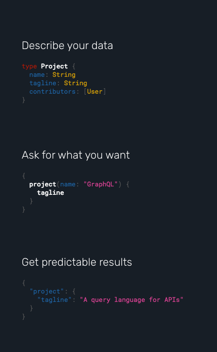

أتينا في عدد من المقالات والدروس السابقة على ذكر دور **GraphQL** في إنشاء وتصميم **الواجهات البرمجية** APIs، ولكن لم يسبق لنا الحديث بإسهاب عن هذه التقنية الحديثة وشرحها بشكل كافٍ يجعلنا نفهم ما يميزها عن طريقة **REST** التي سادت طوال السنين الماضية.

لهذا أعتقد بأن هذا هو الوقت المناسب لتخصيص مقال مفصل لفهم الفكرة وآلية العمل التي بني عليها GraphQL، فالأخير سيكون جزءً أساسيا من دروس جافاسكريبت التي سنقوم بإعدادها ونشرها في قادم الأيام.

## الخادم (Server) والعميل (Client)

كل تطبيق ـ سواء كان تطبيق ويب أو غيره ـ يعتمد على واجهة خلفية ممثلة بخادم يتم التعامل معه لمعالجة وتخزين بيانات المستخدمين أو جلبها من قاعدة البيانات. وعندما يتعلق الأمر بطرق المحادثة بين الخادم وعملائه، فإن REST تعتبر أشهر هذه الطرق وأكثرها استخداما إلى يومنا هذا.

REST هي اختصار ل *Representational state transfer *وفكرتها الأساسية تقوم على أن الوصول لجميع الموارد في الخادم (Resources) يتم عن طريق روابط HTTP وفق عدد من الإصطلاحات (Conventions) التي يجب احترامها.

يمكننا قراءة (Read) تلك الموارد عن طريق طلبات HTTP من نوع GET، إنشاء (Write) موارد جديدة عن طريق طلبات POST، إضافة إلى عمليتي التحديث (Update) والحذف (Delete) اللتان تتمان عن طريق الطلبين PUT و DELETE على التوالي.

تعرف هذه العمليات مجتمعة باسم CRUD (أو Create ،Read ،Update ،Delete).

الموارد هنا نقصد بها أي كيان (Entity) يدخل في تشكيل التطبيق، مثلا _reviews_ ،_users_ ،_products_ في حالة تطبيق متجر إلكتروني، وفي معظم الحالات كل مورد يقابله جدول في قاعدة البيانات.

طريقة REST لا تفرض شكلا معينا للجواب (Response)، ولكن الشائع هو استخدام بنية **JSON** لأنها مدعومة من جل لغات البرمجة والتعامل معها سهل وبسيط.

**مثال لطلب REST :**

```json
// RESTful request
GET https://api.domain.com/products/22
```

```json
// Response in JSON
{
  "id": "22",
  "name": "iPhone X",
  "price": "999",
  "color": "Gold"
}
```

كانت هذه ـ تقريبا ـ الطريقة الوحيدة لتنظيم الإتصال وتبادل المعلومات في ما بين تطبيقات وخدمات الويب (Web services) طيلة الأعوام الماضية، إلى أن جاءت فيسبوك بنظام جديد اسمه **GraphQL** ليزيل هذه الرتابة وليكون منافسا حقيقيا لبنية REST.

## ما هو GraphQL ؟

ببساطة شديدة، يمكن تعريف GraphQL على أنه **لغة استعلام** (Query Language) جديدة تم تطويرها من طرف شركة فيسبوك. هذه الأخيرة استعانت ب GraphQL في مشاريعها الداخلية (بالتحديد في تطبيقاتها للهواتف) منذ العام 2012 قبل أن يتم إتاحته للعموم بداية من عام 2015 على شكل مشروع مفتوح المصدر.

قامت فيسبوك بتطوير **GraphQL** ليكون بديلا لبنية REST المعروفة، ويتميز بأنه يسمح للبرنامج العميل (Client Application) بتحديد المعلومات التي يريدها من الخادم، هذا الأخير **يقوم بإرسال تلك المعلومات فقط، ولا شيء آخر**.

في بنية REST، لا نستطيع تحديد البيانات التي نريدها على وجه الدقة لأن **الخادم هو الذي يقرر ما هي البيانات التي سيقوم بإرسالها وليس العميل**.

بالعودة إلى المثال أعلاه، سيقوم الخادم بإرسال نفس الجواب (Response) دائما، والذي يضم اسم المنتج، ثمنه، لونه وبطبيعة المعرف (id) حتى ولو كان غرضنا الوحيد من ذلك الطلب (Request) هو اسم المنتج فقط (_iPhone X_)! هذا يعني بأن الخادم قام بطلب معلومات من قاعدة البيانات وإرسالها لنا ونحن أصلا في غير حاجة إليها :)

الإشكالية الأكبر هي عندما نضطر لإرسال أكثر من طلب واحد للخادم لغرض بسيط. فمثلا لعرض اسم الصانع - الذي سيكون هو Apple في حالتنا - في صفحة المنتج سيكون علينا إرسال طلب HTTP آخر يشبه ما يلي :

```
GET https://api.domain.com/manifacturers/{manifacturer_id}
```

وفي كثير من الحالات نظطر لإرسال عدد أكبر من طلبات HTTP للحصول على عدد من المعلومات التي تخص **مورد** (Resource) معين.

ولكن، باستخدام لغة الاستعلام GraphQL يمكن للعميل (Client) تحديد البيانات (Data) التي يحتاجها عن طريق طلب HTTP واحد، وقد تمكنت فيسبوك بفضل هذه التقنية من تقليل الضغط على خوادمها والتحكم أكثر في **عرض النطاق الترددي** أو **Bandwidth**.

إذن يمكننا بواسطة GraphQL الاستعلام عن **اسم المنتج** و**اسم الصانع** بطلب HTTP واحد إلى الخادم بهذه الكيفية :

```json
// GraphQL query
product(id: "22") {
  name
  manifacturer {
    name
  }
}
```

والجواب من المفترض أن يكون على هذا الشكل :

```json
// a GraphQL query result
{
  "data": {
    "product": {
      "name": "iPhone X",
      "manifacturer": {
        "name": "Apple"
      }
    }
  }
}
```

تلاحظون أننا قمنا بالإستعلام على موردين اثنين (Product و Manifacturer) في آن واحد :) وعن طريق طلب HTTP وحيد (غالبا POST) يضم الإستعلام (Query) على شكل نص (String) يتولى GraphQL في الخادم قراءته ومعالجته. إضافة لهذا، قمنا بطلب البيانات التي تهمنا فقط (اسمي المنتج والصانع) وليس جميع بيانات المورِد كما في حالة RESTful APIs.

[](../images/what-is-graphql.png)

> قد تتساءلون عن الطريقة أو الآلية التي نرسل بها طلبات **GraphQL** نحو الخادم ؟ هذا سؤال وجيه وغاية في الأهمية، لذلك اطمئنوا لأننا سنخصص لهذا الموضوع مقالا قادما بإذن الله. ما يجب أن تعلموه أن هناك مكتبات خاصة تعرف ب GraphQL Clients تستخدم لهذا الغرض بالتحديد، أشهرها هو Apollo Client بالنسبة لبيئة جافاسكريبت.

### أنواع العمليات في GraphQL

تنقسم العمليات في GraphQL إلى 3 أنواع رئيسية :

- **Query** : تستخدم بغرض الإستعلام عن بيانات معينة وقراءتها (**READ**).
- **Mutation** : كل mutation تمثل تغييرا يطرأ على البيانات، ويمكن لهذا التغيير أن يكون حذفا، إضافة أو تعديلا (**WRITE**). يعني إذا أردنا مثلا إضافة منتج جديد لقاعدة البيانات فسيكون ذلك عن طريق mutation نقوم بتعريفها لهذا الغرض.
- **Subscription** : تمكن هذه العملية من القراءة المستمرة (**Continuous read**) للبيانات، يعني كلما حدث تغيير على مستوى البيانات يقوم الخادم بإخبار العميل (Client)، فيتولى الأخير تحديث واجهة المستخدم (مثلاً) بناء على البيانات الجديدة التي قام بعمل subscription عليها. تتم العملية برمتها بالإعتماد على نمط PubSub حيث الخادم (Server) هو **Publisher** والعميل (Client) هو **Subscriber**.

كما ذكرنا سابقا، قامت فيسبوك في عام 2015 بجعل **GraphQL** مشروعا مفتوح المصدر على شكل مجموعة من المعايير والمواصفات القياسية (Specifications) مع تنفيذ (Implementation) واحد لهذه المواصفات خاص بلغة البرمجة جافاسكريبت. منذ ذلك الوقت، تبنت مجتمعات لغات البرمجة الأخرى GraphQL وأنشأت مكتبات خاصة بها للتعامل مع هذه التقنية، وأصبح بذلك GraphQL متوفرا لجميع المطورين على اختلاف لغات البرمجة التي يستخدمونها (PHP ،Java ،Go ،C# ،Python ،Ruby إلخ...).

بالموازاة مع ذلك، بنيت مكتبات وحلول جديدة حول GraphQL بهدف جعل تجربة المطورين مع هذه التقنية أكثر سهولة وكفاءة، ومن أبرز هذه الأدوات نجد [أبولو](https://www.apollographql.com/) (الذي سبقت الإشارة إليه أعلاه) و[Relay](https://facebook.github.io/relay/)، هذا الأخير من تطوير شركة فيسبوك نفسها وتستخدمه في تطبيقاتها الخاصة.

> GraphQL غير متعلق بلغة برمجية بحد ذاتها، وغير منحصر أيضا على البيئات المعتمدة على HTTP وكذلك يمكن للجواب (Response) أن يكون على أي هيئة تناسبنا، وفي الغالب تكون JSON.

## النهاية

GraphQL تقنية جديدة لاقت نجاحا كبيرا في السنوات الثلاث الماضية، وانتشرت كالنار في الهشيم. العديد من الشركات والعلامات التجارية الكبرى قامت بتحديث وترقية واجهاتها البرمجية لتلائم GraphQL، من بينها **فيسبوك**، **شوبيفاي**، **نيويورك تايمز**، **تويتر**، **Github** ،**Pinterest** والكثير من عمالقة الويب سيلتحقون بهذه الكوكبة في قادم الأيام من دون شك.

مميزات GraphQL كثيرة ومتعددة، لم نتطرق في هذا الموضوع سوى لجانب يسير منها.

غرضنا من هذا المقال هو تعريفكم بهذه التقنية الحديثة في عالم البرمجة، وأعلم جيدا أن العديد منكم سيواجهون بعض المشاكل في استيعاب الموضوع بشكل جيد، هذا أمر عادي. أعدكم بأن تكون هناك مقالات ودروس أخرى حول GraphQL قريبا لكي نفهم جيدا كيفية عمله وطريقة التعامل معه في مشاريع ملموسة.

إلى ذلك الحين، لا تترددوا في طرح ملاحظاتكم وأسئلتكم حول هذا الموضوع في صندوق التعليقات. وإذا أعجبكم الموضوع فسأكون مسرورا إذا شاركتموه مع أصدقائكم ;)
