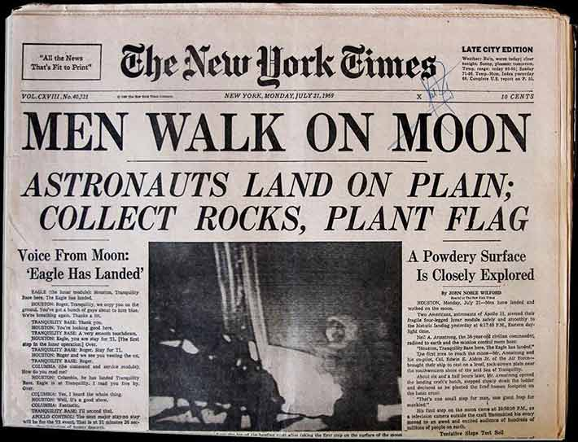
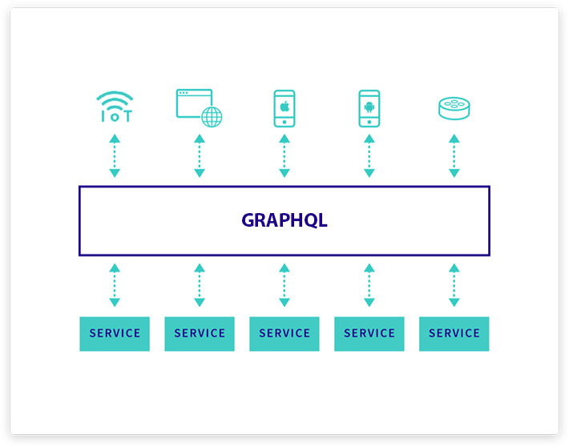

من منا لا يعرف **نيويورك تايمز** ؟ واحدة من أشهر الجرائد والمؤسسات الإعلامية في العالم، إن لم تكن الأشهر. عمرها يتجاوز 160 عاما واستطاعت طيلة تلك السنين بناء قاعدة جماهيرية واسعة، حيث أن عدد زوار موقعهم الرسمي يتجاوز 150 مليون زائر فريد في الشهر!

وعلى الرغم من أنه لا ينظر إلى نيويورك تايمز على أنها شركة تكنولوجيا، إلا أنها استطاعت طوال الفترة الماضية مواكبة التطور التقني الحاصل في صناعة الإنترنت وواجهت بشكل مثير للإعجاب التحديات المتعلقة خاصة بحركة المرور (الترافيك) الهائلة في مختلف تطبيقاتها والتي تحسدها عليها العديد من المؤسسات والشركات الأخرى.

في هذا التقرير سنتكتشف معا كيف وجهت شركة نيويورك تايمز جهودها كاملة نحو **React.js** و **GraphQL** لدعم منصاتها الإلكترونية التي تقدم من خلالها محتوى متجدد على مدار الساعة لملايين القراء والمشتركين.

## بداية عهد الإنترنت و"رقمنة" محتوى نيويورك تايمز

مند بداية تسعينات القرن الماضي، عملت مؤسسة نيويورك تايمز على خطة لرقمنة (Digitization) محتواها الأرشيفي (الورقي) الذي ظل حبيس الرفوف طيلة عقود مضت. هذا لا يعني أنهم كانوا يريدون التخلي عن النسحة الورقية من جريدتهم، بل على العكس، كان هدفهم هو تعزيز وتوسيع شرائح القراء والمشتركين التي يمكنهم الوصول إليها.

في بداية عصر الرقمنة، تم الإعتماد بشكل خاص على لغة البرمجة PHP لبناء موقع **New Work Times** الرسمي. جميع المقالات والمحتوى على تلك المنصة كان يتم تقديمها بواسطة PHP التي كانت اللغة المسيطرة على مجال الويب آنذاك، وهي كذلك إلى يومنا هذا ولو بنسب متفاوتة من بلد لآخر.

مع مرور السنوات، وبعد التطور الذي شهدته شبكة الويب والصناعات المرتبطة به، كان لا بد على نيويورك تايمز مواكبة ذلك التطور والركوب بأسرع ما يمكن على تلك الموجة حتى تبقى منافسة بقوة في ميدان صناعة الإعلام الإلكتروني بأمريكا والعالم.

### الأداء والسرعة هما الهاجس الأول

بالنسبة للقراء والمستخدمين، لا يوجد أهم من سرعة أداء الموقع، فلا يمكن أن تجعل متابعيك ينتظرون طويلا لكي يتم تحميل المحتوى على أجهزتهم لأن ذلك سيدفع عددا كبيرا منهم للبحث عن مكان آخر لإستيقاء الأخبار والمعلومات، وفي الغالب سيكون ذلك المكان عند أقرب المنافسين لك.

المطورون في الشركة كانوا على ذراية بهذا الموضوع، فبعد مشاورات وبحث مستفيض قرروا تبني كلا من React.js و [GraphQL](https://www.tutomena.com/web-development/what-is-graphql/) لإعادة تشكيل منصتهم الإلكترونية، إلى جانب تقنيات أخرى مثل Node.js و **Relay**. هذا الأخير كان الخيار الأول من بين سلسلة عملاء (Client) تقنية GraphQL في مراحل حياته الأولى، قبل أن يزيحه ـ أو على الأقل يزاحمه ـ **Apollo** بقوة على مكانه.

المهم أن **نيويورك تايمز** بهكذا خطوات قررت السير مع آخر صيحات تطوير الويب، وأظن بأن هذا هو الطريق الذي يجب أن تسلكه كل شركة تسعى للبقاء أطول ما يمكن في السوق.

### قابلية الوصول

نقطة أخرى كانت تشكل مصدر قلق واهتمام بالغين بالنسبة لمؤسسة مثل New York Times، أولا وهي **قابلية الوصول** أو Accessibility.

نسبة لا يستهان بها من المشتركين والمتابعين من ذوي إعاقات، يستعينون مثلا بقارئ الشاشة للإستماع للمحتوى. هذا مثال من عدد معتبر من الحالات التي كان واجبا أخذها بعين الإعتبار حتى لا تتأثر أي شريحة من الشرائح المتابعة والمستهلكة لمحتوى الجريدة.

قسم التكنولوجيا (IT Department) في الشركة رأوا في React.js خيارا جيدا للإستجابة لهذه النقطة. صحيح أن إنشاء وتقديم صفحات سريعة نقطة مهمة وتمثل المصدر الأول لقوة React، ولكن تقديم كود HTML نظيف ومتوافق مع معايير قابلية الوصول نقطة أخرى لا تقل أهمية عن غيرها ولم يكن بالإمكان غض الطرف عنها.

## نيويورك تايمز بعد تبني React.js

بعد مواجهة كل تلك التحديات، بدا أن نيويورك تايمز بدأت في جني ثمار ذلك التحول الجذري تجاه React.js. المطورون صاروا يتعاونون فيما بينهم بشكل فعال وأكثر سرعة. الأكواد المكررة (Duplicated codes) قلت بنسب كبيرة بفضل خاصية إعادة الإستخدام (Reusability) التي تتميز بها مكونات React، ما جعل المطورين يركزون جهودهم على لغة برمجة واحدة، عوض عن مجموعة متنوعة ومختلفة من اللغات والحزم سابقا.

هذه الخاصية (Reusability) تسهل كذلك إنشاء تصاميم وواجهات أمامية لمختلف أنواع الأجهزة، من الحواسيب العادية إلى اللوحية، مرورا بالهواتف الذكية، ووصولا لأجهزة تلفاز آبل (Apple TV) وجميع الأجهزة التي يمكن لأي مستخدم متابعة الأخبار من خلالها.

## واجهة المستخدم ليست كل شيء! ماذا عن البيانات ؟

React.js ليست القطعة الوحيدة المهمة بالنسبة لمطوري نيويورك تايمز، لأن تأثيرها الإيجابي سيكون محدودا إذا لم يصاحب ذلك تنظيم جيد وربط ممتاز لكل تلك البيانات (Data) التي ربما لا نرى إلا جانبا يسيرا منها في واجهة المستخدم.

البيانات التي تستهلكها منصات نيويورك تايمز تأتي من مصادر متعددة (Data sources)، وسيكون من الرائع لو تم جمعها في مكان واحد قبل الإستعلام عليها مثلما تجتمع مياه الأودية في السد الكبير الذي بدوره يمد القرى والمدن المجاورة له بالماء الشروب :) لحسن الحظ المطورون وجدوا هذا السد، إنه **GraphQL**.

ميزة GraphQL الكبيرة هو أنه يجمع كل تلك البيانات في نقطة مركزية واحدة، ويتولى هو توزيع تلك البيانات والمعلومات على العملاء (Clients) الذين يطلبونها، هؤلاء غير معنيين بأصل تلك البيانات ومن أين جاءت، هذا دور خادم GraphQL في الواجهة الخلفية ولا ينازعه فيه أحد. النتيجة هي شفرة برمجية نظيفة واستعلام سهل على البيانات من طرف مكونات React.js التي لم يعد عليها القلق بشأن كيفية الاتصال بمجموعة مصادر البيانات الخاصة بـ NYT.

[alert type="info" icon-size="normal"]فالكور ([Falcor](https://netflix.github.io/falcor/)) من Netflix كان كذلك خيارا مطروحا في البداية، ولكن لم يصمد أمام GraphQL لكون الأخير عبارة عن جملة من المواصفات (Specs) يمكن تطبيقها في عدة لغات برمجة وفي بيئات مختلفة، بينما الأول (Falcor) هو مكتبة خاصة بتطبيقات جافاسكريبت ولا يمكن استخدامها فيما عدا ذلك (أندرويد، iOS إلخ...).[/alert]

### لا بد من اختيار عميل ل GraphQL في الواجهة الأمامية

بعد الإنتهاء من بناء خادم GraphQL، يجب التفكير في اختيار عميل (Client) من أجل إرسال الإستعلامات ومختلف أنواع العمليات إلى ذلك الخادم، حيث أنه يسهل تلك المهام بشكل كبير ويمنحنا مزايا لا حصر لها، ليس أولها نظام الكاش، ولا آخرها هو سهولة جلب وإرسال البيانات من وإلى مكونات واجهة المستخدم.

في البداية استقر رأي مطوري نيويورك تايمز على استخدام مكتبة [Relay](http://facebook.github.io/relay/) التي صممتها فيسبوك، وتمت الإستعانة بها لفترة زمنية معينة قبل أن تبدأ بعض المشاكل في الظهور في ظل محدوديتها من ناحية المرونة وتوافقها مع ما كان يراد منها، بالتالي كان من الصعب على المطورين المواصلة على نفس النهج لفترة أطول. ولم يتطلب الأمر زمنا طويلا حتى تم توجيه البوصلة ناحية **Apollo**.

[Apollo Client](https://www.apollographql.com/client/) كان يمنح تقريبا كل المزايا التي يتمتع بها Relay ويزيد عليها مزايا خاصة به، بالإضافة إلى أنه يمكن استخدامه مع أي مكتبة أو إطار عمل جافاسكريبت، على عكس **Relay** الذي صمم خصيصا لتطبيقات ومشاريع React.js.

## النهاية

لم يكن الطريق سهلا على منصة عملاقة مثل نيويورك تايمز من أجل أن تعيد تشكيل بنيتها التقنية بشكل كامل، ولكن يبدو أن الأمر يستحق فعلا كل ما بذل ويبذل من أجله.

بتوجهها نحو بيئة React.js، فتحت NYT على نفسها أبوابا أخرى وفرصا جديدة واعدة في مجالات الموبايل والواقع الإفتراضي، هذان المجالان تغطيهما React بشكل ربما لا يخفى على أحد من خلال إطاري العمل [React Native](https://www.tutomena.com/web-development/javascript/%d9%85%d9%82%d8%af%d9%85%d8%a9-%d8%b9%d9%86-react-native/) و [React 360](https://facebook.github.io/react-360/) على التوالي، وربما نرى في السنوات القادمة توجها جديدا من New York Times نحو هذه التقنيات.

حيازة React.js و GraphQL لثقة هذا النوع من العلامات التجارية الكبرى يمنحها موثوقية وقيمة أكبر لدى المبرمجين والشركات الناشئة، وهذا ربما ما يفسر هستيريا React التي تجتاح اليوم مطوري الويب المشكلين لمجتمع React.js الذي يعد من بين الأكبر والأنشط من بين جميع المجتمعات والبيئات الأخرى في ميدان البرمجة.

---

ترجمة بتصرف للمقال : [React and GraphQL at the NYTimes](https://softwareengineeringdaily.com/2018/10/22/react-and-graphql-at-the-nytimes/)
