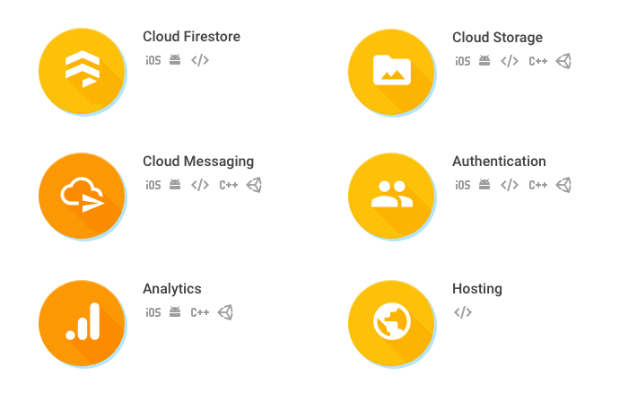

لربما سمعتم كثيرا عن منصة **فايربيز** (Firebase) من شركة غوغل وتتساءلون عن ماهيتها ودورها في مساعدة المبرمجين على بناء تطبيقات عصرية بأقل مجهود. أنا كذلك مرت على ذهني هذه الأسئلة عندما تعرفت على هذه المنصة قبل مدة، وبعد بحث وقراءة لبعض الدروس والمقالات أدركت جيدا قيمتها وقمت بتجربة عدد من مزاياها في بعض المشاريع الشخصية لكي أستطيع تطبيق ما قرأته وبالتالي استيعابه جيدا.

وحتى أختصر عليكم الطريق، سأشرح لكم في هذا الدرس ما هي خدمة Firebase ؟ ما أهم المزايا والوظائف التي توفرها، ولماذا المبرمجون اليوم هم في أمس الحاجة لمثل هذه المنصات.

هذا المقال سيكون نظريا بالأساس لأن هدفنا منه هو إعطاؤكم نظرة عامة عن الموضوع، ولكن المؤكد أنه ستكون هناك دروس عملية في قادم الأيام إن شاء الله.

## ما هي منصة Firebase إذن ؟ وما هو الهدف الأساسي من ورائها ؟

تخيل أنك تريد ـ كرائد أعمال ـ تطوير تطبيق مثل WhatsApp، قد تبدو المسألة من الوهلة الأولى بسيطة ولا تحتاج سوى لمطور تطبيقات بارع لكي يقوم بالمهمة. ولكن إذا قمنا بنظرة أكثر شمولية ودقة فإننا سنحتاج لما هو أكثر من ذلك :

- أولا، وكما قلنا سنحتاج لمطور تطبيقات أندرويد و iOS (في غالب الأحيان نتحدث عن مطورين اثنين).
- ثانيا، سيكون علينا البحث عن مطور لبناء واجهة خلفية (Backend) لإدارة قاعدة بيانات التطبيق وكذلك لتوفير مختلف الواجهات البرمجية APIs التي سيستهلكها عملاء (Clients) أندرويد و iOS.
- ثالثا، مع مرور الوقت وازدياد عدد مستخدمي التطبيق سيكون علينا الزيادة في إمكانيات الخادم أو الخوادم التي تستضيف الواجهة الخلفية للتطبيق، في هذه الحالة قد نكون في حاجة لمهندس شبكات لكي يتكفل بالموضوع.

هذا فقط فيما يتعلق بالجانب التقني، وإذا ما أظفنا لهذه اللائحة مصاريف التسويق والخدمات الأخرى فربما تصبح الميزانية أكبر بكثير مما تخيلناه أو توقعناه في البداية. إضافة إلى أنه ليس سهلا دائما إيجاد مطورين أكفاء للتكفل بكل تلك المهام.

### هنا يأتي دور "فايربيز"

بفضل منصة **Firebase**، أصبح بإمكان مطور تطبيقات الموبايل (والويب كذلك) أن يشغل كل تلك المهمات في نفس الوقت، أي أنه بات بمقدوره أن يكون **مطورا شاملا** قادرا على إنجاز تطبيق معقد ومتكامل من الصفر إلى مرحلة الإنتاج دون أن يقلق من مسألة الخادم والبنية التحتية المرافقة له. "فايربيز" يضع في متناولنا بنية تحتية متكاملة توفر كافة المزايا والمقومات التي يفترض أن تكون متواجدة في أي تطبيق.

التعامل مع هذه المنصة سهل ولا ينطوي على أي صعوبة تذكر، فعن طريق ال **Firebase Sdk** يمكن للمطورين التواصل مع واجهات فايربيز المبرمجية انطلاقا من جهة العميل (Client side)، ولكل منصة مستهدفة (ويب، أندرويد، iOS) هناك Sdk خاص بها.

تأسست Firebase في عام 2011 من طرف مطوران اسمهما James Tamplin و Andrew Lee، وبعد ذلك بثلاث سنوات قامت شركة Google بالإستحواذ عليها وتطويرها بشكل كبير بهدف منح المطورين بنية تحتية (Backend) جاهزة وقابلة للتوسيع (Scalable) لدعم مشاريعهم الخاصة مهما كان حجمها.

هذا النوع من المنصات تعرف باسم **Backend as a service** platform واختصارا BaaS.

## أهم المنتوجات/الخدمات التي توفرها منصة "فايربيز"

قد لا يكفينا مقال واحد لكي نمر على [جميع الخدمات](https://firebase.google.com/products/) التي يوفرها Firebase، لذلك سنحاول أن نذكر فقط أهمها وأكثرها استخداما من قبل المطورين :

- **Cloud Firestore** : قاعدة بيانات من نوع NoSQL، تمكن من تخزين البيانات وجلبها أو مزامنتها مع مختلف العملاء (Clients) المتصلين بتلك القاعدة.
- **Cloud Storage** : عبارة عن مساحة لتخزين واستدعاء مختلف أنواع الملفات الخاصة بالمستخدمين مثل الصور، الفيديوهات إلخ...
- **Authentication** : من أهم وأشهر الخدمات التي توفرها منصة Firebase. هذه الخدمة تتيح للمطورين وضع نظام لتعريف وإثبات هوية المستخدمين (تسجيل الدخول) من خلال عدة وسائل (فيسبوك، غوغل، رسائل قصيرة، الإيميل وكلمة السر إلخ...)، وكل هذا فقط من خلال أسطر برمجية قليلة تعد في كثير من الأحيان على أصابع اليدين.
- **Cloud Messaging** : هذه الخدمة تسهل على مطوري تطبيقات الموبايل وضع نظام لإرسال التنبيهات إلى أجهزة المستخدمين حيث التطبيق مثبت. بالإضافة لذلك، تستطيع معاينة البيانات والتحليلات (Analytics) المتعلقة بتلك التنبيهات بناء على سلوك المستخدمين حيالها.
- **Firebase Hosting** : خدمة استضافة للملفات الساكنة مثل HTML ،CSS و [JavaScript](https://www.tutomena.com/web-development/javascript/) بالإضافة إلى أنواع أخرى من الملفات التي تقدم عن طريق ما يعرف **بشبكة لتوصيل المحتوى** أو اختصارا CDN عبر بروتوكول Https الآمن.
- **Firebase Remote Config** : خدمة سحابية تمكن المطورين من التحكم في عدد من الإعدادات الخاصة بتطبيقاتهم (Configuration) وتغييرها بدون إجبار المستخدمين على تحديث تلك التطبيقات في أجهزتهم.

## النهاية

هذه فقط عينة بسيطة من الإمكانيات التي توفرها منصة **Firebase**، إذا أردتم معرفة المزيد حول هذا الموضوع أدعوكم لزيارة [الموقع الرسمي لفايربيز](https://firebase.google.com/docs/) وتطبيق بعض الأمثلة العملية التي تجدونها.

نسيت أن أخبركم بأن Firebase توفر خطة مجانية (Spark Plan) للمطورين لأغراض التجريب والتعلم. بينما هناك خطتين مدفوعتين إضافيتين، أولاهما (Flame Plan) تكلف 25 دولار في الشهر، والثانية (Blaze Plan) للتطبيقات والمشاريع الأكبر وفيها يتم الدفع حسب الموارد المستهلكة.
