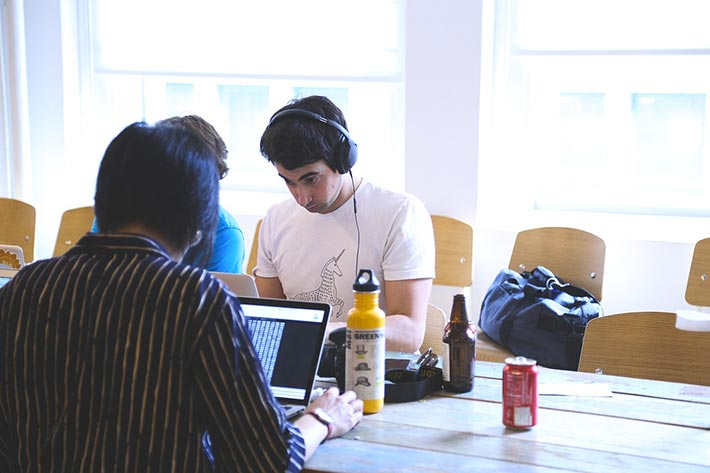

بحسب دراسة تحليلية لموقع [Statista.com](https://www.statista.com/chart/3570/app-usage-in-the-united-states/)، تضاعف الوقت التي يقضيه الأمريكيون في استخدام التطبيقات على هواتفهم الذكية فيما بين عامي 2011 و2015. هذه الدراسة أكدت أهمية التطبيقات في علاقة هؤلاء المستخدمين بأجهزتهم المحمولة، ولعل هذا ما يفسر سعي العديد من رواد الأعمال في السنين الأخيرة لتحويل أفكارهم إلى تطبيقات ذكية.

ما هي التكلفة التي يجب على رائد الأعمال تحملها إذا أراد بناء تطبيق للهواتف الذكية ؟ لكي نجيب على هذا السؤال، سنحاول تخمين الكلفة التقريبية لإنشاء بعض التطبيقات الكبيرة والمعروفة مثل **واتساب** و**فيسبوك**، بناءً على عدد من المعايير والمعطيات. وسنرى كذلك بعض العوامل الإضافية التي تتحكم في تحديد السعر الحقيقي لصناعة تطبيقات الموبايل.

## كيف سنقوم بحساب تكلفة بناء تطبيق ؟

تتم عملية حساب تكلفة صناعة تطبيق - كيفما كان نوعه - وفقا للمعادلة الرياضية التالية:

> سعر بناء التطبيق = الوقت اللازم للتطوير X معدل الأجر في الساعة

لكي نعرف الوقت اللازم للتطوير فإن نقوم أولا بتحديد المزايا التي يراد تواجدها في التطبيق، ثم نقوم بعملية جمع للأوقات اللازمة لتطوير كل واحدة من تلك المزايا. يجب إذن تفكيك التطبيق قدر المستطاع إلى أكبر عدد من الجزئيات التي يمكن يمكن تسعيرها بشكل شفاف وواضح سواء للمطور نفسه أو للعميل.

معدل الأجر في الساعة يختلف من منطقة لأخرى في العالم، فمطور تطبيقات الهواتف الذكية المحترف بأمريكا الشمالية (الولايات المتحدة وكندا) يعمل في العادة بما لا يقل عن 120 دولارا في الساعة، أما في دول أوروبا الغربية فالأسعار تحوم حول 70 إلى 80 دولارا، المطورون من الشرق الأوسط يتقاضى أغلبهم ما يتراوح بين 40 إلى 60 دولارا في الساعة.

> هذه الأرقام بحسب منصة [Codementor.io](https://www.codementor.io/freelance-rates/mobile-app-developers) المتخصصة في توظيف المطورين الأحرار.

تجدر الإشارة إلى أن هذه الأسعار تكون متغيرة في نفس المنطقة من مطور لآخر بحسب التجربة والخبرة. وحتى تكون التقديرات أقرب ما يكون إلى واقعنا العربي، فإننا سنبني تقديراتنا على حسب الحد الأدنى لما يتقاضاه مطورو تطبيقات الموبايل العرب المحترفون، يعني 40 دولارا مقابل ساعة واحدة من العمل.

## تطبيق واتساب

تطبيق **WhatsApp** للتراسل الفوري غني عن التعريف، ويتميز بتجربة استخدام ممتازة رغم المزايا العديدة التي يوفرها. سنحاول جرد أهم هذه المزايا والوقت اللازم لتطوير كل واحدة منها بحسب بعض المصادر التي استندت عليها منصة Codementor.io :

- نظام التسجيل : 82 إلى 99 ساعة.
- جهات الإتصال : 85 إلى 105 ساعة.
- نظام الإشعارات : 65 إلى 90 ساعة.
- الدردشة : 200 إلى 205 ساعة.
- نظام تحديد الموقع الجغرافي : 55 إلى 75 ساعة.
- إتصال الفيديو : 230 إلى 310 ساعة.
- ضبط الإعدادات : 50 إلى 60 ساعة.
- طبعا ستكون هناك تكاليف إضافية متعلقة مثلا بتصميم واجهة الإستخدام (UI/UX Design)، إدارة المشروع واستراتيجية DevOps. كل هذا سيتطلب عدد ساعات من العمل يتراوح بين 390 و495 ساعة.

إذا جمعنا كل هذه الأرقام، سنخلص إلى أن تطوير تطبيق شبيه بواتساب سيستغرق ما بين 1157 إلى 1484 ساعة من العمل المتواصل. وإذا ما أخذنا بعين الإعتبار معدل **40 دولارا في الساعة** الجاري به العمل في السوق العربية، سنستنتج أن تطوير مثل هذا التطبيق سيكلف صاحبه من 46.280 إلى 59360 دولارٍ أمريكي.

## تطبيق فيسبوك

يقوم **بين تشيبرز**، الشريك المؤسس ل [HappyFunCorp](https://happyfuncorp.com/) : "**إذا طلبت مني صناعة تطبيق فيسبوك من أجلك، فسأطلب منك 500 ألف دولار و9 أشهر من الزمن للتصميم والتطوير**". وبطبيعة الحال هذا السعر لا يشمل تكاليف التخزين السحابي التي لا يمكن الإستهانة بها أبدا.

بالنسبة لفيسبوك، من الصعب جرد جميع المزايا والوظائف التي يحفل فيها هذا التطبيق المعقد، ولكن رغم ذلك سنحاول عزل أهمها وأكثرها استخداما من طرف المستخدمين، ونخص بالذكر:

- نظام التسجيل والدخول (Registration & Login).
- نظام مشاركة النصوص/الصور/الفيديوهات.
- الإشعارات (Notifications).
- خدمة التراسل (Messaging).
- نظام الصفحات والمجموعات (Pages & Groups).
- News Feed.
- الدردشة (Chat).
- مكالمات الفيديو (Video calls).

وفقا لموقع [Indeema](https://indeema.com/blog/how-much-does-it-cost-to-build-a-facebook-application)، تطوير شريط الأخبار وحده قد يتطلب 450 ساعة من العمل. هذا في الحقيقة غير مستغرب ومنطقي إلى حد بعيد كون هذه الميزة من أهم الوظائف التي يفخر بها تطبيق فيسبوك، وتنطوي لوحدها على عدد كبير من المزايا الصغيرة مثل ميزة التفاعل مع المنشورات، نظام التعليقات، إمكانية حفظ المنشور، تمكين أو تعطيل الإشعارات الخاصة بمنشور معين، إخفاء المنشور إلخ...

ميزتي الدردشة ومكالمات الفيديو ستأخذان على الأرجع ما لا يقل عن 500 ساعة من وقت المطور. في المجمل، الواجهة الخلفية (Back-end) لفيسبوك قد تكلف المطور ما بين 1500 إلى 1700 ساعة من العمل، بينما الواجهة الأمامية (Front-end) للتطبيق قد تستأثر لوحدها بما لا يقل عن 1300 ساعة.

في المجموع، بناء تطبيق مثل فيسبوك سيستهلك من 2800 إلى 3100 ساعة، وإذا ما قمنا مرة أخرى بنفس العملية الحسابية (40 دولار ضرب عدد الساعات الإجمالي) سنجد بأن ميزانية هذا المشروع ستتراوح بين **112,000** دولار إلى **124,000** دولار! وإذا قمنا بتلك العملية الحسابية وفقا لمعدلات أجور المطورين في الولايات المتحدة الأمريكية (_\$150 / الساعة_) سيتجاوز هذا الرقم **460,000** دولار بقليل، وهذا تقريبا نفس الرقم الذي تحدث عنه **بين تشيبرز** :)

## عوامل أخرى يلزم أخذها بعين الإعتبار

بعدما أخذنا نظرة تقريبية عن الميزانيات التي يتطلبها إنجاز تطبيق شبيه بأحد التطبيقات الكبيرة، سنلقي نظرة أخرى على مجموعة من العوامل الإضافية التي يجب الإلتفات إليها عند التفكير في إنشاء تطبيق للهواتف الذكية.

### درجة تعقيد التطبيق

من بين الأسباب التي تجعل من الصعوبة الإجابة على سؤال "كم سيكلفني بناء تطبيق للهواتف الذكية ؟" هو أن هناك أنواع كثيرة من تلك التطبيقات، وكل نوع يتسم بمستوى معين من التعقيد والتقنيات التي يتطلبها. ولكي نبسط هذه المسألة، سنختزل أنواع تطبيقات الموبايل إلى 3 أصناف رئيسية :

#### **1\. تطبيقات بدون خادم ويب**

هناك تطبيقات لا تقوم بأي اتصال بخادم للويب لجلب أو تخزين بيانات معينة. وبصفة عامة يعتبر هذا النوع من التطبيقات هو الأقل تكلفة مجال صناعة تطبيقات الأجهزة الذكية. في العادة يتراوح مقابل إنشاء تطبيق من هذا الصنف بين 1000 و4000 دولار، وقد يكون الرقم أكبر بحسب خصوصية التطبيق.

#### **2\. تطبيقات متصلة بخادم ويب**

على عكس الصنف الأول، تقوم التطبيقات من هذا النوع بالإعتماد على خوادم عن بعد لتخزين ومعالجة بيانات المستخدمين، ويتم الإتصال عادة بين الخادم والتطبيق عن طريق ما يعرف بالواجهة البرمجية أو API. هذه الواجهة البرمجية يتم بناؤها باستخدام إحدى لغات البرمجة التي تشتغل في ناحية الخادم (مثال: PHP، بايثون، روبي، Node.js إلخ...). لذلك نجد تكلفة هذا النوع من التطبيقات أعلى، فقد لا تقل في العادة عن 8000 دولار أمريكي ويمكن أن تصل إلى 50,000 دولار!

#### **3. تطبيقات الألعاب**

تطبيقات الألعاب من بين أنواع التطبيقات التي يصعب في الحقيقة تقدير متوسط سعر تطويرها، هذا لأن هذا الصنف بدوره ينقسم لعدة أقسام دنيا. هذا الصنف يضم أشكال عدة من الألعاب تبدأ من Tic-Tac-Toe وتصل إلى وتصل إلى الألعاب الأكثر تعقيدا مثل Candy Crush وغيرها.

على سبيل المثال، مطور لعبة Flappy Hen، وهي لعبة شبيهة بلعبة **Flappybird** سابقا، استغرق حوالي 40 إلى 50 ساعة لإنشاء تطبيقه. إذا ما قمنا بضرب 50 ساعة في معدل الأجور الأمريكي فإن هذه اللعبة قد تكلف ما يصل لِ 7500 دولار لتطويرها. من جهة أخرى، يمكن لتطبيق لعبة لسباق السيارات يعتمد على نظام لتحديد الإتجاه (Gyroscope) أن يكلف صاحبه مبلغ 125000 دولار بسهولة.

هناك نقاط أخرى قد تؤدي لزيادة كلفة صناعة تطبيقات الألعاب، من بينها إمكانية استخدام عدد من المكونات الأصلية للجهاز مثل البلوثوت، نظام تحديد المواقع الجغرافية (GPS)، المستشعرات إلخ...

### من سيقوم بصناعة التطبيق ؟

هذا سؤال يجب طرحه كذلك عند التخطيط لبناء مشروعك.

#### **1\. هل ستقوم بالبحث عن فريق من المطورين وتوظيفهم في شركتك ؟**

هذا الخيار ليس دائما الأسهل، لأنه من الصعب إيجاد مطورين أكفاء وذوي خبرات جيدة يمكن التعويل عليهم في بناء تطبيق يستجيب للمعايير التي تتوق إليها. وبالإضافة إلى ذلك فهذا الخيار مكلف وسيلقي على كاهلك مهمة إدارة الوقت ومتابعة عمل المطورين، وهي مهمة ليست بالسهلة بالخصوص إذا كانت لديك أعمال وأولويات أخرى. يمكن إيجاد حل لهذه النقطة عن طريق إيجاد خبير متخصص في إدارة المشاريع، ولكن هذا سيعني بكل تأكيد زيادة في ميزانية المشروع.

#### **2\. هل ستبحث عن مطورين يعملون عن بعد (Freelancers) ؟؟**

هذا هو الخيار الأقل كلفة، وقد يكون ملائما إذا كان مشروعك بسيطا وليست فيه تفاصيل كثيرة تتطلب متابعة دقيقة. والخيار كما قلنا لن يكلف كثيرا مقارنة بالخيارات الأخرى، ولكن بشرط أن تبحث عن مطورين ذوي خبرات جيدة، فالسوق مليئة بالمطورين من شتى أصقاع الأرض ولكن قليلون هم المطورون الجيدون الذين يمكن التعويل عليهم.

الشائع كذلك أن المطورين الأحرار (_Freelancers_) لا يولون أهمية كبيرة للتواصل والتفاعل مع العملاء، وهذا يشكل مصدر قلق وإزعاج كبيرين لهؤلاء العملاء، وبالتالي وجب وضع النقاط على الحروف معهم قبل عقد الإتفاق في حال ذهبت مع هذا الخيار :)

#### **3\. هل ستوكل مهمة إنجاز المشروع لشركة خاصة ؟**

هناك شركات خاصة عملها وتخصصها هو إنجاز مشاريع وتطبيقات على أعلى مستوى من الكفاءة، بفضل الخبرات المتراكمة لديها والمطورين الجيدين الذين تحوزهم. هذه الشركات تتوفر على فرق منظمة، كل فريق مسؤول على مرحلة معينة من مراحل الإنتاج، ودورك كرائد أعمال هو متابعة سير العمل في مشروعك ومستوى التقدم في الإنجاز وإبداء ملاحظاتك عند الحاجة.

هذا الحل هو الأكثر فاعلية والأكثر أمانا، ولكنه في نفس الأكثر تكلفة. والمسألة برمتها متعلقة بالميزانية لديك، إذا كان فيها من المتسع ما يكفي، فأعتقد بأن هذا هو الخيار الأفضل لرواد الأعمال الذين يريدون تطبيق أفكارهم على أرض الواقع **بأقل قدر من المخاطر**.

### هل سيكون التطبيق أندرويد أم iOS ؟

يقول **Ken Yarmosh**، وهو المؤسس والمدير التنفيذي لمنصة [Savvy Apps](https://savvyapps.com/blog/android-vs-ios-which-platform-to-build-for-first) لصناعة تطبيقات الموبايل، بأن إنشاء تطبيقات أندرويد يكلف أكثر مما يكلفه إنشاء تطبيق iOS. وبالرغم من أن معدلات أجور مطوري **Android وiOS** تقريبا متساوية، إلا أن تطبيقات iOS تستهدف أجهزة وشاشات أقل بكثير مما تستهدفه تطبيقات أندرويد، حيث أن نظام التشغيل iOS يعمل فقط على أجهزة شركة Apple الذكية، بينما أندرويد يستعمل من طرف عشرات الشركات حول العالم في مئات الأشكال المختلفة من الأجهزة التي تختلف في المواصفات وأبعاد شاشاتها. لذلك قال Ken أن تطبيقات Android أعقد عادة وأكثر تكلفة من تطبيقات iOS، ولعل هذا من بين الأسباب التي تجعل عددا من الشركات الكبرى تستهدف في تطبيقاتها iOS قبل Android.

- قد يهمك أيضا: [قصص ملهمة لمبرمجين عانقوا النجاح](https://www.tutomena.com/blog/successful-programmers-stories/)

## النهاية

هناك عدة عوامل ومعايير يجب وضعها نصب الأعين التخطيط لإنجار تطبيق موجه للهواتف الذكية. لا يجب التركيز على معيار واحد فقط دون غيره، فعندما قمنا بتقدير تكلفة إنجاز تطبيقي واتساب وفيسبوك، بينينا حساباتنا فقط على معيار المزايا الموجودة في التطبيقين، بينما التكلفة قد تكون أكبر من ذلك إذا احتسبنا تكاليف الخدمات السحابية لدعم البنية التحتية للتطبيق، كما أنه قد يختلف المبلغ من منصة لأخرى (iOS وAndroid).

في نفس الوقت يجب أن نشير إلا أن هذه الأرقام ـ التي قد تبدو مبالغا فيها بالنسبة لنا نحن في المنطقة العربية ـ لا يجب أن تكون مصدرا لتحطيم معنويات رواد الأعمال وأصحاب الأفكار الريادية، لأن WhatsApp عندما قام Brian Action بتطويره لم يكن يوفر حتى نصف المزايا الموجودة فيه حاليا، وبالتالي لم تكن كلفة إنشائه ما ذركناه في هذا المقال.

فكرة التطبيق يجب أن تكون واضحة، وبناء عليها تضاف وتطور المزايا الضرورية فيه. مع مرور الوقت يمكن إضافة الأفكار والمميزات الجديدة، ما يمنح صاحب المشروع تحكما أفضل في ميزانية مشروعه وإطلاقه للسوق بأسرع ما يمكن.

---

ترجمة بتصرف للمقال : [? How Much Does it Cost to Make An App in 2018](https://www.codementor.io/blog/app-costs-1nqj6ehste)
