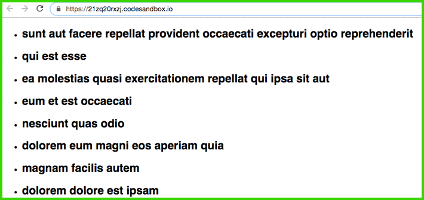

إذا كنت من محبي مكتبة React.js أو على الأقل مهتما بأخبارها، فمن المؤكد بأنك سمعت مؤخرا كثيرا من الناس يتحدثون عن ميزة جديدة اسمها **React Hooks** مرتقبة في إصدار [React 16.8](https://reactjs.org/blog/2019/02/06/react-v16.8.0.html) الذي سيرى النور بشكل رسمي بعد شهور قليلة (الربع الأول من 2019).

React Hooks دار حولها حديث ولغط كبير منذ إعلان Dan Abramov عنها في مؤتمر ReactConf الأخير. وكما أشرت في البداية، فإن هذه الميزة مازالت قيد التطوير والإختبار، ولكن يمكن تجربتها عن طريق إصدار **React 16.7.0-alpha**، في انتظار دمجها بشكل رسمي في **16.8 React**.

<iframe width="560" height="315" src="https://www.youtube.com/embed/dpw9EHDh2bM?controls=0" frameborder="0" allow="accelerometer; autoplay; encrypted-media; gyroscope; picture-in-picture" allowfullscreen="allowfullscreen"></iframe>

## ما هو الغرض من React Hooks ؟

في الوقت الحالي، إذا كنا في حاجة لإستخدام الحالة (_State_) أو وظيفة معينة من [وظائف دورة الحياة (_Lifecyle methods_)](https://www.tutomena.com/web-development/javascript/reactjs-lifecycle-methods/) في المكون فنحن مجبرون على إنشاء مكون من نوع Class Component، لأنه لا يمكن الوصول إلى هذه المزايا من خلال المكونات الوظيفية أو Functional Components. ولكن مع قدوم React Hooks، ستصبح كل تلك المميزات متوفرة ل Functional Components كما هي متوفرة منذ زمن ل Class Components.

ببساطة، **جاءت هذه الميزة الجديدة لكي نتمكن من الوصول لجميع مميزات React.js من دون استخدام الكلاسات**. ولكن يجب أن ننوه هنا إلا أن القائمين على مكتبة React.js نفوا أن تكون لديهم في الوقت الحالي أي خطط مستقبلية للإستغناء عن Class Components.

حتى نقوم بالتعرف على React Hooks، سنقوم بتثبيت الحزمتين react@next و react-dom@next بعد أن نقوم بتوليد المشروع عن طريق create-react-app.

## الوصول إلى State عن طريق useState

لنأخذ مثال العداد التي يعرفه الجميع :)

في طريقة `Class Component` سيكون لدينا مكون اسمه `Counter` يشبه ما يلي :

```javascript
import React, { Component } from 'react';

export default class Counter extends Component {
  state = {
    count: 0
  };

  doIncrement = () => {
    this.setState({ count: this.state.count + 1 });
  };

  doDecrement = () => {
    this.setState({ count: this.state.count - 1 });
  };

  render() {
    return (
      <div>
        <h1>{this.state.count}</h1>

        <button onClick={this.doIncrement}>+</button>
        <button onClick={this.doDecrement}>-</button>
      </div>
    );
  }
}
```

باستخدام React Hooks، سنحول Counter إلى Functional Component واستخدام State بفضل **useState** hook.

```javascript
import React, { useState } from "react";

export default function Counter() {
const [count, setCount] = useState(0);

return (

<div>
<h1>{count}</h1>

      <button onClick={() => setCount(count + 1)}>+</button>
      <button onClick={() => setCount(count - 1)}>-</button>
    </div>

);
}
```

تلاحظون أننا قمنا بإنشاء متغيرين اثنين (count و setCount) باستخدام طريقة Destructuring assignment:

- المتغير الأول `count` يمثل قيمة الحالة، مرادف ل `this.state`.
- المتغير الثاني `setCount`وهو عبارة عن **دالة تمكن من تغيير قيمة تلك الحالة**، ويمكن تشبيهها ب this.setState في المثال الأول.

وتجذر الإشارة إلى أنه يمكن تسمية هذين المتغيرين كما يحلو لنا، ولكن جرى الإصطلاح على تسمية الدالة (المتغير الثاني) بنفس اسم الحالة (المتغير الأول) مع إضافة set في البداية.

**useState** تقبل بارامترا واحدا يمثل القيمة البدئية للحالة، وقيمة العداد البدئية في حالتنا هي 0 :)

> في الأمثلة أعلاه، والأمثلة التي ستلي، قمنا باستخدام صيغة الدوال السهمية (Arrow functions) لكتابة الدوال. إذا كان لديك إشكال مع هذا التركيب الجديد فأدعوك للإطلاع على [مقال سابق لنا حول هذا الموضوع](https://www.tutomena.com/web-development/javascript/arrow-functions-javascript/).

## استخدام useState عدة مرات داخل المكون

عندما نكن في حاجة للوصول إلى عدة حالات (Multiple states) فإنه يمكننا استخدام useState hook عدة مرات حسب الحاجة.

```javascript
import React, { useState } from "react";

const LIST_PRODUTCS = [
{
id: 0,
title: 'SAMSUNG GALAXY S9',
price: 720.00
},
{
id: 1,
title: 'iPHONE X',
price: 999.00
}
];

export default function Counter() {
const [count, setCount] = useState(0);
const [product, setProduct] = useState(LIST_PRODUTCS);

return (

<div>
...
</div>
);
}
```

## لنكتشف hook آخر مهم : useEffect

إذا كان useState hook يتيح لنا إمكانية إدارة State من داخل المكونات الوظيفية، فإن **useEffect** هو ال hook  الذي يمكننا من استنساخ دور Lifecycle methods التي اعتدنا استخدامها في Class Components لأغراض متعددة، منها القيام بعمليات Fetching لواجهاتنا البرمجية (APIs)، التعامل مع Browser APIs إلخ...

useEffect يقوم لوحده بالعمل الذي تقوم به **ثلاثة** من وظائف دورة حياة المكون وهي : **componentWillUnmount componentDidUpdate **،**componentDidMount**.

لكي نرى كيفية عمل هذا ال Hook، سنأخذ مثال العداد السابق ونضيف إليه دالة useEffect :

```javascript
import React, { useState, useEffect } from "react";

export default function Counter() {
const [count, setCount] = useState(0);

useEffect(() => {
console.log("EFFECT CALLED!");

    setInterval(() => console.log("tick"), 1000);

});

return (

<div>
<h1>{count}</h1>

      <button onClick={() => setCount(count + 1)}>+</button>
      <button onClick={() => setCount(count - 1)}>-</button>
    </div>

);
}
```

الذي سيقع الآن، هو أنه بمجرد عرض (Mounting) المكون Counter في الصفحة، سيتم تنفيذ ما بداخل useEffect، يعني إطلاق setInterval التي تقوم بطباعة الرسالة "tick" كل ثانية في ال console، وقبل ذلك سيتم طباعة الرسالة !EFFECT CALLED التي تخبرنا بأن الدالة useEffect تم استدعاؤها. هنا إذن لعب useEffect دور وظيفة دورة الحياة **componentDidMount**.

عند النقر على أحد الأزرار + أو - سيتم إعادة تنفيذ الدالة useEffect، أي طباعة الرسالة !EFFECT CALLED وإعادة إطلاق setInterval من جديد.

**لماذا ؟**

لأنه تم تغيير قيمة الحالة count وبالتالي وجب إعادة استدعاء وتنفيذ ما بداخل useEffect، أي أن الأخير يقوم بوظيفة **componentDidUpdate** في هذه الحالة.

في أحيان كثيرة، قد نريد من useEffect أن يلعب فقط دور componentDidMount ولا نريد أن يشتغل كلما حدث تغيير في إحدى الحالات التي يعتمد عليها المكون (componentDidUpdate).

## كيف نطلب من useEffect أن يشتغل مرة واحدة فقط ؟

إذا كنا نريد تنفيذ شيء ما مرة واحدة، أي فقط بعد تركيب المكون في الصفحة (مثلا إرسال طلب Ajax لجلب بيانات معينة)، سنقوم بتمرير مصفوفة فارغة كبارامتر ثاني للدالة useEffect :

```javascript
useEffect(() => {
console.log("EFFECT CALLED!");

    setInterval(() => console.log("tick"), 1000);

}, []);
```

الآن حتى إذا غيرنا قيمة count عن طريق الزرين (+) و (-) فلن يتم تشغيل useEffect. سيشتغل فقط مرة واحدة، وهي كما قلنا لما يعرض في الصفحة (**componentDidMount**).

في حالة أردنا تنفيذ **componentDidUpdate** عندما يطرأ تغيير على حالة (أو حالات) **محددة** للمكون (إذا افترضنا أنه لدينا مكون لدية أكثر من State) فسنقوم بتمرير اسم الحالة في المصفوفة الفارغة التي رأيناها في المثال أعلاه.

لاحظوا المثال التالي :

```javascript
useEffect(() => {
console.log("EFFECT CALLED!");

    setInterval(() => console.log("tick"), 1000);

}, [count]); // only run if count changes
```

هكذا ستلعب الدالة `useEffect` دور `componentDidUpdate` **فقط في حالة تغير الحالة count،** وإذا افترضنا أن مكوننا لدينا **حالات أخرى**، فمهما تغيرت قيمها فلن يشتغل `useEffect` أبدا ولن يلعب دور `componentDidUpdate`.

### ماذا عن componentWillUnmount ؟

في مثال العداد، يتم إطلاق setInterval عندما يتم تركيب المكون `</ Counter>` في الصفحة، والسلوك الطبيعي هو أن نقوم بإيقاف setInterval بعد أن يغادر `</ Counter>` صفحتنا. حاليا تظل setInterval تشتغل وتظهر الرسالة "tick" كل ثانية في ال console حتى عندما يفصل العداد `</ Counter>` عن الصفحة (Unmounted).

componentWillUnmount هي الوظيفة في دورة حياة مكونات React التي تمكننا من تنفيذ أوامر معينة عندما يتم إزالة ذلك المكون من الصفحة. كيف نقوم بمحاكاة عمل componentWillUnmount باستخدام useEffect ؟

إليكم الطريقة :)

تشغيل الوظيفة componentWillUnmount يتم عن طريق **إرجاع دالة** من داخل useEffect.

هكذا سنقوم بإيقاف setInterval عندما يتم إزالة `</ Counter>` من الصفحة :

```javascript
useEffect(() => {

    console.log("EFFECT CALLED!");

    const interval = setInterval(() => console.log("tick"), 1000);

    // Clear setInterval when Counter is "unmounted"
    return () => clearInterval(interval);

}, [count]);
```

تلاحظون أننا قمنا بإيقاف setInterval بداخل الدالة التي نقوم بإرجاعها (return).

هكذا عندما يُزال Counter component من صفحتنا سيتم إيقاف جميع العمليات التي كانت تشتغل في الخلفية (background) لحسابه.

## مثال عملي لإستخدام useState وuseEffect

لا أيوجد أفضل من مثال عملي بسيط لكي نختم به هذا الدرس.

سنقوم بإنشاء مكون جديد اسمه BlogList، ومن خلاله سنجلب لائحة عناوين لمقالات من الواجهة البرمجية المزيفة [jsonplaceholder](https://jsonplaceholder.typicode.com/) والتي استخدمناها سابقا في [دروس Angular](https://www.tutomena.com/web-development/javascript/angular-services/).

المكون BlogList سيكون على هذا الشكل :

```javascript
import React, { useState, useEffect } from "react";

export default function BlogList() {
const [posts, setPosts] = useState([]);
useEffect(
() => {
fetch("https://jsonplaceholder.typicode.com/posts")
.then(response => response.json())
.then(data => {
setPosts(data); // set posts in state
});
},
[] // componentDidMount
);

return (

<ul>
{posts.map(post => (
<li key={post.id}>
<h2>{post.title}</h2>
</li>
))}
</ul>
);
}
```

والنتيجة هي قائمة `<ul>` لعناوين عدد من المقالات التي استعلمنا عليها في `useEffect` من خلال الرابط *https://jsonplaceholder.typicode.com/posts*.

[](../images/blog-list.png)

useEffect في هذا المثال تلعب دور componentDidMount فقط حيث سيتم تنفيذها **مرة واحدة فقط** لأننا مررنا المصفوفة الفارغة (Empty array) في البارامتر.

- قد يهمك أيضا : [شرح أساسيات React.js – مكتبة جافاسكربت لتطوير واجهات المستخدم](https://www.tutomena.com/web-development/javascript/react-javascript-library/)

## النهاية

يسعى مطورو React.js لجعل تجربة المطورين أفضل مع هذه المكتبة، وباعتقادي أنهم نجحوا من خلال ميزة **React Hooks** في قطع خطوة كبيرة نحو الأمام في هذا المسعى.

useState و useEffect ليسا ال Hooks الوحيدين في مشروع React Hooks، هناك useContext و useReducer كذلك ولكن لم نتطرق إليهما في هذا الدرس لأنهما أقل أهمية وكذلك لكي لا يطول المقال أكثر.

هدفي من خلال هذا الموضوع هو تعريفكم بهذه الميزة القادمة لمكتبة React.js والأهداف التي يسعى إليها Dan Abramov ورفاقه من ورائها.

إذا أعجبكم الدرس لا تترددوا في مشاركته مع أصدقائكم من محبي React وجافاسكريبت، وسأكون مسرورا كذلك لرؤية انطباعاتكم وآرائكم حول React Hooks من خلال صندوق التعليقات :)

يمكنكم الإطلاع على المصادر والمراجع المرفقة بهذا المقال إذا كان لديكم فضول لمعرفة المزيد حول هذا الموضوع.

---

مراجع وروابط للإستزادة :

- [Getting Started with React Hooks](https://scotch.io/tutorials/getting-started-with-react-hooks)
- [What are React Hooks?](https://www.robinwieruch.de/react-hooks/)
- [Hooks at a Glance](https://reactjs.org/docs/hooks-overview.html)
