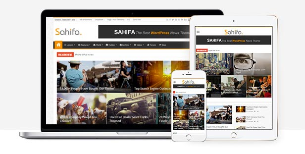
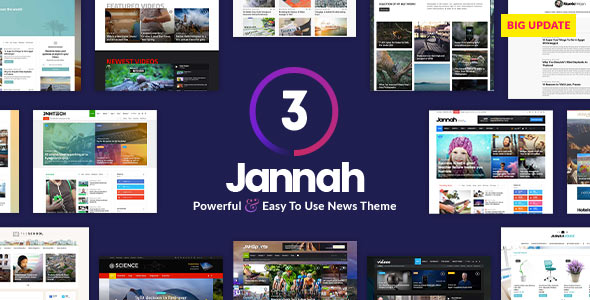
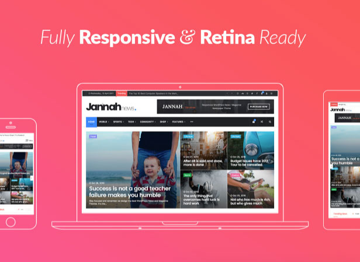
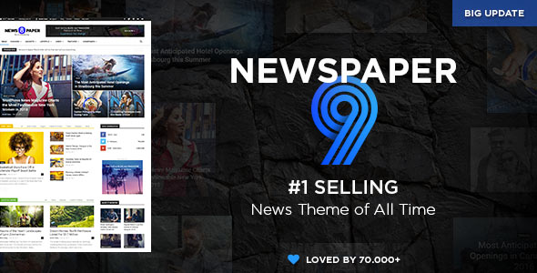
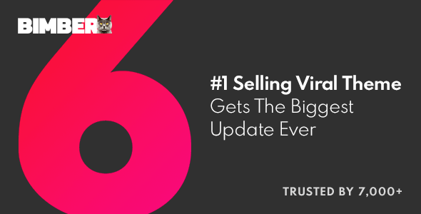
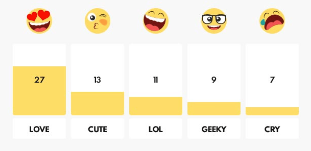

إذا كنت تريد أو تنوي إنشاء موقع إخباري بمحتوى متجدد ومتنوع، ففي غالب الأحيان لن تكون مجبرا على بنائه من الصفر. السبب أن هناك عشرات ـ إن لم نقل مئات ـ من قوالب ووردبريس التي صنعت خصيصا لمثل هذا النوع من المواقع الإلكترونية. جزء كبير من هذه القوالب مجاني والباقي عبارة عن قوالب مدفوعة.

في العديد من المناسبات، أكدنا على أن قوالب ووردبريس المدفوعة (_Premium themes_) أفضل بكثير من القوالب المجانية، سواء من ناحية **الجودة**، **الأمان**، **التحديثات**، **الدعم الفني** وغيرها من المزايا الأخرى. لذلك ننصح دائما المدونين الجادين باختيار قوالب مدفوعة لاسيما وأن أسعارها في الغالب مقبولة إلى حد بعيد.

ولأننا لن نجد على الأغلب مكانا أفضل من **منصة ثيم فورست** (Themeforest) للبحث عن قوالب ووردبريس المدفوعة، سأختصر عليكم الطريق وأعرض لكم قائمة لأفضل **قوالب ووردبريس الإخبارية** على هذه المنصة وفقا لعدد المبيعات التي حصلت عليها وكذلك تقييمات الذين قاموا بشرائها.

## 1- قالب صحيفة [Sahifa]

يمكن اعتبار قالب صحيفة أنجح منتج إلكتروني عربي في سلسلة متاجر Envato ككل. هذا القالب الذي تم إطلاقه لأول مرة في عام 2012 استطاع خلال السنوات الماضية تحقيق نجاحات جعلته من أكثر قوالب ووردبريس حصولا على المبيعات على متجر Themeforest، إذ بيعت منه إلى حدود الساعة أزيد من 26.200 نسخة. وقد جنى من ورائه المؤلف (TieLabs) مئات الآلاف من الدولارات خلال 6 سنوات الماضية.

صحيح بأن تصميم قالب صحيفة تقليدي نوعا ما، كون القالب، كما قلت سابقا، يزيد عمره عن 6 سنوات لم يشهد خلالها تعديلات كبرى على مستوى التصميم. ولكن من ناحية المزايا، القالب غني للغاية ويضم عددا من المميزات التي يحتاج إليها في العادة جميع أرباب المواقع مثل :

- لوحة تحكم خاصة لتغيير مختلف الإعدادات الخاصة بالقالب، مثل تغيير ألوان القالب، الخطوط، الإعلانات إلخ..
- قالب جاهز للترجمة بسهولة، ويدعم إضافة **WPML** في حالة كان الموقع متعدد اللغات.
- دعم كامل للإضافات **buddyPress** ،**bbPress**.
- باني صفحات **TiePage Builder** خاص لتخصيص وتصميم الصفحات عن طريق السحب والإفلات.
- ودجات خاصة بمنصات التواصل الإجتماعي.
- دعم ممتاز لإضافة **WooCommerce** لإنشاء متجر إلكتروني.
- القالب يوفر أزيد من **35 مربع جانبي** (Widget) و**40 shortcodes** بالإضافة **لعشرات ال blocks**.
- بطبيعة الحال القالب **متجاوب** بشكل رائع مع مختلف الأجهزة والشاشات، و**متوافق بشكل جيد** مع معايير السيو SEO.
- دعم كامل للغة العربية، لا حاجة لتعريب القالب :)
- إلخ...

[معاينة القالب](https://www.tutomena.com/go/sahifa-themeforest/)

## 2- قالب جنة [Jannah]

قالب جنة من إبداعات فريق TieLabs أيضا، قالب عصري وحديث مقارنة بصحيفة، حيث أنه عرض للبيع لأول مرة على ثيم فورست في منتصف 2017.

يتسم القالب كما ذكرت بتصميم جذاب وعصري ونجد فيه تقريبا جميع المزايا الموجودة في قالب صحيفة، أضف إلى ذلك دعمه لمحرر **Gutenberg** الجديد، ولتقنية صفحات غوغل المسرعة المعروفة اختصارا بالرمز **AMP**.

قالب جنة يوفر كذلك ميزة ممتازة وهي إمكانية إرسال إشعارات للزوار (_Web Notifications_) من أجل جذبهم وإبقائهم على علم بكل جديد. بالإضافة إلى هذا، يوفر **Jannah** كاشفا لمانع الإعلانات AdBlock حتى تسنح لنا الفرصة لكي نطلب من زوار موقعنا تعطيل تلك الإضافة اللعينة :)

القالب يدعم اللغة العربية (RTL Ready)، وهذا أمر عادي بالنظر إلى كون الفريق المطور عربيا :)

- تم بيع قالب جنة أزيد من **5000** مرة إلى حدود كتابة هذه الأسطر.
- حصل القالب على معدل تقييم عالي وصل **4.8/5** من 459 زبونا.

[معاينة القالب](https://www.tutomena.com/go/jannah-themeforest/)

## 3- قالب Newspaper

سبق وتحدثنا عدة مرات عن هذا القالب في مدونتنا، وقمنا بمراجعة شاملة له في [مقال سابق](https://www.tutomena.com/blog/newspaper-wordpress-theme-review/).

يمكن اعتبار **قالب Newspaper** أشهر قالب موجه لمواقع المحتوى والأخبار بكل أشكالها، ويزخر بعدد كبير جدا من المزايا . عيبه الوحيد في رأيي أنه **لا يدعم RTL**، ولكن إذا كانت لديك بعد المهارات في CSS فيمكن تعريب الواجهة الأمامية للقالب بسهولة، بينما تعريب لوحة التحكم (Admin Panel) يحتاج لمجهود أكبر ومهارات خاصة في ووردبريس.

شخصيا، أستخدم قالب **نيوزبيبر** في مدونة توتومينا واستطعت تعريب واجهته الأمامية في سويعات قليلة عن طريق ما يعرف بالقالب الإبن (_Child theme_).

بالمناسبة، إذا قمت بمعاينة قالب Newspaper وبعده قالب Jannah فستلاحظ بأن الأخير تأثر بالأول بشكل واضح، سواء من ناحية التصميم أو المزايا. ولكن هذا لا يمنع أن هناك مزايا في **جنة** غير موجودة في **نيوزبيبر**، والعكس صحيح.

- قالب Newspaper بيع أكثر من **71.000** مرة.
- معدل تقييم ممتاز، تقريبا **4.85/5** من قرابة 5300 مشتري.
- Newspaper يتم تحديثه بصفة مستمرة ومنتظمة، ويدعم عدد كبير من إضافات ووردبريس المعروفة.

[معاينة القالب](https://www.tutomena.com/go/newspaper-themeforest/)

## 4- قالب Bimber

هناك عدد من المواقع الإخبارية التي تعتمد على نشر نوع من المحتوى معروف باسم **المحتوى الفيروسي** أو بالإنجليزية Viral content. **مواقع الفيرال** تعتمد على نشر محتوى قابل للإنتشار بسرعة على منصات التواصل الإجتماعي، هذا المحتوى في العادة يكون غير هادف وغير مفيد، ويهدف من خلاله أصحاب تلك المواقع إلى الربح عن طريق الإعلانات بفضل العدد الكبير من الزوار القادمين من فيسبوك وغيره.

إذا كنت تريد إطلاق موقع للفيرال فلن تجد على الأرجح أفضل من **قالب Bimber**. هذا القالب يتيح جميع الوظائف اللازم توفرها في مواقع من هذا النوع، مثل:

- لائحة الموضيع الساخنة أو Trending News ،Hot News...
- عدادات مزيفة لعدد المشاركات (Fake Counters)
- تمكين الزوار من نشر مساهماتهم على الموقع من الواجهة الأمامية.
- نظام للتفاعل مع المواضيع عن طريق أيقونات Emojis شبيه بنظام فيسبوك إلخ...
- نظام لتقييم المواضيع (Voting on posts).
- كاشف لموانع الإعلانات (AdBlockers detector).
- إلخ...

ستجد في القالب كذلك العديد من العروض (Demos) والتصاميم الجاهزة للتثبيت **بنقرة زر واحدة** بحسب نوع الموقع أو النيتش (_Nich_) الذي تريد استهدافه.

وبما أنه، كما قلنا سابقا، مواقع الفيرال تعتمد بشكل رئيسي على الربح من الإعلانات فإن قالب Bimber يوفر نظاما متقدما وجيدا لإدارة الإعلان من عدة مزودين، أبرزهم Taboola ،Google Adsense وOutbrain.

- حصل Bimber Wordpress Theme على عدد مبيعات يفوق **7600**.
- معدل تقييم ممتاز (**4.83/5** من 535+ عميل).
- دعم كامل للعربية (**RTL Ready**).

[معاينة القالب](https://www.tutomena.com/go/bimber-themeforest/)

## 5- قالب Soledad

تعرفت على قالب Soledad مؤخرا، وبكل صراحة أعجبت به كثيرا لأنه قالب يوفر تصميمات أنيقة للغاية تجمع بين البساطة والأناقة. بمجرد الدخول لمعاينة هذا القالب ستحس بارتياح كبير تجاهه.

**قالب Soledad** يدعم محرر Gutenberg في إصدار ووردبريس 5.0 الجديد، ويوفر كذلك توافقية ممتازة مع صفحات AMP وكذلك سياسية وقانون حماية البيانات المعروفة اختصارا ب GDPR.

كغيره من القوالب التي سبقت الإشارة إليها، يتيح Soledad عددا كبيرا جدا من التصاميم الجاهزة لمختلف أنواع المواقع والمدونات (مجلات، مدونات شخصية، مواقع أخبار إلخ...)، ويوفر كذلك بالمجان إضافة **Revolution Slider** المدفوعة لإنشاء عدد لا متناهي من أشكال السلايدرات (_Sliders_). وستجد كذلك أن القالب يوفر باني الصفحات المعروف **Visual Composer** لبناء وتخصيص الصفحات بالسحب والإفلات.

- حصل قالب Soledad على عدد مبيعات يقارب **16.000**.
- معدل تقييم تقريبا **مثالي** (**4.88/5** من 534+ زبون).
- دعم كامل للعربية (**RTL Ready**) :)

[معاينة القالب](https://www.tutomena.com/go/soledad-themeforest/)

## في الختام

هذه كانت قائمة لأفضل 5 قوالب إخبارية لووردبريس على متجر Themeforest من وجهة نظرنا. سيكون من الرائع أن تشاركوا معنا آراءكم في حال قمتم بتجربة أحدها من قبل.

شراء القالب مجرد خطوة أولى لتأسيس مشروع على الإنترنت، والخطوة الكبيرة والأهم هي العمل والمواصلة دون كلل حتى تتحقق النتيجة المرجوة :)

**قد يهمك أيضا:** [أفضل قوالب ووردبريس متوافقة مع السيو SEO في ثيم فورست](https://www.tutomena.com/web-development/wordpess-seo-friendly-themes-themforest/)
