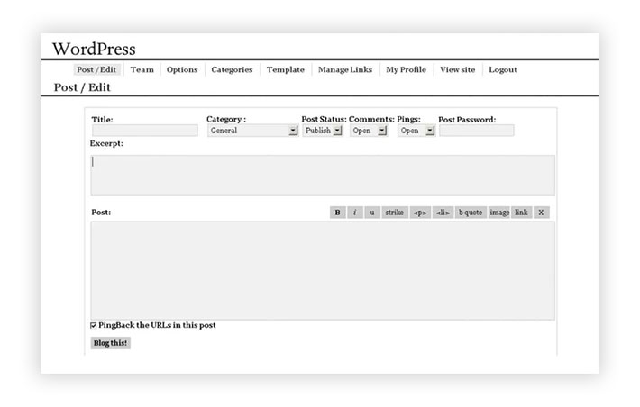

لا شك أنك سمعت مرارا وتكرارا عن **ووردبريس**، وفهمت ربما على أنه برنامج أو سكريبت يساعدنا على إنشاء مدونات إلكترونية بسهولة، ويجعلنا بذلك نركز أكثر على المحتوى عوض التركيز على الجوانب التقنية المرتبطة بتطوير المدونة.

هذا كله صحيح، ولا جدال في كون ووردبريس النظام الذي يقف خلف نسبة ساحقة من المدونات المنتشرة على شبكة الإنترنت. ولكن، هل ووردبريس فعلا مجرد برنامج لإنجاز وإدارة المدونات ؟ الجواب هو : لا!

سأبين في هذا المقال لماذا WordPress ليس مجرد سكريبت للمدونات على عكس ما يعتقد كثيرون، وسنتكلم عن تاريخ تطوره والمراحل المهمة التي مر منها ليتشكل في النهاية ووردبريس الذي نعرفه الآن: **نظام إدارة المحتوى** الأشهر والأكثر استخداما في العالم.

## ما هو نظام إدارة المحتوى ؟

تعرف أنظمة إدارة المحتوى - أو اختصارا CMS باللغة الإنجليزية - على أنها نوع من البرامج التي تساعد صناع المحتوى على إنشاء وتحديث محتوى مواقعهم الإلكترونية أو نوع آخر من البرامج المعلوماتية.

بتعبير آخر، برامج إدارة المحتوى هي تطبيقات توفر واجهات بسيطة وفي متنال المستخدم العادي من أجل إنشاء محتوى موقعه والتحكم فيه دون الحاجة لإكتساب أي مهارات في البرمجة.

ووردبريس برنامج إدارة محتوى **مفتوح المصدر**، ما يعني أنه بإمكان الجميع الإطلاع على الشفرة المصدرية والتعديل عليها أو بناء مشروع آخر عليها. ولعل ثقافة المصدر المفتوح من أقوى الأسباب وراء نجاح وتطور ووردبريس، حيث يساهم في تطويره المئات من المطورين المنتشرين حول العالم.

المصدر المفتوح كان كذلك من الأسباب المهمة وراء تمتع ووردبريس بواحد من أنشط المجتمعات البرمجية على شبكة الإنترنت، ويتنوع أعضاء هذا المجمتع ما بين مطورين لقوالب وإضافات ووردبرس، وكذلك مصممين وصناع المحتوى بجميع أشكاله.

## هل يوجد منافسون لووردبريس ؟

إلى جانب ووردبريس، هناك المئات من برامج وأنظمة إدارة المحتوى التي تسعى للحصول على نصيب لها في الكعكة. من أشهرها نجد **دروبال** (Drupal)، **جوملا** (Joomla)، **ماجنتو** (Magento) الخاص بالمتاجر الإلكترونية، **بريستاشوب** (Prestashop) أحد المنافسين الكبار لماجنتو، **غوست** (Ghost CMS) إلخ...

على الرغم من كون كل تلك الخيارات جيدة ولا تقل في كفاءتها وأداءها عن ووردبريس، إلا أن الأخير يتربع بشكل مريح على عرش سوق CMS بحيث [يدعم لوحده %60 من مجموع المواقع](https://websitesetup.org/popular-cms/) التي تعتمد على نظام معروف لإدارة المحتوى، وأقرب منافسيه Joomla لا تتجاوز حصته %7 في أحسن الأحوال.

في مقال سابق [رأينا إحصائيات تشير إلى أن Wordpress يدعم أزيد من %30](https://www.tutomena.com/news/wordpress-top-cms-2018/) من إجمالي المواقع الموجودة على شبكة الإنترنت، وهناك الآلاف من مواقع ووردبريس يتم إنشاؤها كل يوم!

## بدايات ووردبريس

لكي نفهم جيدا كيف بنى ووردبريس نجاحه، سنمر على مختلف المراحل المهمة والمفصلية في حياته التي دامت لحد كتابة هذا الموضوع 15 عاما.

في يوم من أيام سنة 2003، أعرب المطور الإنجليزي **مايك ليتل** في أحد المنتديات عن نيته في إنشاء تفريعة (Fork) عن مشروع **b2/cafelog** الذي كان يعيش أيامه الأخيرة آنذاك. لم تمر سوى فترة قصيرة حتى انضم **مات مولنويغ** () إلى مايك ليؤسسا مشروعهما المشترك، **ووردبريس**.

[alert type="info" icon-size="normal"]في 2003، كان Matt Mullenweg يبلغ من العمر 19 عاما فقط ويصغر شريكه Mike Little ب 22 سنة :)[/alert]

في ذات العام، تم الإعلان عن الإصدار الأول من ووردبريس الذي كان مقتصرا على إنشاء وإدارة مقالات المدونات، ولقد نالت لوحة تحكمه البسيطة استحسان المتابعين في ذلك الوقت.

**البساطة** كان عاملا مهما جدا في نجاح ووردبريس، فمطورو ووردبريس لم يكن همهم هو إنجاز لوحة تحكم تعج بالوظائف والمزايا لأن ذلك كان سيسبب الإرتباك للمستخدمين المستهدفين آنذاك، والذين كانوا في غالبيتهم من المدونين.

## الإضافات (Plugins)

عام 2004 سيكون مهما للغاية في حياة ووردبريس، فيه تم إطلاق الإصدار الجديد **1.2** والذي حمل معه ميزة **الإضافات** أو Plugins التي يعرفها الجميع الآن.

تتيح ال Plugins لمستخدمي ووردبريس فرصة إضافة عدد هائل جدا من الوظائف لمواقعهم، إلى جانب الوظائف الأساسية الموجودة في نواة ووردبريس. وقد ساهمت الإضافات منذ ذلك الوقت في جعل ووردبريس برنامج لإنشاء مختلف أنواع المواقع الإلكترونية بدءً بالمدونات (التخصص الأصلي لووردبريس)، مرورا بمواقع الشركات والخدمات وليس انتهاءً بالمتاجر الإلكترونية.

في يومنا هذا، لا يخلو أي موقع ووردبريس من أنواع الإضافات المختلفة، فهناك Plugins تمكن من :

- إضافة نماذج الإتصال (Contact forms).
- إضافة وسائل الدفع الإلكتروني المختلفة.
- أدوات تحسين السيو (SEO).
- إضافة إمكانية بيع المنتوجات الرقمية وغيرها.
- النشر التلقائي على منصات التواصل الإجتماعي.
- إضافة منتديات الدعم.
- تسريع المواقع بفعل نظام للكاش (Cache).
- إلخ...

كل ما يتخيله العقل تقريبا ستجد له إضافة لووردبريس، فمستودع ووردبريس حاليا يزخر بما يناهز 60.000 إضافة تغطي كافة الإحتياجات. ويمكن لأي مطور حول العام إنشاء إضافته الخاصة ونشرها على هذا المستودع بعد أن يتم مراجعتها وقبولها.

- اقرأ أيضا: [إضافات ووردبريس الأكثر شعبية](https://www.tutomena.com/blog/most-popular-wordpress-plugins/)

## القوالب والصفحات

بعد تقديم ميزة الإضافات للجمهور بعام واحد، كان الوقت ملائما في عام 2005 للإعلان عن ميزتين أخريين من مزايا ووردبريس التي مازالت إلى اليوم تشكل قوة وجاذبية ووردبريس: **القوالب** و**الصفحات**.

مكن نظام الصفحات (Pages) مستخدمي ووردبريس من إنشاء مواقع متعددة الأغراض وليس فقط مدونات. وأتاحت ميزة القوالب (Themes) إمكانية تخصيص شكل هذه المواقع كل حسب ذوقه، وذلك لكي لا يكون هناك تشابه أو حتى تطابق بين مواقع ووردبريس المنتشرة.

- اقرأ أيضا: [أفضل قوالب ووردبريس الإخبارية في ثيم فورست](https://www.tutomena.com/blog/best-wordpress-news-themes/)

## إنشاء منصة Wordpress.com

بعد النجاح الكبير الذي حققه ووردبريس كبرنامج مجاني ومفتوح المصدر، ارتأى Matt Mullenweg إلى أنه بإمكانه الإستفادة من هذه السمعة الطيبة لبرنامجه واستغلاله في مشروع ربحي موازي للمشروع المجاني. بالفعل قام Matt بتأسيس شركة **Automattic** وأسس تحت مظلتها منصة wordpress.com ذات الهدف الربحي.

يمكن أن نقارن منصة wordpress.com بنظيرتها Blogger من غوغل، الفرق أن الأولى ليست مجانية بشكل كامل.

wordpress.com توفر خدمة مجانية لإنشاء واستضافة مدونات ومواقع ووردبريس في نطاق فرعي، وخيارات المستخدم في الخطة المجانية محدودة، لذلك يجب الدفع من أجل الحصول على خيارات وإمكانيات إضافية مثل إضافة "دومين" خاص، حذف الإعلانات، إمكانية الإستعانة بالإضافات والقوالب المخصصة، مساحة تخزين أكبر إلخ...

- **للمزيد من التفاصيل:** [ما هو الفرق بين wordpress.org و wordpress.com](https://saidelbakkali.com/diferences-between-wordpress-org-and-wordpress-com/)

كانت تلك حركة ذكية جدا من Matt Mullenweg لأنها لاقت نجاحا كبيرا وجنى منها أموالا كثيرة ساعدته وحفزته للمضي قدما في تطوير نظام Wordpress.

## أنواع المنشورات المخصصة (Custom Post Types)

عام 2010 كان عاما آخر من الأعوام المجيدة في تاريخ ووردبريس.

في ذلك العام تم إدخال ميزتي **أنواع المنشورات المخصصة** أو ما يعرف ب Custom Post Types، و**التصنيفات المخصصة** أو بالإنجليزية Custom Taxonomies.

قبل ميلاد هاتين الميزتين، كان هناك عدد محدود من أنواع المنشورات التي يمكن لصاحب الموقع إنشاؤها :

- المقالات (Posts).
- الصفحات (Pages).
- الصور والوسائط (Media).

وكان هناك تصنيفين فقط كان يمكن أن نصنف بهما منشوراتنا:

- التصنيفات (Categories).
- الوسوم (Tags).

ولكن بعد ظهور Custom Post Types و Custom Taxonomies أصبح بإمكاننا إنشاء نوع المنشور الذي يناسبنا. فمثلا نستطيع إنشاء Post Type اسمه Movies (أفلام) مع حقول خاصة به مثل مدة الفيلم، المخرج، سنة الإنتاج إلخ... ويمكننا كذلك إنشاء تصنيفات (Taxonomies) خاصة بهذا النوع من المنشور مثل: رعب، دراما، وثائقي، أكشن إلخ...

هاتين الإضافتين زادتا من وهج ووردبريس وجعلتا منه برنامجا أقوى وأكمل، يستجيب لتطلعات المطورين وأصحاب المواقع على السواء.

## المخصص (Customizer)

في 2012، تم إضافة واجهة رسومية جديدة للوحة تحكم ووردبريس وسميت بالمُخصص أو Customizer.

عن طريق المخصص يستطيع صاحب الموقع تخصيص إعدادات موقعه ورؤية النتائج مباشرة في واجهة الموقع الأمامية، يعني دون أن يتم إعادة تحميل الصفحة كما في السابق.

يتوفر المخصص على واجهة برمجية (API) موجهة للمطورين بغرض بناء قوالب ووردبريس يتم تخصيصها بشكل شبه كامل من خلاله. ولقد شكل ذلك بداية لتوجه ووردبريس نحو اعتماد أكبر على لغة البرمجة **جافاسكريبت**، وهو التوجه الذي سيترسخ وسيتضح للجميع في إصدار ووردبريس **WordPress 5.0** الأحدث والذي جاء مع محرر جديد وثوري اسمه **Gutenberg**.

## ووردبريس 5.0 ومحرر غوتنبرغ

إصدار ووردبريس 5.0 مرحلة مهمة جدا في سيرة ووردبريس، ويشكل محرر Gutenberg الجديد أبرز ملامحها. هذا المحرر، الذي سبق أن [تطرقنا إليه بتفصيل في مقال سابق](https://www.tutomena.com/web-development/wordpress-gutenberg/)، جاء لتعويض محرر TinyMCE القديم، جالبا معه عدة مزايا خاصة، أبرزها اعتماده على نظام جديد لإدارة المحتوى على شكل كتل (**Blocks**) قابلة للتخصيص وإعادة الإستخدام بسهولة.

يمكن تشبيه ال Blocks بالمربعات الجانبية (Widgets) ولكنها تستخدم ويتم إعدادها داخل المحرر نفسه، وبطبيعة هناك واجهة برمجية موجهة لمطوري ووردبريس من أجل تطوير Blocks جديدة ومخصصة.

أحد أهداف هذا التوجه من ووردبريس هو منح أصحاب المواقع والمدونات تجربة أفضل في صناعة المحتوى. ولكن رغم ذلك، أحدث هذا التغيير ردود فعل متباينة في أوساط مجتمع ووردبريس بين من يرى بأن غوتنبرغ سيحول صناعة ووردبريس إلى مستوى آخر من الإبداع في التصاميم والمحتويات، [وآخرين يرون بأن هذا المحرر أضر بإنتاجيتهم](https://www.amnaymag.com/%D9%85%D8%AD%D8%B1%D8%B1-gutenberg-%D9%81%D9%8A-%D9%88%D9%88%D8%B1%D8%AF%D8%A8%D8%B1%D9%8A%D8%B3-%D8%B3%D9%8A%D8%A1-%D9%88%D9%87%D8%B0%D8%A7-%D9%87%D9%88-%D8%A7%D9%84%D8%AD%D9%84/) خاصة وأن العديد منهم كانوا معتادين على إعداد وكتابة منشوراتهم في برامج مثل Microsoft Word قبل أن يتم نسخها ولصقها في محرر ووردبريس القديم TinyMCE.

## النهاية

هكذا، صديقي العزيز، تعرفتَ على أبرز المراحل التاريخية التي مر منها برنامج إدارة المحتوى **WordPress**.

العديد من الدروس يمكن أن تستفاد من قصة هذا المشروع الناجح، أهمها من وجهة نظري أن إطلاق أي مشروع يجب أن يتم بأسرع وقت ممكن، وألا يتم إضاعة الكثير من الوقت في محاولة بناء مشروع مثالي يضم كافة المزايا دفعة واحدة.

ووردبريس كما رأينا بدأ بسيطا، وتطور بشكل تدريجي ومنتظم، ومازال إلى يومنا هذا يتطور ويوفر وظائف ومميزات جديدة. لذلك أتوقع أن يظل محافظا على مكانته الحالية لأعوام طويلة قادمة.

_ما رأيك أنت صديقي بقصة النجاح هذه ؟ وهل تظن بأن ووردبريس سيواصل تربعه على عرش أنظمة إدارة المحتوى على المدى المنظور ؟_

_شارك معي وجهة نظرك من خلال صندوق التعليقات :)_
