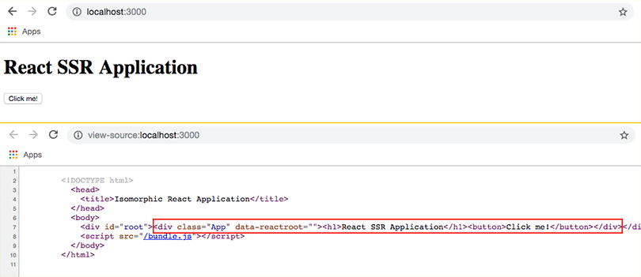

**Server Side Rendering** - اختصارا SSR - هي عملية يتم خلالها توليد كود HTML الخاص بتطبيقات جافاسكريبت الحديثة **في الخادم عوضا عن المتصفح**.

لماذا ؟ وكيف ؟ هذان هما السؤالان اللذان سنجيب عليهما في هذا الدرس :)

## لماذا أصبحنا نتكلم عن Server Side Rendering

في تطبيقات الويب التقليدية، حالما يقوم المستخدم بالدخول إليها عن طريق عنوان URL، يتم إرسال طلب Http إلى الخادم حيث التطبيق مستضاف. بعد ذلك يقوم خادم الويب في تلك الإستضافة (مثلا خادم Python ،PHP أو غيرهما) بتوليد كود HTML الخاص بتلك الصفحة بشكل كامل ويقدمه إلى المتصفح ليقوم بعرضه.

هذه العملية تتكرر مع كل صفحة يتم طلب من طرف المستخدم.

المتصفح كان عمله بسيطا وسهلا مقارنة بحاله اليوم :)

ولكن في أيامنا هذه، انتشر ما يعرف [بتطبيقات الويب أحادية الصفحة](https://www.tutomena.com/web-development/javascript/what-is-single-page-application/)، وأصبح معظم العمل يتم على مستوى المتصفح. هذا الأخير يقوم فقط بطلب البيانات من الخادم الذي يلبي الطلب على شكل واجهة برمجية API يتم استهلاكها في المتصفح بطبيعة الحال وبناء عليها يتم توليد وتقديم كود HTML للمستخدم عن طريق جافاسكريبت.

في مدونة توتومينا تحدثنا مرارا عن عدد من أطر عمل جافاسكريبت التي تساعد المطورين على بناء تطبيقات ويب حديثة بأقل مجهود.

**React.js** واحد من أشهر هذه الأطر وأكثرها استخداما.

في تطبيق مبني على React.js مثلا، عندما نطلب صفحة من الخادم فإن كل ما نحصل عليه هو مايلي :

```html
<!DOCTYPE html>
<html lang="en">
  <head>
    <meta charset="utf-8" />
    <link rel="shortcut icon" href="/favicon.ico" />
    <title>React Application</title>
  </head>
  <body>
    <div id="root"></div>
    <script src="/app.js"></script>
  </body>
</html>
```

نلاحظ أنها صفحة تقريبا فارغة، لا تتضمن سوى `<div>` وأسفل منه ملف جافاسكريبت app.js يتم استدعاؤه.

هكذا تبدو تطبيقات الويب أحادية الصفحة في كل أطر عمل جافاسكريبت الأخر (Vue.js ،Angular إلخ...).

عندما تصل هذه الصفحة إلى المتصفح، يقوم الأخير بواسطة جافاسكريبت الموجود في الملف app.js، بتحديد المكونات (Components) التي يجب توليدها وتركيبها في الصفحة بناء على URL (أو Route) المطلوب. كل هذا العمل يتم في المتصفح (Client) بعد أن تصل إليه الصفحة الفارغة قادمة من الخادم (Server).

### الآثار الجانبية

تطبيقات الويب ذات الصفحة الواحدة جميلة وتجعل المستخدم يحسن كأنه في تطبيق مكتبي أصلي، ولكن لكل شيء جميل آثار جانبية لا يجب إهمالها، أو على الأقل يجب أن نكون على دراية بها.

إليكم أهم الآثار الجانبية أو النواقص التي تعاني منها تطبيقات SPA :

- تحميل الموقع يكون ثقيلا خاصة عندما يكون الإنترنت بطيئا، ويعاني من هذا البطء في العادة مستخدمو الأجهزة المحمولة من الدول النامية، حيث اتصال الإنترنت سواء من الجيلين الثالث والرابع يكون دون المستوى الإعتيادي. بطء التحميل ناتج عن ملف الجافاسكريبت الذي يكون كبيرا، فحتى بعد تحميله يستغرق المتصفح وقتا لا يستهان به في قراءته من أجل تجهيز وعرض الصفحة للمستخدم، ويكون الأخيرا قادرا على التفاعل معها. يمكن تسريع هذه العملية عبر اتباع طرق مثل تقسيم كود الجافاسكريبت وتحميل الأكواد التي نحتاجها في الصفحة فقط باستخدام ال Code Splitting و Lazy Loading، ولكن تطبيق هذه الأفكار لا يكون دائما عملية سهلة بالنسبة لمطوري الويب الذين لا يتمتعون بمستوى معين من الخبرة.
- محركات تقوم بأرشفة صفحات الويب عن طريق ما يعرف بالعناكب (_Crawlers_)، هذه العناكب عندما تدخل لصفحة SPA تجدها فارغة كما رأينا أعلاه، وبالتالي لا تصل إلى محتوى الصفحة لأنها لا تقرأ الجافاسكريبت مثلما تفعل المتصفحات. في السنوات الأخيرة أصبحت تلك العناكب أكثر ذكاءً وتطورا، ومحرك Google أعلن فيما سبق أنه يستطيع أرشفة وقراءة الصفحات التي يتم توليدها عبر جافاسكريبت. ولكن رغم هذا كله ما يزال هذا النوع من التطبيقات يعاني من إشكاليات أخرى مع SEO، ما يؤثر بشكل سلبي على ظهورها على محركات البحث.
- نفس ما قيل عن محركات البحث يمكن أن يقال على منصات التواصل الإجتماعي، حيث إن الصفحات تصبح مبدئيا غير قابلة للمشاركة بشكل جيد، لأن موقع التواصل (فيسبوك مثلا) لا يستطيع الوصول إلى معلومات meta التي تظهر للمستخدين عند مشاركة الرابط (مثلا عنوان الصفحة، وصف الصفحة، الصورة إلخ...)

لإيجاد حلول لكل هذه المشاكل تم اختراع مصطلح Server Side Rendering، وفي الحقيقة هو كان دائما موجودا ولكن لم يكن أحد يتحدث عنه مثل اليوم لأنه كان الخيار الأصلي والوحيد بالنسبة لمطوري الويب.

تم بناء عدة أطر عمل جافاسكريبت **حول** أطر عمل الواجهات الأمامية المعروفة لكي تصبح قادرة على العمل في الخوادم وليس في المتصفحات فقط.

- Next.js تم بناؤه حول [React.js](https://www.tutomena.com/web-development/javascript/react-javascript-library/).
- Nuxt.js تم بناؤه حول [Vue.js](https://www.tutomena.com/web-development/javascript/3-reasons-to-choose-vuejs-framework/).
- Angular Universal حول [إطار العمل Angular](https://www.tutomena.com/web-development/javascript/components-angular-framework/).. هذا الإطار مدعوم رسميا من فريق Angular.

تطبيقات الويب أحادية الصفحة التي تستفيد من SSR تعرف باسم **Isomorphic applications**، أي تطبيقات الويب **المتماثلة** لأنها تشتغل في بيئتي الويب والعميل معا. (تعرف كذلك باسم Universal Apps).

## مثال عملي ل Server Side Rendering

في هذا الدرس سنرى كيفية تقديم تطبيق ويب (تطبيق React.js) من الخادم، ولن نقوم باستخدام أي من أطر العمل التي سبقت الإشارة إليها، بل سنرى كيفية فعل ذلك من الصفر وباستخدام [إطار العمل Express](https://www.tutomena.com/web-development/javascript/what-is-expressjs/) فقط.

سنقوم [بإعداد مشروع React.js من الصفر](https://www.tutomena.com/web-development/javascript/react-app-from-scratch-using-webpack4/) لأن مشاريع create-react-app لا تدعم Server side rendering :) لذلك سننشئ المشروع بناء على البنية كما تلاحظون في الصورة أسفله.


- المجلد **public**: سنقوم بإنشائه ونتركه فارغا، وسيتم توليد الملفات بداخله (مثلا bundle.js) بشكل آلي، بناء على إعدادات webpack. يمكن كذلك أن يحتوي على الصور وملفات Css إلخ...
- المجلد **src**: هذا هو المجلد الذي سيضم كافة أكوادنا البرمجية الخاصة. سنقوم بتقسيمها إلى ثلاثة أجزاء : server ،browser و shared.

- browser يضم الكود الذي نريد تشغيله على المتصفح. - server فيه الكود الذي نريد تشغيله على الخادم (Express). - shared الأكواد المشتركة بين الخادم والمتصفح، وهي في الغالب مكونات React.js.

### shared/App.js

في الملف `shared/App.js` نجد مكون React عادي :

```js
import React from 'react';

function App() {
  return (
    <div className="App">
      <h1>React SSR Application</h1>
    </div>
  );
}

export default App;
```

### server/index.js

أما الملف `server/index.js` فيسكون على هيئة كهذه :

```js
import React from 'react';
import { renderToString } from 'react-dom/server';

import express from 'express';

import App from '../shared/App';

const app = express();

app.use(express.static('public'));

app.get('*', (req, res) => {
  const reactDom = renderToString(<App />);

  res.send(htmlTemplate(reactDom));
});

app.listen(process.env.PORT || 3000, () => {
  console.log('Server is listening');
});

function htmlTemplate(reactDom) {
  return `
  <!DOCTYPE html>
    <head>
      <title>Isomorphic React Application</title>
    </head>
    <body>
      <div id="root">${reactDom}</div>
      <script src="/bundle.js"></script>
    </body>
  </html>
`;
}
```

سأقوم بشرح ما قد يبدو غير مفهوم في هذا الملف.

```js
import { renderToString } from 'react-dom/server';
```

هنا قمنا باستيراد الوظيفة **renderToString** من react-dom/server، وتلعب دور render في الخادم. الفرق أنها تقوم بإرجاع ال HTML على شكل **String** وليس شجرة DOM كما جرت عليه العادة في ناحية المتصفح.

```js
const app = express();

app.use(express.static('public'));
```

السطر الأول هنا يقوم بإنشاء تطبيق إكسبريس، بينما الثاني يخبر Express بأنه سيجد الملفات الساكنة في المجلد public. الملف الساكن الوحيد في مثالنا هو _build.js_ الذي يتم توليده من طرف Webpack.

```js
app.get('*', (req, res) => {
  const reactDom = renderToString(<App />);

  res.send(htmlTemplate(reactDom));
});
```

هنا نقول لإكسبريس أن يقوم بتحويل المكون `<App/>` إلى كود Html على شكل String وذلك عن طريق الوظيفة **renderToString**.

بعد ذلك يتم تقديم هذا Html للمتصفح عن طريق **res.send**.

### browser/index.js

الملف الأخير الذي يخصنا في هذا المثال هو browser/index.js:

```jsx
import React from 'react';
import ReactDOM from 'react-dom';

import App from '../shared/App';

ReactDOM.hydrate(<App />, document.getElementById('root'));
```

نرى بأن هذا الملف بسيط للغاية، فقط قمنا باستيراد المكون `<App/>` وركبناه في العنصر **div#root**.

النقطة الوحيدة المثيرة للإنتباه في هذا الملف هي أننا استخدمنا الوظيفة **ReactDOM.hydrate** عوض ReactDOM.render. وفي الحقيقة الوظيفتان تقومان بنفس الدور، الفرق أن hydrate مصممة خصيصا للحالة التي يتم فيها تقديم كود HTML المكون بواسطة renderToString، يعني حالة Server Side Rendering.

- [هذا الرابط يعطي معلومات وتفاصيل أكثر عن ReactDOM.hydrate](https://reactjs.org/docs/react-dom.html).

هكذا عندما نقوم بتشغيل المشروع على المتصفح - عن طريق `npm run dev` - سنلاحظ بأن الشفرة المصدرية للصفحة موجودة بالكامل، لأنه تم توليدها وتقديمها من طرف الخادم.

[](../images/react-ssr-source-code.png)

ستجدون الشفرة المصدرية لهذا المثال كاملة (بما فيها ملف webpack.config.js :) ) على Github في [هذا الرابط](https://github.com/tutomena/react-basic-ssr).

## في الختام

كما رأينا، إضافة خاصية Server Side Rendering لتطبيقات الويب ليس بالأمر الصعب جدا ولكن ليس سهلا كذلك :) خاصة إذا كان التطبيق كبيرا وأكثر تعقيدا من مثالنا.

هل SSR ضروري ؟ هذا يعتمد على نوع التطبيق والهدف من ورائه. إذا كان التطبيق مثلا عبارة عن مدونة أو موقع تواصل مفتوح مثل فيسبوك أو تويتر، فمن الضروري أن يتم تقديم الشفرة المصدرية من الخادم. أما إذا كان التطبيق مغلقا، مثلا تطبيق لإدارة شركة أو موارد بشرية، فعندها قد لا يستحق العناء والمجهود اللذان سيبذلان من أجله.

على كل حال، هذا الموضوع مثار نقاش حاد بين المطورين كما ستلاحظون من خلال [هذه المناقشة على منصة Reddit](https://www.reddit.com/r/reactjs/comments/7o6oj6/serverside_rendering_not_worth_it/).

_سيكون من الرائع لو تشاركوا معنا كذلك آراءكم وتجاربكم حول هذه الفكرة لإغناء موضوعنا أكثر :) _
