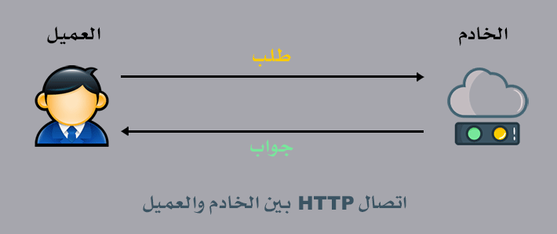
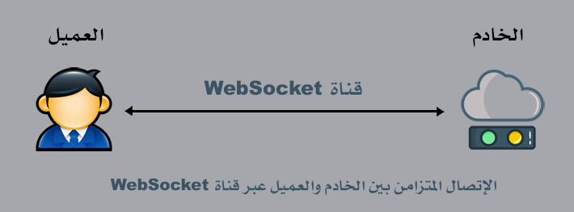
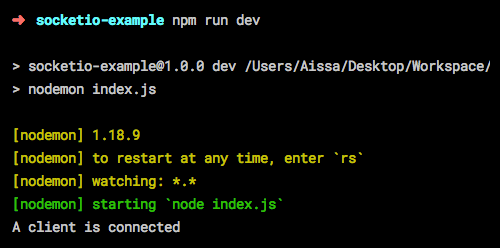
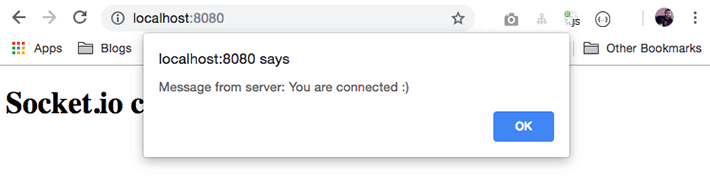
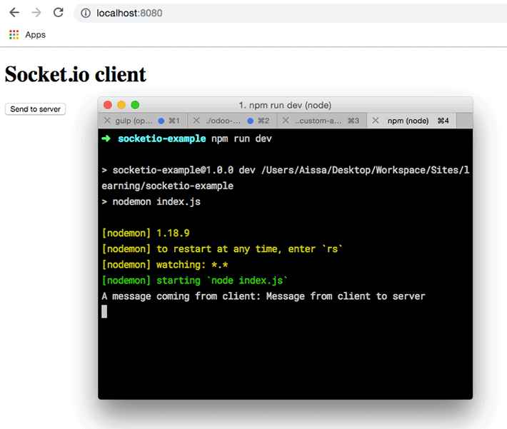

socket.io هي من أكثر المكتبات شعبية في بيئة Node.js، نظرا لكونها سهلت كثيرا على مطوري الويب بناء تطبيقات تزامنية بين الخادم والعميل بالإعتماد بشكل خاص على بروتوكول Websocket. وعندما نقول تطبيقات تزامنية أو آنية (Real Time) فإننا نقصد بها كل تطبيق يحتاج فيه العملاء (Clients) للحصول على أحدث البيانات من الخادم (Server) من دون إعادة تحميل الصفحة أو الضغط على أي زر في التطبيق.

## ما هي آلية عمل WebSockets ؟

في فيسبوك، على سبيل المثال، يتلقى المستخدم إشعارات بالتعليقات الجديدة على منشوراته ويشاهدها في الوقت الحي على شاشته من دون تدخل منه. الذي يحدث أنه بمجرد دخولنا إلى موقع فيسبوك يقوم الأخير بفتح قناة لا تغلق إلا بعد الخروج منه، ومن خلالها يستطيع الخادم إرسال بيانات معينة إلى العميل الذي يقوم بالتنصت على الخادم وانتظار أي خبر جديد منه ليقوم بعرض ما يتلقاه من بيانات على واجهة المستخدم.

هذه العملية ثنائية الإتجاه (Bi-directional)، أي أن الخادم كذلك قادر على التنصت على العميل وانتظار معلومات جديدة منه ليقوم بإرسالها للعملاء الآخرين. هذا يحدث على سبيل المثال في تطبيقات الدردشة أو الشات، حيث تقوم بكتابة رسالتك ومباشرة عند الضغط على زر الإرسال تظهر في الطرف الآخر عند صديقك.

يمكنك تشبيه هذا الفيلم بالجندي الذي يحمل جهازه اللاسلكي، ويستخدمه للإتصال بقائده وإخباره بآخر المستجدات الميدانية، فيقوم القائد بدوره بتحويل تلك المعلومات الواردة في الإتصال عن طريق جهازه إلى مجموعة من الجنود الآخرين الذي يحملون أجهزتهم كذلك ويتنصتون عليها :)

## بنية HTTP التقليدية

في بنية HTTP التقليدية، العميل (المتصفح) دائما يطلب بشكل صريح (Explicitly) والخادم يستجيب، هكذا كانت دائما تطبيقات الويب تعمل حتى ظهرت واجهة Websocket API الخاصة بجافاسكربت بالتزامن مع بروز إصدار HTML5 الجديد قبل سنوات.

[](../images/http-communication-1.png)

في البداية كان هذا كافيا، ولكن مع التطور الحاصل في مجال تطبيقات الويب تبينت محدودية هذه البنية وعدم استجابتها لتطلعات مطوري الويب وأصحاب المشاريع الريادية على الإنترنت. السبب كما قلنا، أنه في هذه الحالة لا يستطيع الخادم من تلقاء نفسه أن يرسل شيئا إلى العميل المتصل، فهو دائما ينتظر طلبا (Http Request) من الأخير لكي يقدم جوابا له (Http Response).

تقنية WebSocket الجديدة تمكن من فتح اتصال أو **قناة مفتوحة بين الخادم والعميل طيلة مدة الجلسة**، ومن خلالها يستطيع الطرفان تبادل الرسائل في الإتجاهين، يعني حتى الخادم يستطيع إرسال ما يريد من بيانات إلى العميل من دون أن يطلب منه الأخير ذلك بشكل صريح، مع إمكانيات معالجة وعرض تلك البيانات في الزمن الحقيقي (_Real time_) بدون إعادة تحميل الصفحة.

[](../images/websocket-communication.png)

### لا يجب الخلط بين WebSockets وأجاكس

هنا لا يجب أن نخلط بين Websocket و تقنية Ajax :) صحيح أن الأخير يسمح للعميل (المتصفح) والخادم بتبادل البيانات دون إعادة تحميل الصفحة، ولكن يبقى العميل هو الذي يطلب تلك البيانات من الخادم والأخير يستجيب فقط، ولا يمكنه إرسال أي شيء من تلقاء نفسه.

## علاقة مكتبة Socket.io ب WebSockets

تتيح لنا مكتبة socket.io الإستعانة بتقنيات Websocket بسهولة عن طريق توفير واجهة برمجية واضحة وبسيطة، كما أنها تستعين بوسائل وتقنيات أخرى من أجل ضمان توافقية كاملة مع المتصفحات القديمة التي لا تدعم ال WebSocket.

فعلى سبيل المثال، إذا كان المتصفح لا يدعم WebSocket وفي نفس الوقت Flash مثبت، تقوم socket.io بالإستعانة ب _Adobe Flash Socket_ للقيام بالإتصال. وفي الحالات الأخرى تستخدم تقنيات مختلفة مثل _Ajax Long Polling_ أو _Forever Iframe_.

كل هذه التقنيات تلجأ إليها المكتبة لإستهداف أكبر قد ممكن من الأجهزة والمتصفحات، وليس علينا كمطورين فهمها لأنه في النهاية نحن نتعامل مع واجهة socket.io الموحدة :)

الجميل كذلك مع هذه المكتبة أنها تستهدف كذلك ناحية الخادم (Node.js) إلى جانب المتصفحات، وبالتالي لن نحتاج لأي مكتبة أخرى لإدارة العمليات جهة الخادم. وهنا تجدر الإشارة إلى أنه **لا يمكن استخدام مكتبة socket.io جهة الخادم إلا مع مكتبة socket.io نفسها جهة العميل**، المكتبات الأخرى المعروفة التي بنيت حول WebSockets (مثلا مكتبة [ws](https://www.npmjs.com/package/ws)) غير متوافقة مع socket.io **إلا إذا تمت الإشارة لعكس ذلك**.

## لنمر إلى التطبيق

الآن وبعد أن تعرفنا على دور وفائدة مكتبة socket.io، سيكون من الجيد إذا مررنا للتطبيق العملي حتى نستوعب جيدا كل الأمور النظرية التي قلناها.

أولا، لنقم بإنشاء مجلد جديد نسميه _socketio-example_ وندخل إليه من خلال نافذة الأوامر السطرية.

إليكم الطريقة المعتادة لفعل ذلك:

```bash
mkdir socketio-example && cd socketio-example
```

بعد ذلك نقوم بتهيئة مشروع Node.js جديد داخل المجلد عن طريق الأمر التالي:

```bash
npm install -y
```

هذا سيؤدي لإنشاء ملف `package.json` الإعتيادي. سنستخدم هذا الملف لاحقا لإضافة أوامر تمكننا من تشغيل خادم Node.js.

الخطوة التالية هي خطوة اختيارية ولكنها محبدة، وهي تحميل الأداة [nodemon](https://nodemon.io/) التي تمكننا من تشغيل خادم Node.js وإعادة تشغيله (_Restart_) بعد كل تغيير على مستوى ملفات المشروع (_Watching changes_)، لكي لا نظطر لفعل ذلك يدويا.

```bash
npm install nodemon --save-dev
```

الآن حان الوقت لتحميل مكتبة socket.io، ودائما عن طريق مدير الحزم npm :)

```bash
npm install socket.io
```

بعد تحميل المكتبة، سننشئ ملفين اثنين :

- **index.js**: الملف الذي تتم على مستواه إدارة الإتصال والعمليات التي تتم على مستوى الخادم (_Server_).
- **index.html**: هذا الملف يمثل العميل (_Client_) الذي يتصل بالخادم ويتولى عرض النتائج للمستخدم.

### ملف الخادم (_index.js_)

محتوى الملف `index.js` سيكون بسيطا، لاحظوا :

```js
var http = require('http');
var fs = require('fs');

var server = http.createServer(function(req, res) {
  fs.readFile('./index.html', 'utf-8', function(error, content) {
    res.writeHead(200, { 'Content-Type': 'text/html' });
    res.end(content);
  });
});

var io = require('socket.io').listen(server);

io.sockets.on('connection', function(socket) {
  console.log('A client is connected');
});

server.listen(8080);
```

هنا قمنا بشيئين :

- أولا أنشأنا خادم **http** وعن طريقه نقوم بإرسال الصفحة **index.html** إلى العميل.
- ثانيا أنشأنا متغيرا اسمه io انطلاقا من الوحدة socket.io التي قمنا بتثبيتها سابقا، وعن طريق هذا المتغير يمكننا التنصت على الحدث **connection** الذي يتم إطلاقه من طرف خادم Socket.io عند اتصال أي عميل (_Client_) به. في حالتنا طلبنا من الخادم أن يقوم بعرض رسالة "_A client is connected_" عند كل اتصال جديد.

إذن في الأخير سيكون هناك اتصالين اثنين :

- اتصال http يفتح لنا صفحة `index.html`على المتصفح.
- من داخل صفحة `index.html` سنقوم بإنشاء قناة اتصال متزامن نحو الخادم عن طريق مكتبة socket.io جهة العميل، فكما قلت في السابق هذه المكتبة تعمل في كلتا الناحيتين (Server و Client).

### ملف العميل (index.html)

```html
<!DOCTYPE html>
<html>
  <head>
    <meta charset="utf-8" />
    <title>Socket.io</title>
  </head>

  <body>
    <h1>Socket.io client</h1>

    <script src="/socket.io/socket.io.js" type="text/javascript"></script>
    <script type="text/javascript">
      var socket = io.connect('http://localhost:8080');
    </script>
  </body>
</html>
```

تلاحظون أن هذا الملف غاية في البساطة كذلك، فقط قمنا باستدعاء مكتبة العميل الخاصة ب Socket.io من خلال المسار socket.io/socket.io.js/ الذي توفره لنا الوحدة _socket.io_ التي استخدمناها في ملف الخادم.

بعد استدعاء مكتبة العميل، سنقوم بفتح قناة الإتصال مع الخادم من خلال الكائن **io** الذي توفره مكتبة **socket.io.js**. وبطبيعة الحال في المشروع الحقيقي يجب تعويض localhost باسم النطاق الخاص بموقعك.

الآن لم يتبق لنا سوى إطلاق الخادم من خلال **nodemon**، وأفضل طريقة للقيام بذلك هي عن طريق أوامر npm.

يمكننا إضافة هذه الأوامر كما رأينا في دروس سابقة في ملف package.json بهذه الطريقة :

```json
...
"scripts": {
    "dev": "nodemon index.js"
}
...
```

نستطيع الآن تشغيل الخادم عن طريق تنفيذ الأمر **npm run dev** (بحيث dev هو اسم الأمر الذي اخترناه أعلاه في ملف package.json).

```bash
npm run dev
```

بعد تشغيل الخادم، ومع دخولنا للرابط http://localhost:8080 على المتصفح سنرى بأن الرسالة "A client is connected" قد طبعت في نافذة الأوامر السطرية.

[](../images/socketio-server.png)

هذا يعني بأن اتصال Socket.io قد تم بنجاح بين الخادم والعميل :) وكلما فتحنا نافذة جديدة في المتصفح ودخلنا للرابط مرة أخرى سنلاحظ بأن الرسالة تطبع من جديد لأن هناك عميلا جديدا ربط اتصالا جديدا مع الخادم.

الآن بعد أن عرفنا كيف نربط اتصالا بين الخادم والمتصفح، سنتقدم قليلا نحو الأمام لنرى كيف يمكن للخادم أن يخاطب العميل، وكيف للأخير أن يخاطب الأول كذلك.

## إرسال واستقبال الرسائل بين الخادم والعميل

### 1. الخادم يرسل رسالة للعميل

في المثال السابق، كنا طلبنا من الخادم أن يقوم بطباعة رسالة "A client is connected" عن طريق console.log، وهذا فقط للتحقق من أن الإتصال تم بنجاح، إذ أن المستخدم لا يرى تلك الرسالة على المتصفح. لهذا، سنقوم الآن بإرسال رسالة لهذا المستخدم لنخبره بأنه متصل، وسيتمكن العميل (المتصفح) من التقاط تلك الرسالة وعرضها على شكل alert.

الطريقة هي كالتالي :

```js
io.sockets.on('connection', function(socket) {
  socket.emit('connected', 'You are connected :)');
});
```

هنا قمنا بإرسال رسالة للعميل عن طريق الوظيفة ()socket.emit التي تقبل معاملين اثنين:

- اسم أو نوع الرسالة، هنا استعملنا connected ويمكن اختيار أي اسم نريد.
- المعامل الثاني يمثل محتوى الرسالة ويمكن أن يكون نصا (string) كما في حالتنا أو كائن جافاسكريبت (Object) إذا أردنا إرسال أكثر من معلومة واحدة.

في ناحية العميل (Client) سنتنصت على قدوم الرسالة عن طريق الوظيفة ()socket.on :

```html
<script type="text/javascript">
  var socket = io.connect('http://localhost:8080');
  socket.on('connected', function(message) {
    alert('Message from server: ' + message);
  });
</script>
```

تلاحظون أن الوظيفة ()on تقبل بارامترين: الأول هو نوع الرسالة (connected) والثاني هو دالة Callback تقبل بدورها بارامترا واحدا هو محتوى الرسالة القادمة من الخادم.

الآن عندما نعود لفتح الرابط http://localhost/8080 على متصفحنا سنجد بأنه يعرض الرسالة في نافذة alert.

[](../images/socketio-client.png)

### 2. العميل يرسل رسالة للخادم

لكي نقوم بإرسال رسالة من العميل نحو الخادم، سنقوم بإضافة زر لصفحة index.html وعند النقر عليه سنقوم بإرسال رسالة للخادم. الطريقة هي نفسها تقريبا.

```html
<!DOCTYPE html>
<html>
  <head>
    <meta charset="utf-8" />
    <title>Socket.io</title>
  </head>

  <body>
    <h1>Socket.io client</h1>

    <button id="button">Send to server</button>

    <script src="/socket.io/socket.io.js" type="text/javascript"></script>
    <script type="text/javascript">
      var socket = io.connect('http://localhost:8080');
      socket.on('connected', function(message) {
        alert('Message from server: ' + message);
      });

      document.getElementById('button').addEventListener('click', function() {
        socket.emit('message', 'Message from client to server');
      });
    </script>
  </body>
</html>
```

العميل يقوم بإرسال المعلومات للخادم بدالة ()emit تحمل كما تلاحظون نفس اسم الدالة أو الوظيفة التي يستخدمها الخادم لنفس الغرض، لهذا قلت سابقا بأن الواجهة البرمجية التي توفرها Socket.io بسيطة وبديهية :)

هنا اخترنا الإسم message لتحديد نوع الرسالة.

الآن يجب علينا أن نطلب من الخادم أن يتنصت على الرسائل من هذا النوع، وذلك عن طريق الدالة ()socket.on:

```js
io.sockets.on('connection', function(socket) {
  socket.emit('connected', 'You are connected :)');

  socket.on('message', function(message) {
    console.log('A message coming from client: ' + message);
  });
});
```

بعد القيام بكل هذه الخطوات بشكل صحيح، وبعد أن ننقر على الزر الجديد في صفحتنا سنرى بأن الرسالة قد تمت طباعتها في نافذة الأوامر السطرية (Terminal) الخاصة بالخادم، ما يعني أن الأخير قد استقبل بشكل جيد رسالة ال Client.

[](../images/socketio-server-msg-from-client.png)

## الإتصال بمجوعة من العملاء

في مثالنا السابق، كان لدينا خادم واحد وعميل واحد فقط، عندما نطلب من الخادم أن يرسل رسالة فإنه يرسلها للعميل المتصل وحده وليس لباقي العملاء والمستخدمين.

لنتخيل مثلا أنه لدينا غرفة دردشة يشارك فيها مجموعة من المستخدمين الذين يدردشون فيما بينهم. عندما يقوم مستخدم بإرسال رسالة نحو الخادم، من المفترض أن يقوم الخادم بتحليلها وإرسالها لباقي المستخدمين حتى يعمل نظام الشات بشكل جيد.

في حالة استخدمنا طريقة ()socket.emit فإن الخادم سيقوم بإرجاع الرسالة للمستخدم الذي قام بإرسالها فقط، وهذا غير منطقي، لأنه ليس هناك من فائدة في أن تدردش مع نفسك :) :)

يجب علينا أن نطلب من الخادم أن يقوم بإرسال تلك الرسالة لكل العملاء والمستخدمين الذين تربطهم في الوقت الحالي قناة socket.io مفتوحة مع الخادم.

الطريقة هي `io.emit()`

```js
io.sockets.on('connection', function(socket) {
  socket.emit('connected', 'You are connected :)');

  io.emit('connected', 'Another client is connected to chat room :)');

  socket.on('message', function(message) {
    console.log('A message coming from client: ' + message);
  });
});
```

الآن كلما فتحنا نافذة جديدة في المتصفح `http://localhost:8080` ستقوم الصفحات في النوافذ الأخرى بعرض الرسالة "_Another client is connected to chat room_" في نافذة **alert** (لأنه سبق أن طلبنا من العميل أن يتنصت على الرسائل من نوع connected)، وهذا بالضبط ما نريده.

[alert type="info" icon-size="normal"]في حالات أخرى، نكون في حاجة لإرسال البيانات من الخادم إلى جميع العملاء باستثناء العميل المرسِل، في تلك الحالة نقوم باستخدام ()socket.broadcast.emit عوضا عن ()io.emit.[/alert]

## الختام

هذه مقدمة بسيطة لمعرفة خصائص ومميزات **مكتبة Socket.io**.

إنشاء تطبيقات الزمن الحقيقي (_Real-time Web Applications_) أصبح أسهل وفي متناول جميع المطورين بمختلف مستوياتهم بفضل هذه المكتبة الرائعة.

الأمثلة التي أوردناها في هذا الدرس غاية في البساطة، وليست إلا إشارة يسيرة لما يمكننا فعله بواسطتها.

في أحد الدروس القادمة إن شاء الله، سأقوم بإنجاز مثال عملي أكثر تقدما، عبارة عن [تطبيق للدردشة نقوم ببنائه بواسطة Socket.io وأحد أطر عمل جافاسكريبت](https://www.tutomena.com/web-development/javascript/socketio-chat-tutorial/) (غالبا سيكون React.js).

> إلى ذلك الحين لا تبخلوا علينا بتعليقاتكم الجميلة، وملاحظاتهم وكذا اقتراحاتكم للدروس المقبلة.
