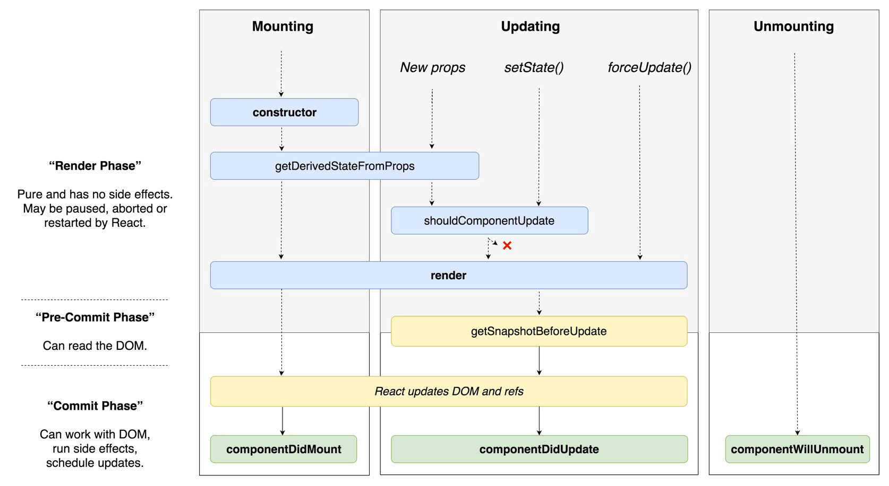

في جميع أطر عمل جافاسكريبت المعروفة اليوم نجد ما يعرف اصطلاحا بالمكونات أو Components، ونعني بها مجموعة من العناصر المستقلة (UI Elements) التي تكون الواجهة الأمامية للتطبيق ويمكن إعادة استخدامها في مواضع عدة سواء في نفس التطبيق أو في تطبيقات ومشاريع أخرى.

هذه المكونات تمتد دورة حياتها من لحظة تهيئتها للظهور في واجهة المستخدم إلى حين اختفائها وحذفها، وإطار العمل الذي نستخدمه يمكننا من التقاط لحظات معينة من هذه الحياة حتى نتفاعل من خلالها مع المكون في تلك المرحلة قبل أن تمضي وتنقضي.

هذه اللحظات تعرف في بيئة أطر عمل جافاسكريبت، وفي بيئة React.js بشكل خاص، **بوظائف دورة الحياة** أو بالإنجليزية **Lifecyle Methods**.

حاليا في [React.js](https://www.tutomena.com/web-development/javascript/react-javascript-library/)، يمكننا استخدام Lifecycle Methods والإستعانة بها فقط في المكونات من نوع **Class Components**، بينما ليس بإمكاننا الوصول إليها من المكونات الوظيفية أو **Functional Components**، طبعا في انتظار أن يصبح هذا متاحا كذلك مع ميزة [React Hooks](https://www.tutomena.com/web-development/javascript/introduction-react-hooks/) المنتظرة في قادم إصدارات React.js.

## المراحل الأساسية لدورة حياة المكونات في تطبيقات React.js

تتألف دورة حياة كل مكون React.js من 3 مراحل أساسية، وهي :

1. Mounting
2. Updating
3. Unmouting

### Mounting

Mounting في React هي العملية التي يتم من خلالها تركيب ودمج واجهة المستخدم الخاصة بالمكون في شجرة DOM بالنسبة لتطبيقات الويب أو في ما يقابلها في الأنواع الأخرى من التطبيقات (تطبيقات React Native على سبيل المثال).

فكما [رأينا في مقال سابق](https://www.tutomena.com/web-development/javascript/virtual-dom/)، تقوم خوارزميات React.js بتمثيل المكون أولا فيما يعرف ب Virtual DOM ثم بعد ذلك يتم إضافته لشجرة DOM الحقيقية بشكل يضمن للتطبيق درجة عالية من الكفاءة وسرعة الأداء.

إذن بتعبير آخر، "**Mounting**" هي اللحظة التي يتم فيها تركيب المكون في DOM الحقيقي ليُعرض للمستخدم.

يمكن النفاذ إلى هذه المرحلة من حياة المكون عبر 4 وظائف أساسية وهي:

- ()constructor
- ()getDerivedStateFromProps
- ()render
- ()componentDidMount

### Updating

بعد تركيب المكون في DOM، تحتفظ مكتبة React.js بنسخة لشجرة Virtual DOM في ذاكرة المتصفح، وقد يقع في التطبيق أن تطرأ تغييرات على مستوى أحد المكونات بناء على التغيرات التي تطرأ على مستوى ال Props أو State الخاصة بذلك المكون. حينذاك سيتوجب على خوارزمية React أن تقوم بتحديث المكون في واجهة المستخدم (ممثلة بشجرة DOM) وفق عملية تعرف باسم **"Updating"**.

في مرحلة Update يمكننا الوصول إلى 5 وظائف، من بينها الوظيفة ()render التي يتم إطلاقها في مرحلة Mount كذلك:

- ()getDerivedStateFromProps
- ()shouldComponentUpdate
- ()render
- ()getSnapshotBeforeUpdate
- ()componentDidUpdate

### Unmounting

يعيش المكون في التطبيق حياته التي بدأها بعملية Mounting ويخضع فيها بعد ذلك (غالبا) لمجموعة من عمليات ال Updates. بعدها قد تأتي اللحظة التي ينهي فيها المستخدم حياته :) حين تتم إزالته وحذفه نهائيا من شجرة DOM في لحظة تسمى "Unmounting". ومن الممكن أن يعود مرة أخرى إلى الحياة و للظهور في التطبيق عبر آلية Mounting ويمر من نفس المراحل مرات ومرات: **تركيب**، **تحديث**، **إزالة**. ، لهذا سميت بدورة الحياة :)

React.js توفر لنا وظيفة واحدة لنعيش من خلالها هذه اللحظة مع مكوننا، احزروا معي اسم هذه الوظيفة :) إنها:

- ()componentWillUnmount

## شرح وظائف دورة حياة مكونات React.js

ليس علينا، كمطوري React.js أن نعرف كل Lifecycle Methods منذ البداية، ففي الغالب لا يتم استخدام إلا بعض منها إلى جانب طبعا وظيفتي ()constructor و ()render اللتان تستخدمان بصفة دائمة في المكونات من نوع Stateful Components.

على كل حال، سيكون من الجيد أن نقوم بشرح مقتضب لكل وظيفة على حدة حتى نكون فكرة عامة عن دورها ومتى نحتاج لإستخدامها.

### constructor(props)

وظيفة البَنَّاء ،التي نجدها في جميع كلاسات جافاسكريبت ES6، تمثل في دورة حياة مكون React أول وظيفة يتم إطلاقها عندما يتم تهيئة (Initialize) ذلك المكون، وتعتبر أنسب مكان لنقوم بتعريف حالة (State) المكون، وكذلك لعمل ال Binding على مختلف الوظائف الخاصة بالمكون والتي نحتاج فيها للوصول إلى الكائن **this** الذي يمثله.

### static getDerivedStateFromProps(props, state)

الوظيفة **getDerivedStateFromProps** يتم استدعاؤها قبل ()render سواء في مرحلة Mounting أو عند تحديث (Update) المكون بسبب تغيرات طارئة على مستوى ال Props الخاصة به.

تستخدم هذه الوظيفة بشكل خاص في حالات معينة نحتاج فيها لتحديث حالة (State) المكون عندما يطرأ تغيير على إحدى خصائصه (Props).

من المهم جدا أن نعرف بأن هذه الوظيفة ساكنة (Static)، أي أنه لا يمكننا الوصول من خلالها إلى ال Instance الخاص بالمكون. كل ما تفعله هو أنها تقوم بإرجاء كائن (Object) لتغيير الحالة أو null لترك الأمور كما هي.

class ExampleComponent extends React.Component {
// Initialize state in constructor,
// Or with a property initializer.
state = {
isScrollingDown: false,
lastRow: null,
};

static getDerivedStateFromProps(props, state) {
if (props.currentRow !== state.lastRow) {
return {
isScrollingDown: props.currentRow > state.lastRow,
lastRow: props.currentRow,
};
}

    // Return null to indicate no change to state.
    return null;

}
}

للمزيد من التفاصيل، أنصحكم بزيارة هذا الرابط:

- [Updating state based on props](https://reactjs.org/blog/2018/03/27/update-on-async-rendering.html#updating-state-based-on-props)

### ()render

()render هي الوظيفة الوحيدة الإلزامية والتي يجب تواجدها في أي مكون من نوع class component، لأنها المسؤولة عن إرجاع مخرجات المكون (غالبا عنصر JSX).

هذه الوظيفة يجب أن تبقى **نقية** (Pure)، أي أنه **لا يجب أن نقوم بتغيير State بداخلها بشكل صريح**. والمعلوم كذلك أنه كلما حدث تغيير على مستوى الكائن state فإن المكون يقوم بإعادة تنفيذ الوظيفة ()render بشكل **أوتوماتيكي** لتحديث ال UI الخاص بالمكون.

### ()componentDidMount

يتم إطلاق componentDidMount مباشرة بعد تركيب المكون في DOM، وهذه اللحظة الأنسب للقيام بعمليات Ajax لجلب البيانات التي يحتاجها المكون عن طريق واجهة برمجية (API) مثلا. بعد وصول تلك البيانات يتم تحديث الكائن حتى يتم استخدامه لعرض تلك البيانات في الوظيفة ()render.

### shouldComponentUpdate(nextProps, nextState)

هذه الوظيفة يقع دائما استدعاؤها عندما يتم تحديث المكون، إما بسبب تغير State أو Props.

القيمة الإفتراضية التي يتم إرجاعها هي True، وإذا ما قمنا بإرجاع False فإن الوظيفة ستمنع المكون من تحديث نفسه (و أبنائه).

تجدر الإشارة هنا إلى أن توثيق React.js الرسمي يحث على تجنب استخدام هذه الوظيفة إلا إذا كان المطور يعرف جيدا ما يفعل لأن ذلك قد يؤدي لآثار جانبية غير جيدة، والأحسن في معظم الحالات هو الإستعانة بالمكونات النقية أو **React.PureComponent** التي تقوم بالإستعانة بهذه الوظيفة داخليا للتأكد من أن حالة المكون أو خصائصه قد تغيرت فعلا قبل إعادة عرضه وتقديمه للمتصفح (Re-render).

إذا كان لديك فضول أكثر لمعرفة جدوى المكونات من نوع PureComponent، هذا مقال يشرح هذه النقطة بشكل ممتاز:

- [? React JS: what is a PureComponent](https://lucybain.com/blog/2018/react-js-pure-component/)

### getSnapshotBeforeUpdate(prevProps, prevState)

**getSnapshotBeforeUpdate** يتم طلبها في اللحظة التي تسبق تركيب المكون في DOM، حيث تمكن الأخير ـ أي المكون ـ من الحصول على معلومات معينة من DOM قبل أن يتم تحديثه (وضع scroll مثلا).

القيمة التي ترجعها هذه الوظيفة يتم تمريرها مباشرة لوظيفة دورة الحياة التالية **componentDidUpdate**.

هذا المثال من توثيق React.js:

class ScrollingList extends React.Component {
constructor(props) {
super(props);
this.listRef = React.createRef();
}

getSnapshotBeforeUpdate(prevProps, prevState) {
// Are we adding new items to the list?
// Capture the scroll position so we can adjust scroll later.
if (prevProps.list.length < this.props.list.length) {
const list = this.listRef.current;
return list.scrollHeight - list.scrollTop;
}
return null;
}

componentDidUpdate(prevProps, prevState, snapshot) {
// If we have a snapshot value, we've just added new items.
// Adjust scroll so these new items don't push the old ones out of view.
// (snapshot here is the value returned from getSnapshotBeforeUpdate)
if (snapshot !== null) {
const list = this.listRef.current;
list.scrollTop = list.scrollHeight - snapshot;
}
}

render() {
return (

{/* ...contents... */}

);
}
}

### componentDidUpdate(prevProps, prevState, snapshot)

هذه هي **وظيفة الحياة الأخيرة في مرحلة التحديث** الخاصة بكل Component، ويتم إطلاقها مباشرة بعد تركيب المكون في DOM ولكن كما قلت في مرحلة **Update** فقط! لأنه في مرحلة **التركيب الأول** (Mounting) كما شرحت سابقا يتم تشغيل الوظيفة componentDidMount.

في **componentDidUpdate** يمكننا القيام بمزيد من العمليات الغير متزامنة مثل طلبات Ajax أو التعامل مع DOM.

componentDidUpdate(prevProps) {
// Typical usage (don't forget to compare props):
if (this.props.userID !== prevProps.userID) {
this.fetchData(this.props.userID);
}
}

يمكن استخدام **()setState** داخل componentDidUpdate ولكن **بشرط أن نتأكد أولا من أن الحالة قد تغيرت فعلا**، تماما كما فعلنا مع _this.props.userID_ في المثال أعلاه، وإلا فإن المكون سيقوم بتحديث state وإعادة تنفيذ ()render أوتوماتيكيا في حلقة تكرارية غير نهائية (Infinite Loop).

إذا قمنا باستخدام الوظيفة **getSnapshotBeforeUpdate** فإن القيمة التي ترجعها يتم تمريرها تلقائيا ل componentDidUpdate على شكل بارامتر ثالث (snapshot).

### ()componentWillUnmount

هذه الوظيفة ترى النور في اللحظة التي تسبق إزالة أو حذف المكون من DOM، وهي المكان المناسب لتنظيف وإلغاء عدد من العمليات التي كان يجريها المكون في الخلفية والتي لم تعد ضرورية بعد حذفه، مثل:

- _Clear intervals._
- _Cancel network requests._
- _Cleaning up subsecriptions._
- ...

## النهاية

هكذا نكون قد مررنا على جميع وظائف دورة حياة React Components.

كما أشرت سابقا فإن ()render هي التي تستخدم في جميع الأوقات لأنها المسؤولة عن إرجاع ال UI الخاص بالمكون، بينما ()constructor تستخدم عندما نحتاج لتعريف state أو لعمل **Methods binding**.

باقي Lifecycle methods تستخدم حسب احتياجات المكون، وفي غالب المشاريع لا يتم اللجوء إلا لبعض منها (componentDidMount خاصة).

Dan Abramov، أحد المطورين في شركة فيسبوك وعضو فريق React.js، قام منذ فترة بمشاركة الصورة أسفله مع متابعيه على تويتر يلخص فيها كثيرا مما قلناه في هذا الدرس.

_أتمنى أن يكون هذا الدرس واضحا للجميع، ولا تنسوا أنني دائما أقرأ تعليقاتكم وأجيب عليها_ :)

_دعوني كذلك أذكركم بأن تشاركوا هذا المقال مع أصدقائكم الذي يشاركونكم نفس الإهتمام ب React.js._

---

**مراجع:**

- [THE MEANING OF "MOUNT" IN REACT](https://jaketrent.com/post/what-does-mount-mean-in-react/)
- [React.js Docs](https://reactjs.org/docs/react-component.html)
