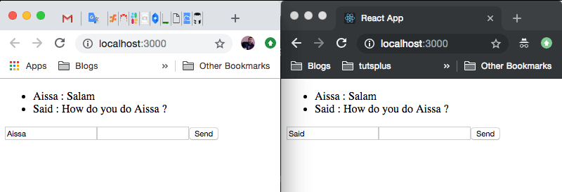

أنجزنا في درس سابق [مقدمة وشرحا لمكتبة Socket.io](https://www.tutomena.com/web-development/javascript/introduction-socketio-library/) لإنشاء تطبيقات الويب التزامنية، أو ما يعرف كذلك **بتطبيقات الزمن الحقيقي** Real-time Applications، وحاولت أن أتطرق فيه لعدد من التفاصيل والأمور التي ستساعد الجميع على فهم واستيعاب آلية عمل هذه المكتبة ودورها.

اليوم سنتعلم معا كيفية استخدام **Socket.io** في مثال عملي حقيقي عبارة عن تطبيق **غرفة دردشة** (Chat Room)، وهذا ما وعدتكم به في نهاية الدرس السابق :)

إلى جانب Socket.io، سنقوم باستخدام [Node.js](https://www.tutomena.com/web-development/javascript/what-is-nodejs/) في هذا الدرس لبناء الخادم، بينما سنلجأ [لمكتبة React.js](https://www.tutomena.com/web-development/javascript/react-javascript-library/) في جهة العميل أو المتصفح.

## الخطوة الأولى

أولا سنقوم بإنشاء مجلدا نسميه مثلا react-sockeio-chatroom وبداخله مجلدين اثنين:

- client: هذا المجلد سيضم الكود الخاص بالمتصفح (React.js).
- server: بينما هذا المجلد سنضع فيه الكود الخاص بالخادم (Node.js).

## الخطوة الثانية

سنبدأ بالخادم، لذلك سندخل إلى المجلد server من نافذة الأوامر السطرية ثم نقوم بتهيئة ملف package.json كما يلي:

npm init -y

بعدها نقوم بتثبيت حزمة **socket.io** وإطار العمل Express، هذا الأخير لا يعد استعماله ضروريا في هذا الدرس ولكنني أردت استخدامه حتى نتعود عليه، لأنه كما تعلمون [إطار عمل Node.js الأشهر والأكثر استخداما](https://www.tutomena.com/web-development/javascript/most-popular-nodejs-web-frameworks/) لبناء خوادم الويب.

npm install socket.io express

[alert type="warning" icon-size="normal"]بما أننا نستخدم مدير الحزم npm، فهذا يعني أن Node.js مثبت في جهازي، وإلا فإن أوامر npm لن تعمل :) [/alert]

بعد تحميل socket.io وإكسبريس، سنقوم بتحميل حزمة ثانية خاصة بمرحلة التطوير (Developement) وهي **nodemon**. هذه الحزمة كما ذكرت في عدة مقالات سابقة اختيارية ولكنها تساعدنا كثيرا كمطورين حيث تقوم بإعادة تشغيل (Restart) خادم Node.js **تلقائيا** مع كل تغيير في أحد ملفاته.

npm install nodemon --save-dev

الآن يجب أن ننشئ ملف جافاسكريبت الذي سنضع فيه أكوادنا الخاصة، ليكن اسمه server.js ولنكتب فيه ما يلي:

const app = require("express")();

const server = app.listen(8081, function(res) {
console.log("Server is running");
});

const socket = require("socket.io");

const io = socket(server);

io.on("connection", function(socket){

    socket.on("SEND_MESSAGE", function(data) {
    	io.emit("RECEIVE_MESSAGE", data);
    });

});

لاحظوا أننا لم نقم بالشيء الكثير في هذا الملف، فقط أنشأنا خادم بواسطة Express وبعدها أضفنا إليه Socket.io.

بعد أن يحدث اتصال من أحد العملاء، طلبنا من Socket.io أن يقوم بالإستماع لرسالة من نوع **SEND_MESSAGE** متوقع أن تأتي **من جهة العميل**، وعند وصولها سيقوم بدوره بإرسال رسالة من نوع **RECEIVE_MESSAGE** إلى **جميع العملاء المتصلين** (المتواجدين في غرفة الدردشة) ومحتوى هذه الرسالة (data) سيكون هو الرسالة التي قام العميل الأول بإرسالها عن طريق **SEND_MESSAGE**.

أتمنى أن تكون الأمور واضحة :)

تلاحظون أن الخادم استخدم ()io.emit عوضا عن ()socket.emit، فالأولى تقوم بالإرسال **لجميع العملاء المتصلين** (هذا ما نريده)، بينما الثانية ترسل **فقط للعميل** الذي أرسل الرسالة SEND_MESSAGE إلى Server.

## الخطوة الثالثة

الآن بعدما أعددنا الخادم الخاص بتطبيقنا، سنمر إلى الجهة الأخرى: **جهة المتصفح** (العميل) :)

سنفتح تبويبا جديدا في Terminal وفيه ندخل إلى المجلد client الذي أنشأناه سابقا.

بعد ذلك سنقوم بإنشاء مشروع React.js عن طريق الحزمة [create-react-app](https://github.com/facebook/create-react-app). إذا لم تقم بتثبيتها من قبل فهذا هو الوقت المناسب لفعل ذلك :)

create-react-app .

النقطة هنا تعني بأن حزمة **cra** ستقوم بإنشاء المشروع في المجلد client مباشرة، أي أنها لن تقوم بإنشاء مجلد جديد.

بعد توليد المشروع، من المفترض أن يكون لدينا 3 مجلدات : **public** ،**node_modules** و **src**. عملنا سيكون داخل هذا الأخير، لذلك سندخل إليه ونقوم بحذف جميع الملفات الإفتراضية التي يضمها **باستثناء** الملفين : index.js و App.js.

الملف **index.js** سيكون محتواه كما يلي:

import React from 'react';
import ReactDOM from 'react-dom';
import App from './App';

ReactDOM.render(<App />, document.getElementById('root'));

هذا الكود لا يحتاج للشرح على ما أظن، فقط طلبنا من React أن تقوم بتركيب المكون <App> في العنصر الذي يحمل المحدد root.

هذا العنصر (div) ستجدونه في الملف index.html الموجود في المجلد public إذا أردتم التأكد :)

الملف الذي يهمنا بالدرجة الأولى في مشروع React هو **App.js** لأنه هو الذي سيضم الأكواد الخاصة بنظام الدردشة. هذا يعني بأنه الملف الذي سنستخدم فيه مكتبة Socket.io **الخاصة بجهة العميل**.

هيا بنا إذن، لنقم بتحميلها:

npm install socket.io-client

بعد تحميل المكتبة، سنفتح الملف App.js ونضع فيه هذه الشفرة:

import React, { Component } from 'react';

import io from 'socket.io-client';

class App extends Component {

constructor(props) {

    super(props);

    this.state = {
        username : '',
        message: '',
        messages: []
    }

    this.socket = io('localhost:8081');

    this.socket.on("RECEIVE_MESSAGE", (data) => {
      this.setState({
        messages: [...this.state.messages, data]
      });
    });

}

handleChange = (e) => {
this.setState({
[e.target.name]: e.target.value
});
}

handleSubmit = () => {

    this.socket.emit('SEND_MESSAGE', {
      author: this.state.username,
      message: this.state.message
    });

    this.setState({ message: '' });

}

render() {
return (

        <ul>
          {
            this.state.messages.map((item) => {
              return <li>{item.author} : {item.message}</li>
            })
          }
        </ul>

        <input
          type="text"
          name="username"
          value={this.state.username}
          onChange={this.handleChange} />

        <input
          type="text"
          name="message"
          value={this.state.message}
          onChange={this.handleChange} />

        <button onClick={this.handleSubmit}>Send</button>

      

    );

}
}

export default App;

كما تشاهدون، في هذا الملف قمنا بإنشاء مكون اسمه **App** والذي استدعيناه سابقا في الملف index.js، وفي constructor الخاص به قمنا بتعريف **State** وهي عبارة عن كائن جافاسكريبت يضم 3 خاصيات: message ،username و messages.

- **username**: اسم المستخدم.
- **message**: الرسالة التي يقوم **المدردش** بإرسالها.
- **messages**: مصفوفة تضم مجموع الرسائل التي تبادلها أعضاء غرفة الدردشة فيما بينهم.

بعد تعريف حالة المكون، قمنا بالإتصال بخادم Socket.io عن طريق الخاصية _this.socket_.

بعدها الإتصال بالخادم، وفي داخل وظيفة البنَّاء (constructor) دائما، طلبنا من this.socket أن يقوم بالإستماع للحدث **RECEIVE_MESSAGE** الذي ننتظر قدومه من الخادم كما رأينا في فقرة سابقة.

عند وقوع هذا الحدث سنقوم بتحديث حالة المكون <App> وذلك بإضافة البيانات التي أرسلها الخادم إلى المصفوفة **messages**. هذه البيانات كما سنرى بعد قليل عبارة عن كائن جافاسكريبت يضم **اسم المستخدم ومضمون رسالته**.

سنخرج الآن من constructor، وننزل قليلا إلى الوظيفة **()render** التي تقوم بإرجاع ال UI الخاص ب <App>.

هذا UI بسيط للغاية:

- عنصر <ul> نعرض من خلاله الرسائل التي تأتي من الخادم من خلال المصفوفة _this.state.messages_. فكما رأينا قبل قليل، كلما أرسل الخادم رسالة RECEIVE_MESSAGE إلى العميل يقوم الأخير بإضافتها محتواها (data) إلى messages.
- حقلين من نوع <input>، أحدهما ندخل فيه اسم المستخدم والآخر رسالتنا.
- زر <button> عند النقر عليه يقوم بتنفيذ الوظيفة **()handleSubmit** التي تقوم بإرسال رسالة من نوع **SEND_MESSAGE** إلى الخادم وتضم **اسم المستخدم** الذي أدخلناه **والرسالة** التي كتبناها.

الآن يمكننا تشغيل كل من الخادم (المجلد server) ومشروع React (المجلد client) عن طريق الأمر:

npm start

بعدها سنفتح الرابط http://localhost:3000 الخاص بالعميل (مشروع React.js) في **تبويبين** أو أكثر في المتصفح حتى نقوم بمحاكاة غرفة الدردشة.

النتيجة كما في الصورة أسفله :)

الشات يعمل بشكل جيد :D

## النهاية

هكذا قمنا بإنشاء نظام بسيط للدردشة باستخدام Node.js ،Socket.io و React.js.

المثال بسيط للغاية ولكنه بلا شك يعطينا فكرة جيدة عن قدرات Socket.io ونوعية التطبيقات التي يمكننا بناؤها بواسطة تلك المكتبة.

_لا تترددوا في مشاركة انطباعاتكم وملاحظاتكم حول الموضوع معي ومع زوار مدونة توتومينا، علقوا علقوا هههه 8-)_
