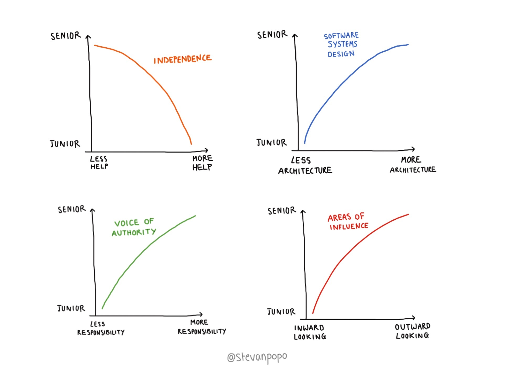

للإجابة على هذا السؤال ينبغي أن نعرف أهم الخصال والمميزات التي يجب توفرها في الشخص لنقول عنه مبرمج أو مطور خبير. ولكي يكون الجواب مركزا سنتفق على 4 خصال مهمة من واقع تجربتي وتجربة العديد من المطورين الخبراء.

## 1. الإستقلالية

كلما زادت خبرة المطور إلا وازدادت معها استقلاليته واعتماده على نفسه وقلت حاجته للمساعدة من الغير. يستطيع المطور الخبير أن يرى المشاكل المفترضة قبل حدوثها وإيجاد أفضل الحلول والسبل لتفاديها.

## 2. امتلاك السلطة

يمتلك المبرمج الخبير سلطة لا يمكن تجاهلها وصوتا مسموعا في الشركة أو الكيان الذي يعمل لحسابه، فهو القادر على توجيه زملائه إلى أمثل الحلول وتسليط الضوء على المشاكل المحتملة في وقت مبكر.

## 3. براعة في التصميم

تكون للمطور الخبير اليد الطولى في تصميم البرامج أو الأنظمة التي يساهم في بنائها. وهنا نقصد بالتصميم تصميم الشفرة البرمجية وهيكلة المشروع بشكل عام وليس التصميم الجرافيكي فقط.

## 4. مجالات التأثير

يميل المطور المبتدئ أكثر إلى العمل في نطاق داخلي محدود لا يتجاوز المهام الموكلة إليه ليقوم بإنجازها. بينما **Senior Developer** يمتد تأثيره إلى مهام منفتحة بشكل أكبر على العالم الخارجي مثل التوظيف، الإدارة والإتصالات الخارجية إلخ...

هذه الخصال الأربعة تشكل معا ما أطلق عليه [ستيفان بوبوفيتش](https://www.stevanpopovic.com/arcs-of-seniority/) **منحنيات الخبرة**.

حاول إيجاد مركزك في كل منحنى من هذه المنحنيات الأربعة لكي تعرف موقعك بالنسبة للمطورين الخبراء.

هذا يعني أن تسأل نفسك:

- هل أقوم غالبا بإنهاء مهامي بشكل مستقل ؟
- هل صوتي مسموع في الكيان الذي أنتمي إليه ؟
- هل لدي مساهمة في تصميم المشروع أو النظام برمته ؟
- هل مجال تأثيري واسع مقارنة بزملائي ؟

إذا كان جوابك على كل هذه الأسئلة "نعم"، فأنت في الغالب مطور خبير :)

بطبيعة الحال، ليس بالضرورة على الجواب أن يكون قاطعا على كل سؤال من تلك الأسئلة الأربعة. فقد تكون Senior Developer ولكن مركزك في منحنى معين من منحنيات الخبرة ليس بقوة مركزك في منحنى آخر، المسألة متعلقة باحتياجات الشركة التي تعمل فيها والمجالات التي لها الأولوية.

---

ترجمة بتصرف [لأحد ردود Stefan Popovic](https://www.quora.com/When-can-I-start-calling-myself-a-senior-developer) على موقع quora.com
