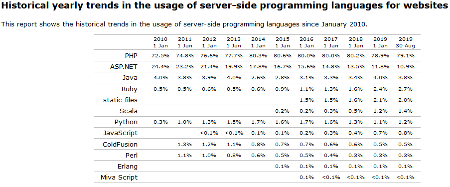

تراجع لغة البرمجة PHP لصالح Python و Node.js أو أي منافس آخر أمر ممكن ولكنه تراجع إذا حدث سيكون بطيئا لأن PHP متجدرة في السوق ولها سنوات طويلة من السيطرة على ميدان Server-side programming languages.

لاحظوا ماذا حدث للحصة السوقية لمجموعة من لغات البرمجة في العقد الأخير:

في الصورة أعلاه، نرى بأن حصة لغة البرمجة في السوق **ازدادت في السنوات العشر الماضية**، ولم تشهد تراجعا إلا في العامين الأخيرين وهو كما ترون تراجع طفيف كما توقعنا سابقا.

ما يدفع محبي PHP كذلك للتفاؤل هو قرب خروج الإصدار الجديد **PHP 7.4** الذي سيحمل معه عدة تحسينات في الوظائف والسرعة، ما يجعل هذه اللغة تبقى في مستوى عالي من التنافسية مع القادمين من الخلف.

أما الحدث السعيد الذي سيحمل PHP لمستوى آخر فهو الإصدار **PHP 8** الذي سيجعل هذه اللغة تعتمد على آلية JIT (أو Just-in-time compilation) في تجميع الشفرة البرمجية والإحتفاظ بها ذاكرة الخادم، ما يعني تحسنا هائلا في الأداء والسرعة.

هذا سيغير كثيرا من قواعد اللعبة في السوق وسيعطي دفعة هائلة لأطر العمل وأنظمة إدارة المحتوى المعتمدة على PHP مثل [لارافيل](https://www.tutomena.com/web-development/php/%d8%a5%d8%b7%d8%a7%d8%b1-%d8%a7%d9%84%d8%b9%d9%85%d9%84-%d9%84%d8%a7%d8%b1%d8%a7%d9%81%d9%8a%d9%84/)، سيمفوني، ووردبريس إلخ...

إذن، أتوقع أن لغة PHP مازال أمامها حياة طويلة لتعيشها في القمة قبل أن يتمكن المنافسون من إزاحتها أو طردها من مضمار المنافسة.

---

مرجع: [Do you think PHP will continually lose market share to other languages such as JS frameworks, etc?](https://www.quora.com/Do-you-think-PHP-will-continually-lose-market-share-to-other-languages-such-as-JS-frameworks-etc)
