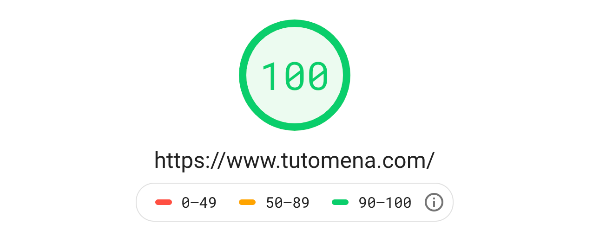

افتتحت **مدونة توتومينا** منذ مارس من عام 2015، ومثل جميع المدونين، لم أجد حلا أفضل وأسرع من ووردبريس لكي أنطلق.

ظل الحال على ما هو عليه إلى نهاية شهر أكتوبر المنصرم عندما قررت نقل توتومينا إلى نظام آخر تماما وفلسفة جديدة في النشر. أتحدث هنا عن مولد المواقع الساكنة (Static Sites Generator) الذي ربما سمعتم بها في الآونة الأخيرة: **Gatsby.js**.

العديد من الأصدقاء والمتابعين سألوني عن سبب هذا التغيير، وبعضهم طالبني بأن أعود لقالب Newspaper القديم الذي كنت أستخدمه مع ووردبريس ظنا منه أنني غيرت القالب فقط 😄

لهذا وجدت أنه من الأفضل أن أكتب تدوينة مفصلة أشرح فيها الأسباب والدواعي التي جعلتني أتخذ هذا القرار الذي قد يبدو لبعض محبي ووردبريس أمرا مفاجئا.

ولكن لا بأس، أظن بأنكم ستفهمون موقفي جيدا بعد أن تقرؤوا ما سَيَلي 👍

## كيف بدأت أفكر في التغيير

لا أحد يشك في قيمة ووردبريس كأفضل نظام إدارة محتوى موجه للمدونين. أمضيت تقريبا 5 سنوات أستخدمه وكان التجربة بالمجمل جيدة ولم أواجه فيها مشاكل تذكر.

ولكن في المدة الأخيرة، بعد أن اكتشفت Gatsby.js وفكرة [JAM Stack](https://www.tutomena.com/web-development/javascript/what-is-jamstack/)، بدأت أفكر وأطرح علي الأسئلة التالية:

1. لماذا أستخدم ووردبريس ؟
2. ما هي الأدوات التي يمنحني إياها دون غيره من الحلول الأخرى ؟
3. ما هي إضافات ووردبريس التي أستخدمها في توتومينا ولا يمكن أن أستغني عنها ؟
4. لماذا أنا أصلا في حاجة لخادم ويب إذا كنت لا أستخدمه في شيء سوى في التعليقات ؟

لم أجد أجوبة مقنعة لأي من هذه الأسئلة، فإضافات ووردبريس الوحيدة التي كنت أستخدمها كانت خاصة بالكاش والسيو وإضافة النشرة البريدية. كل هذا أستطيع القيام به مع Gatsby.js بسهولة دون الرجوع لتلك الإضافات، فكاش الخادم لا أحتاج إليه ما دمت أتعامل فقط مع ملفات ساكنة (Html, Css, JavaScript) و سأستفيد كذلك من كاش المتصفح بشكل ممتاز.

أما السيو فأنا أعرف أساسياته وأستطيع كتابة مقالات صديقة لمحركات البحث فقط بما أعرفه وأتعلمه من هنا وهناك.

بخصوص النشرة البريدية، أنا مطور ويب وأستطيع إنشاء فورم بشكل يدوي بسهولة وربطه مع الخدمة التي أستعين بها، وبالنسبة للتعليقات نجد خدمة Disqus الغنية عن التعريف والتي تقوم بالدور على أحسن ما يرام.

## لماذا Gatsby.js بالضبط ؟

صحيح أن هناك مولدات مواقع ساكنة كثيرة ولكل منها طريقتها وفلسفتها الخاصة، نذلك منها على سبيل المثال:

- Jekyll (Ruby)
- Next.js (React.js & Node.js)
- Nuxt.js (Vue.js & Node.js)
- VuePress (Vue.js & Node.js)
- GridSome (Vue.js & Node.js)
- Hexo (Node.js)
- Hugo (Go)

ولكني ملت كثيرا لخيار Gatsby بمجرد أن قرأت عنه واكتشاف بعضا المدونات التي تعتمد عليه وكيف أنها فائقة السرعة. كما أنني تأثرت كثيرا بحماس مجتمعه الكبير والنمو الكبير في أعداد المنضمين إليه، مستفيدا من مجمتع React.js الضخم حيث أنه مبني على هذه المكتبة وذلك سبب آخر وعامل من العوامل التي جعلتني أذهب معه دون سواء.

أما المميزات التقنية ل Gatsby.js فيمكننا أن نذكر منها ما يلي:

- **لا وجود لإعادة تحميل الصور** ـ فنحن لدينا في النهاية تطبيق React.js أحادي الصفحة (Single Page Application).
- **تحسين الصور** ـ جميع الصور يتم تحسينها وضغطها بشكل آلي يضمن سرعة تحميلها، بالإضافة لتفعيل ميزة التحميل الكسول (Lazy loading) الممتازة.
- **جلب وإعداد الموارد بشكل مسبق** ـ تعرف هذه الميزة ب Pre-fetching حيث أن Gatsby يقوم بقراءة كل الروابط الموجودة في الصفحة وتحميلها في الكاش استعدادا لطلبها من طرف المستخدم.
- **تحزيم وتصغير الكود** (Code bundling and minification).
- يتم **إعداد وتوليد** جميع الصفحات في عملية البناء (Build time).
- يمكن لأي شخص أو متابع لمدونة توتومينا أو يقوم بالتعديل على المقالات وإصلاح الأخطاء الموجودة فيها، ثم إرسال طلب السحب أو Pull Request لكي أراجعه ثم أقوم بدمجها مع التفريعة الرئسيية (Master branch).
- كلما قمت بتحديث في الكود أو عدلت على مقال معين، ما علي سوى عمل `git push` ليتم نشر التعديلات في المدونة بشكل تلقائي ( شكرا **Netlify** 👍).

## السرعة

شكرت [Netlify](https://www.netlify.com/) أعلاه لأنها تقدم خدمة استضافة ممتازة جدا للمواقع الساكنة إضافة إلى مزايا أخرى عديدة متميزة لن نتطرق إليها اليوم لأنها ليس موضوعنا.

تتوفر خدمة Netlify على شبكة تقديم محتوى CDN سريعة جدا، ولعلكم لاحظتم سرعة تحميل مدونة توتومينا بعد الإنتقال إلى Netlify و Gatsby، فكلاهما ساهما بشكل كبير في حصول المدونة على النقطة الكاملة (**100**) في اختبار PageSpeed Insights عوض 65 التي حصلت عليها المدونة عندما كانت تعتمد على ووردبريس، وكلنا نعرف أهمية عامل سرعة التحميل في تحسين الظهور على محركات البحث.

هذا لا يعني أنه لا يمكن لمدونات أو مواقع ووردبريس أن تحصل على معدل عالي في هذا الإختبار، إنما الذي أردت قوله أن المهمة مع Gatsby.js و Netlify سهلة ولا تحتاج إلى أي مجهودات تذكر.

العامل الآخر الذي يعزى إليه سرعة المواقع الساكنة هو أنها لا تعتمد على أي خادم ويب (Web Server) ولا قواعد بيانات، وما يتم إرساله للمستخدم مجرد ملفات ساكنة مث الصور، خطوط، ملفات Html، جافاسكريبت و Css.

الجميل والممتع كذلك مع Netlify هو سهولة نشره التدوينات أو أي تغيير أو تعديل نقوم به على مستوى ملفات الموقع. فقط نقوم بعمل `git push` للتغييرات إلى مستودع المشروع على Github.com وسيتم بناء (Build) الموقع ونشر التعديلات بشكل تلقائي من طرف **Netlify**. فأنا عندما أنهي كتابة التدوينة على ملف markdown، أقوم بعمل الخطوات التالية:

1. `git add my-blog-post-title.md`
2. `git commit -m "Publish TITLE OF MY BLOG POST"`
3. `git push`

بعد هذا بدقيقة أو دقيقتين أجد أن التعديلات قد تم نشرها في مدونة توتومينا 😃

كل ما عليك فعله هو ربط حسابك في Netlify مع حسابك في Github لكي يحصل الأول على الأذونات (Permissions) اللازمة للقيام بعمله.

> إلى جانب Github.com، تدعم خدمة Netlify بشكل جيد منصتي Bitbucket.com و Gitlab.com.

## تكاليف أقل مع نتائج أفضل

عندما تريد إنشاء مدونة ووردبريس فإنك بحاجة لاستضافة مدفوعة، وأرخص استضافة لا تقل تكلفتها عن 65 إلى 70 دولارا في السنة. هذا المبلغ قد لا يبدو كبيرا بالنسبة لشخص يملك وظيفة ولكنه قد يشكل عائقا بالنسبة لبعض المدونين الصغار والمبتدئين، خاصة وأن العائد المادي عن الإعلانات في المحتوى العربي متواضع للغاية أو منعدم، إلا إذا كانت مدونتك تستقبل عشرة آلاف زائر فما فوق كل يوم.

خدمة Netlify لديها خطة مجانية أكثر من كافية ومناسبة للمدونات أو المواقع الصغيرة والمتوسطة، وهي الخطة التي أستخدمها الآن 😄 هذا يعني أنه لم يعد علي دفع سنتيم واحد على الإستضافة، **ولم تعد تكلفني هذه المدونة من الناحية المادية سوى 13 دولارا الخاصة باسم النطاق**.

## درجة عالية للحماية والأمان

من أهم المزايا التي نجدها في المواقع الساكنة، إلى جانب سرعتها، هو **درجة أمانها العالية**. فهي كما قلنا لا تتوفر على أي قواعد للبيانات، باستثناء تلك التي تخص خدمات الطرف الثالث التي تعتمد عليها، مثل خدمة **Disqus** التي نعتمد عليها في هذه المدونة في نظام التعليقات.

إضافة إلى ذلك، هناك دائما نسخة من الشفرة المصدرية للموقع على جهازي، فحتى لو تم اختراق الحساب على Netlify أو حتى Github وتم مسح جميع الملفات فالأمر لا يشكل مشكلا كبيرا، يكفي أن أسترجع حساباتي وأعمل من جديد `git push` ليعود الموقع للعمل كما في السابق.

## المصدر المفتوح

عندما تكون الشفرة المصدرية لبرنامج معين مفتوحة للجميع للمشاركة في تطويره وتحسينه فإننا نقول عليه **برنامج مفتوح المصدر** (Open Source Software). وهذا بالضبط ما أصبحت عليه مدونة توتومينا، إذ أصبح بإمكان أي شخص سحب شفرة المدونة إلى جهازه والتعديل عليه كما يشاء لإضافة أو إصلاح أمور محددة، ثم بعد ذلك يقوم بإرسال التعديلات إلي على شكل Pull Request لكي أقوم بمراجعتها ودمجها.

المساهمة في مشروع مدونة توتومينا لا يقتصر على الجانب البرمجي فقط، بل أصبح بإمكان الجميع ـ بما فيهم غير المبرمجين ـ مساعدتنا في تصحيح وإصلاح الأخطاء التي يجدونها في التدوينات التي نقوم بنشرها، وذلك عبر منصة Github.com مباشرة، **أي أن تحرير المواضيع لم يعد مقتصرا على مدير الموقع فقط كما ألفنا دائما**.

## نقل المحتوى من ووردبريس إلى Gatsby.js

الآن وبعد أن مررت على أبرز مميزات هذه البيئة الجديدة، سأمر للتحدث عن الطريقة التي ابتعتها لنقل المحتوى السابق من ووردبريس إلى Gatsby.js وأشارك معكم كذلك أهم الصعوبات التي واجهتها.

هذه المرحلة هي الأصعب ربما في رحلة الهجرة من ووردبريس إلى Gatsby، خصوصا إذا كان الموقع قديما والمحتوى كبير.

بالنسبة لمدونة توتومينا، هذه هي المراحل التي اتبعتها:

- قمت بتصدير محتوى المدونة على شكل ملف XML، وذلك من خلال لوحة تحكم ووردبريس (Tools > Export).
- بعد ذلك قمت باستخدام [هذا السكريبت](https://github.com/lonekorean/wordpress-export-to-markdown) لتحويل ملف export.xml المولد إلى ملفات من نوع markdown التي ستأستخدمها في Gatsby. كان علي التعديل على هذا السكريبت لكي يتوافق مع ما كنت أريده بالضبط.
- كان علي المرور على جميع ملفات Markdown وترتيبها كما يجد والتعديل عليها، مثلا تعديل مسارات الصور، Code blocks وغيرها... لذلك يمكن أن تلاحظوا أنه في بعض الصفحات ما يزال هناك Code blocks لا تظهر بشكل جيد بعد 😆
- إعادة توجيه روابط صور نسخة وودبريس القديمة التي لم تعد تعمل إلى الصفحة الرئيسية.
- إصلاح أكواد Shortcodes المكسورة.
- قمت بعمل Clone لقالب مدونة [taniarascia.com](https://github.com/taniarascia/taniarascia.com/) وأجريب عددا من التعديلات عليه، هذا القالب أعجبني كثيرا لبساطته وخفته.

هذه أهم الصعوبات والخطوات التي كان علي القيام بها لكي تنجح عملية النقل. كلفني كل هذا تقريبا 10 إلى 15 يوم من العمل. وطبعا كنت أخصص فقط سويعات من وقتي كل مساء لهذا الموضوع، لأنه في النهار لم يكن لدي الوقت لذلك بسبب انشغالي بالعمل.

[هذه التدوينة](https://www.taniarascia.com/migrating-from-wordpress-to-gatsby/) ساعدتني في إيجاد المسار الصحيح للقيام بكل ما سبق.

---

آمل أن هذه المقالة كان كافية للإجابة على جميع تساؤلات متابعي مدونة توتومينا، وأتمنى أن الخطوة التي اتخذناها بالإنتقال من ووردبريس إلى Gatsby.js أصبحت مفهومة الآن ومقبولة لدى الجميع.

أنا دائما **رهن الإشارة** في حال كانت لديكم أسئلة حول هذا الموضوع 💌 💚
