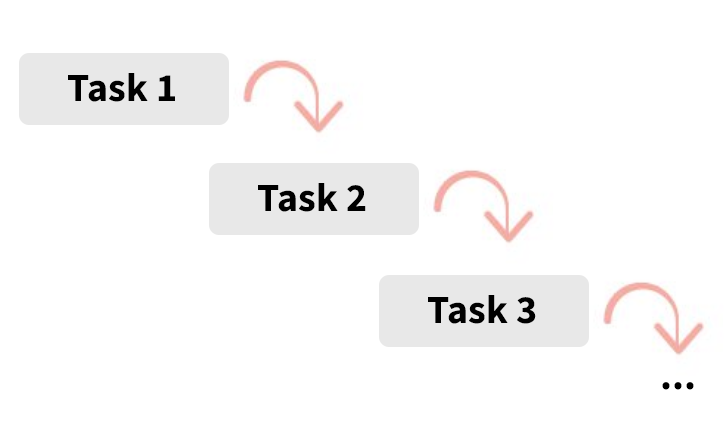

في [مؤتمر جافاسكريبت](https://www.youtube.com/watch?v=nLF0n9SACd4) (JsConf) الذي انعقد بإيسلندا عام 2018، قام المتحدث Dan Abramov - أحد المهندسين البارزين في فريق **React.js** - باستعراض ميزة جديدة يتم الإشتغال عليها لجعل العرض الغير متزامن للمكونات مهمة أسهل وأكثر تصريحية (More Declarative).

فكرة هذا النمط الجديد تكمن في إحاطة المكون الغير متزامن بمكون آخر سماه **دان أبراموف** آنذاك ب `Placeholder`. هذا الأخير يقبل خاصية اسمها `fallback` بحيث يتم عرض محتواها من طرف `<Placeholder />` في انتظار تحميل وتجهيز كافة البيانات الغير متزامنة التي يحتاجاها المكون المحاط.

بعد أكثر من عام على ذلك المؤتمر، تقدمت الأشغال كثيرا في هذا المشروع وأصبح يعرف باسم **React Suspense**. وإذا كنت من متابعي أخبار React.js فلا شك بأنك سمعت عن هذا المصطلح مرات عديدة في الشهور الأخيرة.

ومع كثرة الحديث عن **Suspense** يتساءل المرء عن سبب كل هذا الإهتمام بهذه الميزة الجديدة، وهل هي فعلا تستحق كل تلك الجلبة التي أحدثت حولها ؟

هذه التدوينة المفصلة ستجيبنا إن شاء الله على كل هذه الأسئلة، وسنعرف معا ماهية هذا الإسم الجديد في عالم React.js.

## توضيح لا بد منه

بسبب أهمية مشروع وفكرة React Suspense، فإن القائمين عليه قرروا تقسيمه إلى قسمين اثنين:

- قسم **يهتم فقط بالإستيراد الديناميكي** لمكونات React أو ما يعرف ب Dynamic Import، والغرض من هذا الجزء هو جعل الشفرة المصدرية للتطبيق صغيرة الحجم قدر المستطاع بحيث لا يتم تحميل أو تضمين الأكواد المسؤولة عن المكونات (Components) التي لا تظهر في واجهة المستخدم في ملف جافاسكريبت الرئيسي للموقع.

  Suspense سيتولى تحميل تلك الأكواد عند الحاجة فقط، أي عندما يحين الوقت لعرضها في User Interface، وذلك بالتعاون مع وظيفة أخرى من وظائف React وهي `React.lazy()`.

  تعرف هذه الخاصية ب **Code Splitting**.

  > هذا الجانب من React Suspense موجود ومدمج **بشكل رسمي** في مكتبة React.js منذ الإصدار 16.6، وسنرى بعد قليل كيفية عمله.

- الجانب الثاني من Suspense يهتم بعرض المكونات بعد أن تحصل على كافة البيانات التي تحتاج إليها. في انتظار وصول تلك البيانات يتم عرض مكون Fallback وهو في العادة يكون عبارة عن Loader لكي يفهم المستخدم أن هذا الجزء من واجهة المستخدم في طور التحميل.
  > هذا القسم الثاني من مشروع Suspense **مازال في طور التطوير والإختبار**، والواجهات البرمجية التي سنراها في هذا المقال قد تتغير بعد وصول الإصدار المستقر من React Suspense.

لكي ألخص ما سبق في كلمتين: القسم الأول من React Suspense والذي هو موجود الآن في إصدار React.js الرسمي يهتم فقط ب **Code Splitting**، بينما القسم الثاني يهتم ب **Data fetching** وهو كما قلت مازال قيد التجربة والتطوير.

<NewsletterForm />

## استخدام Suspense من أجل Code Splitting

عندما تبلغ تطبيقات درجة معينة من التعقيد فإنها تكون بالضرورة مؤلفة من عدد كبير من المكونات، وأكواد جافاسكريبت لا يستهان بحجمها خاصة عن استخدام عدد كبير من المكتبات الخارجية. لذلك عندما يحاول المطور في النهاية تحزيم الشفرة المصدرية فإنه يحصل على ملف جافاسكريبت ضخم يتسبب في بطء تحميل التطبيق على المتصفح خاصة إذا كان الإتصال بالإنترنت بطيئا.

لحسن الحظ اهتمت مكتبة React.js بهذه الناحية، ووضعت رهن إشارتنا الوظيفة `React.lazy()`.

هذه الدالة تهتم بتقسيم حزمة (Bundle) الجافاسكريبت إلى عدة قطع، كل منها مسؤول عن مكون معين وبمجهود لا يذكر تقريبا. يمكن بعد ذلك الإستعانة ب Suspense لإدارة وضعية التطبيق عند طلب المكون (Component) وبالتالي يمكننا مثلا إظهار Loader بانتظار أن يتم تحميل قطعة الكود الخاصة بذلك الجزء من واجهة المستخدم.

### دور Suspense في Code Splitting

عند طلب حزمة جافاسكريبت، يعني هنا ملف جافاسكريبت، فإنه من الطبيعي أن يأخذ بعض الوقت لكي يتم تحميله عبر الشبكة. هذا الوقت يختلف من حين لآخر بحسن سرعة الإتصال بالإنترنت. لذلك كما قلت يوفر لنا `<Suspense />` إمكانية عرض Loader في User Interface بانتظار جهوزية الملف المطلوب.

```jsx
import React, { Suspense } from 'react';

const AboutPage = React.lazy(() => import('./AboutPage'));

const App = () => (
  <Suspense fallback={<Loader />}>
    <AboutPage />
  </Suspense>
);
```

في هذا المثال افترضنا أنه لدينا صفحة About ممثلة بالمكون `<AboutPage />`، بمجرد الدخول للتطبيق وطلب تلك الصفحة فإن React سيقوم بتحميل كود جافاسكريبت المسؤول عن ذلك المكون والذي لا نجده في الملف الرئيسي (Main Bundle) الذي يتحكم في التطبيق ككل.

ولرؤية هذا بشكل أفضل، أنشأت مثالا بسيطا جدا على CodeSandbox وفيه أنشأت مكونين اثنين: `<HomePage />` و `<AboutPage />`. ستلاحظون كيف يتم تحميل Javscript Chunks عند عرض المكونين لأول مرة.

[](https://codesandbox.io/s/objective-taussig-5uimi?fontsize=14&hidenavigation=1&theme=dark)

والصورة التالية توضح الأمر كذلك:


الآن رأينا كيف أنه من السهل إضافة ميزة Code Splitting لتطبيقات React، والتجربة ممتازة بحيث لا نحس أنها غير متزامنة (Asynchronous) بالرغم من أنها كذلك.

الآن حان الوقت لنتكلم عن الجانب الأهم والأكثر تعقيدا من مشروع Suspense: جانب **Data fetching**.

## استخدام Suspense من أجل Data fetching

الفكرة الرئيسية من وراء مشروع Suspense هو تأجيل عرض مكون من مكونات واجهة المستخدم إلى تحقق شرط معين. في انتظار تحقق ذلك الشرط سيتم عرض مكون مؤقت لإخبار المستخدم بأن هناك شيء ما يجري خلف الكواليس.

في الفقرة السابقة رأينا بأن الجزء الأول من Suspense ينتظر إلى حين تحميل قطعة الكود الخاصة بالمكون ليتحقق شرط عرض هذا الأخير. ولكن في المستقبل يسعى فريق React.js لجعله ينتظر أي شيئ غير متزامن (Asynchronous)، بما في ذلك الصور مثلا والبيانات القادمة من الخادم إلخ...

<NewsletterForm />

### مقاربة Render-as-You-Fetch لتجربة استخدام أفضل

عندما نعمل على مكون يحتاج لبيانات خارجية فإن الطريقة الأكثر شيوعا لعمل Data fetching هي من خلال الوظيفة `componentDidMount()` أو `useEffect()`. تعرف هذه الطريقة ب **Fetch-on-Render**، ولديها بعض السلبيات التي قد لا نلقي لها بالا في أغلب الأحيان.

على سبيل المثال، عندما ندخل لمكون رئيسي يحتاج لبيانات من الخارج فإننا نطلب تلك البيانات من خلال `useEffect`، أي عندما يكون المكون قد عرض بالفعل. إلا أننا نقوم بعرض `<Spinner />` مثلا في انتظار الحصول على Data ليتم عرض المكون بالكامل. بعد ذلك تعاد نفس العملية مع المكونات الفرعية. هنا نقع في مشكل يعرف برمجيا ب **Waterfall problem** أو **مشكل الشلال** حيث كل مهمة تنتظر إتمام التي قبلها لكي تبدأ، مشكلة في الأخير ما يشبه الشلال.



ليتضح هذا الكلام جيدا، دعونا نرى هذا المثال:

```jsx{4-6,22-24}
function ProfilePage() {
  const [user, setUser] = useState(null);

  useEffect(() => {
    fetchUser().then(u => setUser(u));
  }, []);

  if (user === null) {
    return <p>Loading profile...</p>;
  }
  return (
    <>
      <h1>{user.name}</h1>
      <ProfileTimeline />
    </>
  );
}

function ProfileTimeline() {
  const [posts, setPosts] = useState(null);

  useEffect(() => {
    fetchPosts().then(p => setPosts(p));
  }, []);

  if (posts === null) {
    return <h2>Loading posts...</h2>;
  }
  return (
    <ul>
      {posts.map(post => (
        <li key={post.id}>{post.text}</li>
      ))}
    </ul>
  );
}
```

هنا لدينا مكونين اثنين: `<ProfilePage />` و `<ProfileTimeline />`، وعند تشغيل وتتبع هذا الكود سنلاحظ ما يلي:

1. نبد بطلب البيانات الخاصة بالمستخدم (user).
2. ننتظر.
3. الحصول على بيانات المستخدم.
4. نبد بطلب المواضيع التابعة لهذا المستخدم (posts).
5. ننتظر.
6. الحصول على المواضيع.

إذا استغرق مثلا وصول بيانات بروفايل المستخدم 3 ثواني فهذا يعني أن البدء في عملية جلب مواضيع ذلك المستخدم لا يبدأ إلا بعد 3 ثواني! على الرغم أنه من الأفضل لو كان بالإمكان القيام بالعمليتين معا في نفس الوقت، أي **توازيا** وليس تواليا.

هذا ما يسمى بمشكل الشلال 🙂

### كيف يعالج Suspense هذا المشكل ؟

مع آلية Suspense، نحن لا ننتظر قدوم الجواب لكي نبدأ في عرض المكون، بل **تبدأ عملية العرض مباشرة في نفس الوقت** الذي نقوم فيه بطلب البيانات الغير متزامنة.

> لتجربة React Suspense **يجب أولا تفعيل Concurrent Mode** كما رأينا في [مقال سابق](/javascript/react-concurrent-mode) بشكل مفصل.

لاحظوا هذا المثال:

```jsx
// This is not a Promise. It's a special object from our Suspense integration.
const resource = fetchProfileData();

function ProfilePage() {
  return (
    <Suspense fallback={<h1>Loading profile...</h1>}>
      <ProfileDetails />
      <Suspense fallback={<h1>Loading posts...</h1>}>
        <ProfileTimeline />
      </Suspense>
    </Suspense>
  );
}

function ProfileDetails() {
  // Try to read user info, although it might not have loaded yet
  const user = resource.user.read();
  return <h1>{user.name}</h1>;
}

function ProfileTimeline() {
  // Try to read posts, although they might not have loaded yet
  const posts = resource.posts.read();
  return (
    <ul>
      {posts.map(post => (
        <li key={post.id}>{post.text}</li>
      ))}
    </ul>
  );
}
```

عند البدء في عرض المكون `<ProfilePage />` يحدث ما يلي:

1. بدأنا في إرسال طلب البيانات عن طريق الدالة `fetchProfileData()` التي تعطينا كائنا خاصا اسمه هنا `resource` وهو ليس بوعد أو Promise كما قد يبدو للوهلة الأولى.

2. مكتبة React تحاول عرض `<ProfilePage />`. هذا الأخير أب لمكونين اثنين: `<ProfileDetails />` و `<ProfileTimeline />`.

3. تحاول React عرض المكون `<ProfileDetails />` وتطلب البيانات الخاصة به عن طرق المورد resource. إذا كانت البيانات غير جاهزة بعد فإنه يتم تجميد هذا المكون (Suspended) وتقوم React بتجاوزه والمرور إلى المكونات الأخرى في الشجرة.

4. تحاول **رياكت** بنفس الطريقة عرض `<ProfileTimeline />` وتطلب بياناته عن طريق `resource.posts.read()` ليتم تجميده هو الآخر ووضعه في حالة انتظار، ثم نمر لعرض تطبيقات أخرى في الشجرة إن وجدت.

5. لم يتم إيجاد مكونات أخرى في الشجرة، إذن يتم الرجوع للمكون `<ProfileDetails />` الذي سبق تجميده ونبحث عن أقرب مكون `<Suspense />` فوقه ليتم عرض ال fallback الخاصة به `<h1>Loading profile...</h1>` في انتظار الحصول على data.

الكائن **resource** يمثل البيانات التي قد تكون أو لا تكون جاهزة، وعن طريق الدالة `read()` يتم تحديد ما إذا كانت البيانات قد وصلت بالفعل وبالتالي عرض محتوى المكون، أو أنها لم تصل بعد وبالتالي تعليق وضعية (أو تجميد) المكون إلى حين وصولها.

[](https://codesandbox.io/s/agitated-surf-j72ou?fontsize=14&hidenavigation=1&theme=dark)

نلاحظ كذلك أننا طلبنا بيانات كل المكونات في نفس الوقت، وبذلك تخلصنا من مشكل الشلال الذي كان يتسبب في تأجيل طلب الأبناء لبياناتهم لحين توصل آبائهم ببياناتهم :) أصبح الكل الآن ينتظر موارده في نفس الوقت الذي ينتظرها فيه الآخرون.

نقطة إيجابية أخرى لصالح Suspense أنه جعلنا نتخلص من التعابير الشرطية التي نكتبها للتأكد من أن المكون قد تم تحميله بنجاح `if(loaded)...` وأصبحت المسألة الآن تصريحية (Declarative) وواضحة أكثر.

مكون Suspense يساعدنا كثيرا حتى في ناحية تصميم البرنامج، فإذا أردنا مثلا أن يظهر دائما `<ProfileDetails />` و `<ProfileTimeline />` في نفس الوقت فإن كل ما علينا فعله هو أن نزيل `<Suspense />` الذي يحوي `<ProfileTimeline />` ليكون المكونان محاطان بمكون `<Suspense />` واحد. هكذا لن يظهر أي منهما إلا بعد أن **يحصلا كلاهما** على كافة البيانات والموارد التي يحتاجانها. أو يمكننا فصلهما بشكل كامل، كل داخل `<Suspense />` الخاص به جنبا إلى جنب، بذلك لن يقلق أي منهما بشأن الآخر، وسيعرض المكون في هذه الحالة حالما يتوصل بالمعلومات التي يحتاجها **هو فقط**. كل هذا دون أن نكتب سطرا برمجيا واحد من اختراعنا.

### الدالة read

الدالة `read()` هنا ليست هي المسؤولة عن إطلاق طلب الحصول على البيانات، هي فقط تحاول قراءة البيانات التي سبق طلبها من طرف `fetchProfileData()` كما قلنا في السابق وأكدنا عليه.

إذا كنت فضوليا وتتطلع لمعرفة ماهية `fetchProfileData()` وكيف تقوم بإخبار <Suspense /> عن جهوزية البيانات من عدمها، فهذا مثال لما يمكن أن تكون عليه:

```js
export function fetchProfileData() {
  let userPromise = fetchUser();
  let postsPromise = fetchPosts();
  return {
    user: wrapPromise(userPromise),
    posts: wrapPromise(postsPromise)
  };
}

// Suspense integrations like Relay implement
// a contract like this to integrate with React.
// Real implementations can be significantly more complex.
// Don't copy-paste this into your project!
function wrapPromise(promise) {
  let status = 'pending';
  let result;
  let suspender = promise.then(
    r => {
      status = 'success';
      result = r;
    },
    e => {
      status = 'error';
      result = e;
    }
  );
  return {
    read() {
      if (status === 'pending') {
        throw suspender;
      } else if (status === 'error') {
        throw result;
      } else if (status === 'success') {
        return result;
      }
    }
  };
}

function fetchUser() {
  console.log('fetch user...');
  return new Promise(resolve => {
    setTimeout(() => {
      console.log('fetched user');
      resolve({
        name: 'Ringo Starr'
      });
    }, 1000);
  });
}

function fetchPosts() {
  console.log('fetch posts...');
  return new Promise(resolve => {
    setTimeout(() => {
      console.log('fetched posts');
      resolve([
        {
          id: 0,
          text: 'I get by with a little help from my friends'
        },
        {
          id: 1,
          text: "I'd like to be under the sea in an octupus's garden"
        },
        {
          id: 2,
          text: 'You got that sand all over your feet'
        }
      ]);
    }, 2000);
  });
}
```

`fetchPosts()` و `fetchUser()` هي مجرد دالتان تقومان بإرجاع Promise بعد أن تقوما بطلب data. لا يهمنا ما هي الطريقة أو المكتبة التي تستخدمانها لفعل ذلك، قد تكون عن طريق fetch أو axios أو jquery.. لا يهم. المهم أن تقوما بإرجاع **Promise**.

نقوم بإحاطة الوعدين بدالة سميناها `wrapPromise()` وبداخلها يتم العمل الأهم، يتم إرجاع الدالة `read()`. بداخل هذه الدالة نقوم بالتأكد من قيمة `status`، إذا تحقق الوعد فان قيمة `status` تكون `success` وبالتالي تقوم `read()` بإرجاء البيانات النهائية. أما إذا كانت قيمة `status` تساوي `error`، أي أن الوعد لم يتحقق بسبب خطأ أو مشكل ما فنقوم بإرجاع ذلك الخطأ. والإحتمال التالي ـ الإفتراضي ـ هو أن الوعد ما يزال قيد المحاولة وحينذاك تكون قيمة `status` هي `pending`.

هذه فكرة عمل **Resource** في **Suspense،** قد تتغير كثير من التفاصيل و APIs التي شرحناها من هنا إلى حين الإصدار الرسمي ل Concurrent Mode و Suspense ولكن الفكرة ستبقى كما هي.

> جميع الأمثلة أعلاه مأخوذة من **توثيق رياكت الرسمي**، لا تترددوا في الإطلاع عليه ففيه ستجدون إيضاحات وتفاصيل أعمق عن كل المواضيع التي مررنا عليها.

## في الختام

أظن أننا الآن فهمنا الأساسيات التي قام عليها مشروع Suspense، هذا المشروع الكبير والذي يندرج ضمن مشروع أكبر هو React Concurrent Mode الذي سيغير كثيرا من وجه React.js نحو الأحسن.

**ما رأيكم بفكرة Suspense ؟ وكيف تظنون بأنه سيحسن من جودة وكفاءة تطبيقات الويب المبنية على رياكت ؟ وإلى أي حد سيساعد المطورين على تحسين أداء تطبيقاتهم ؟**

#### مراجع مهمة

- [Suspense for Data Fetching](https://reactjs.org/docs/concurrent-mode-suspense.html)
- [Concurrent UI Patterns](https://reactjs.org/docs/concurrent-mode-patterns.html)
- [Can you feel the Suspense?!](https://react.christmas/2019/5)

<Author slug="aissa" />
